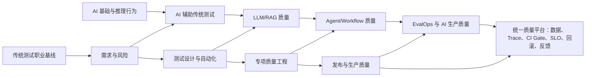
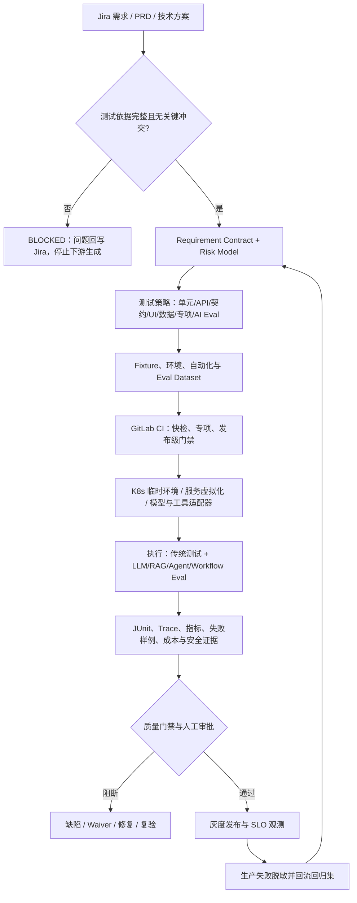
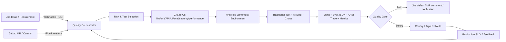

# 测试开发 × AI 课程专业架构审计与重构方案

> 审计角色：10 年以上测试开发、质量平台与 AI Quality Engineering 负责人视角  
> 审计日期：2026-08-10  
> 审计对象：当前公开 17 页、现有课程工程、实验包与拟扩展知识树  
> 结论性质：课程架构决策，不代表所有课题已经完成研究、实验或生产验证

## 0. 执行结论

当前项目不能被称为“从小白到专业级的完整测试开发 × AI 课程”。它更准确的状态是：

- 已形成两条专题路径：`需求到测试证据`、`Agent 性能与稳定性`；
- 仓库中有 3 个可运行实验包：RAG Eval、Agent Load、Requirements-to-Evidence；
- 公开 17 页中，只有 `TD-P08` 与 `TD-AP06` 能直接对应已有红绿实验；其余页面大多描述了应交付的工件，但公开页面没有把脚本、模板、Fixture、预期输出和验证入口真正交到学习者手里；
- 接口、Web UI、Android、iOS、数据、性能、可靠性、故障注入、安全、CI/CD、Jira/GitLab/K8s、LLM/RAG/Agent/Workflow 评测等专业能力没有形成可独立验收的课程轨道；
- 当前的核心问题不是“内容字数不够”，而是知识树、依赖、实验、工具适配、工程架构和交付门禁没有统一成一套质量系统。

因此，本次建议不是继续扩写现有页面，而是按以下顺序重构：

1. 先建立传统质量工程与 AI 质量工程的双主线能力地图；
2. 再按研发测试生命周期和专项族建立完整课程树；
3. 每课先定义可执行工件、失败注入和验收标准，再写正文；
4. 把 Jira、GitLab、K8s、测试框架、评测框架和可观测平台接成统一实验环境；
5. 公开状态以“仓库中是否有可运行物料”为准，而不是以页面是否写完为准。

当前完整性判定：

| 审计项 | 结论 | 主要证据 |
|---|---|---|
| 研发测试生命周期 | 部分覆盖 | 需求到发布有 8 页，但缺真实协作平台和多专项下游 |
| 专项完整性 | FAIL | API、Web、Android、iOS、数据、安全、传统性能与混沌没有独立实训轨道 |
| AI 基础 | FAIL | 当前公开 17 页没有形成大模型、推理、RAG、Agent、Eval 的前置教学路径 |
| AI 应用于传统测试 | FAIL | 有需求与测试工件思想，但缺可运行的 AI 适配器、基线对照和人工门禁实验 |
| AI 系统评测 | 部分覆盖 | 有 RAG 与 Agent 压测实验，但 LLM、RAG、Agent、Workflow、Benchmark 未形成完整分轨 |
| 平台工程 | FAIL | Jira、GitLab、K8s、消息通知、环境编排、报告回写未形成端到端实验 |
| 可执行性 | FAIL | 17 页声明产物，但大多数页面没有对外提供对应下载与运行入口 |
| 专业图示 | FAIL | 缺少系统架构、数据流、状态机、部署拓扑、指标链路和故障传播图体系 |
| 完整课程声明 | 不允许 | 只能声明为两个已验证专题路径与若干资料页 |

## 1. 重构后的课程定位

### 1.1 学习者起点与终点

课程不把学习者假设成 AI 专家，也不把测试简化成“让模型生成用例”。

起点分三类：

- 小白/初级测试：会执行基础测试，但不能独立建立风险、Oracle、自动化和发布证据；
- 测试开发：会写接口或 UI 自动化，但缺平台、稳定性、AI 系统评测能力；
- 资深/负责人：能负责质量策略，但需要建立 EvalOps、AI 可观测性、成本与生产质量治理。

统一终点是：学习者能把一个业务需求或 AI 产品，从测试依据、风险、自动化、专项验证、CI/CD、发布门禁一直连接到生产反馈，并用可重放证据解释为什么可以发布、为什么必须阻断、出现问题时如何回滚。

### 1.2 双主线，而不是工具目录



传统主线回答“测试开发原本怎样工作”；AI 主线回答“被测对象、自动化方式、失败模式和质量证据怎样变化”。任何 AI 课题都必须保留对应的传统原则、人工责任和非 AI 基线。

### 1.3 五级能力等级

| 等级 | 角色结果 | 能独立完成的工作 | 必须提交的证明 |
|---|---|---|---|
| L0 入门 | 看懂测试与 AI 系统 | 识别对象、风险、输入、输出和责任人 | 系统图、风险表、版本清单 |
| L1 执行者 | 跑通已给实验 | 运行基线、故障注入、修复和复验 | 命令记录、红绿报告、失败解释 |
| L2 工程师 | 改造真实项目 | 替换 Fixture、接入一个真实适配器、维护测试代码 | 可运行仓库、CI 报告、Trace |
| L3 专项负责人 | 设计质量方案 | 定义工作负载、指标、阈值、门禁、降级和回滚 | 方案、Dashboard、Runbook、演练证据 |
| L4 平台/质量负责人 | 建设组织能力 | 统一数据、工具、环境、治理和生产反馈 | 平台架构、SLO、权限模型、质量经营报告 |

## 2. 完整能力地图

### 2.1 能力域

| 能力域 | 传统稳定能力 | AI 时代新增能力 | 典型失败 | 作品集证据 |
|---|---|---|---|---|
| 需求与风险 | 测试依据、可测性、风险分析、追踪 | 多文档证据抽取、冲突检测、结构化契约、AI 权限边界 | AI 补写不存在的规则、覆盖冲突、丢失来源 | Test Basis Pack、Requirement Contract、风险矩阵 |
| Oracle 与设计 | 边界、状态、组合、属性、探索式、独立 Oracle | 组合 Oracle、Rubric、Judge 校准、统计与人工升级 | 自洽假绿、Judge 偏置、Oracle 被实现污染 | Oracle Registry、Mutation 报告、校准集 |
| API/服务 | HTTP、Schema、业务规则、鉴权、幂等、契约 | 从 OpenAPI/Diff 生成候选测试、语义变更审查、Agent 调 API | 只测 200、越权、重试副作用、契约漂移 | OpenAPI 测试仓、Pact、状态机与 CI 报告 |
| Web UI | 用户旅程、隔离、定位、可访问性、视觉、跨浏览器 | AI 生成/维护测试、视觉语义辅助、Browser Agent 评测 | 脆弱定位器、自愈误修绿、第三方依赖假失败 | Playwright 仓、Trace、a11y 与视觉差异报告 |
| Android | 分层测试、Espresso 同步、设备矩阵、权限、生命周期 | AI 生成用例、日志/崩溃归因、跨设备变更分析 | Idling 不正确、系统弹窗、后台状态、ROM 差异 | Espresso/Appium 套件、设备矩阵、失败包 |
| iOS | XCTest/XCUITest、可访问性标识、模拟器/真机、系统权限 | AI 辅助生成与诊断、跨版本风险选择 | 签名、权限弹窗、动画/同步、状态残留 | XCUITest 套件、xcresult、真机/模拟器报告 |
| 数据与集成 | 数据约束、ETL、消息、契约、最终一致性 | AI 数据质量解释、漂移分析、合成数据治理 | PII 泄漏、重复/乱序、训练评测污染 | Data Contract、质量规则、回放与对账报告 |
| 性能与容量 | 工作负载、分位数、吞吐、饱和、长稳、容量拐点 | Token、TTFT、TPOT、Goodput、调用放大、单位成功任务成本 | 平均值掩盖尾延迟、重试风暴、KV Cache/队列饱和 | k6/Locust/GenAI-Perf 脚本、容量曲线 |
| 可靠性与混沌 | SLI/SLO、告警、故障注入、恢复、事故复盘 | 模型/工具/检索降级、Agent 循环、不可控副作用 | 无界重试、错误降级、重复写、恢复洪峰 | Chaos 实验、SLO、Runbook、GameDay 报告 |
| 安全与隐私 | ASVS、API 安全、身份权限、密钥、供应链 | Prompt Injection、数据泄露、Excessive Agency、模型/插件供应链 | 越权工具、间接注入、敏感 Trace、危险自动化 | Attack Set、策略、红队报告、阻断证据 |
| CI/CD 与平台 | Pipeline、环境、报告、门禁、灰度、回滚 | 模型/Prompt/数据/Scorer 版本门禁、统计 Waiver、EvalOps | 报告不影响退出码、环境漂移、阈值随意放宽 | GitLab Pipeline、Jira 回写、K8s 临时环境 |
| LLM/RAG 质量 | 数据集、断言、分层诊断 | 任务成功、事实性、拒答、检索召回、忠实性、引用 | 幻觉、旧知识、冲突知识、Judge 与人工不一致 | Eval Repo、数据卡、RAG 分层报告 |
| Agent/Workflow | 状态机、接口、权限、事务与补偿 | 轨迹、工具选择、Handoff、终止、预算、Verifier | 伪成功、死循环、错工具、越权、副作用不可逆 | Trace、Policy、Trajectory Eval、沙箱 |
| Benchmark | 测试设计、抽样、统计 | Harness、Pass@k、Judge score、污染、版本可比性 | 榜单分数脱离任务、数据泄漏、协议不同 | 可复现小基准、Metric Card、审计报告 |
| 质量领导力 | 风险接受、资源取舍、组织反馈 | AI 风险治理、人机权限、成本与质量联合决策 | 把 AI 当免责主体、自动批准高风险操作 | 质量章程、RACI、投资与改进路线图 |

### 2.2 研发测试与 AI 质量双生命周期



## 3. 课程知识树总览

课程采用 8 个阶段、28 个模块、建议 145 个课题。课题数是覆盖矩阵推导结果，不是营销数字。每一课都必须拥有独立工件和退出门禁；后续可以在不破坏能力边界和验收工件的前提下合并相邻短课，但不能为了缩减数量重新把 API、移动端、性能、稳定性或 AI 评测压成一个大页面。

| 阶段 | 模块 | 目标 | 阶段出口工件 |
|---|---|---|---|
| S0 | M00-M01 | 建立测试职业基线与 AI 基础 | 传统测试基线仓、AI 系统结构图、版本清单 |
| S1 | M10-M12 | 打通需求到发布与生产反馈 | Requirements-to-Evidence 工件链 |
| S2 | M20-M28 | 掌握 API、Web、移动、数据、性能、可靠性、安全专项 | 多专项可运行测试平台 |
| S3 | M30-M32 | 用 AI 改造传统测试，但保留职业控制 | AI Assisted Testing Repo 与基线对照 |
| S4 | M40-M44 | 测试 LLM、RAG、Agent、Workflow 与 Benchmark | 版本化 Eval 与 Benchmark 仓库 |
| S5 | M50-M52 | 建设 AI 性能、可观测性、稳定性与安全体系 | AI Production Quality Pack |
| S6 | M60-M61 | 打通 Jira、GitLab、K8s、通知与 EvalOps | 统一质量平台最小闭环 |
| S7 | M70 | 用 Capstone 证明岗位能力 | 可演示、可运行、可审计作品集 |

## 4. 模块与课题清单

以下“产物”均指必须进入仓库的实际文件，不是页面中出现一个名称。`验收`默认都包含：基线通过、故障注入变红、修复后同一检查恢复、保留运行证据。

### S0：专业基线与 AI 基础

#### M00 测试开发职业基线

模块前置：无。模块出口：一个能因真实业务缺陷稳定变红的小型测试仓库。

| ID | 课题 | 前置 | 每课可执行产物 | 专业验收 |
|---|---|---|---|---|
| M00-01 | 测试开发的质量责任、角色与决策权 | 无 | `quality-responsibility-map.md`、RACI | 每个质量决定有责任人、输入证据和升级路径 |
| M00-02 | 研发测试完整生命周期与工件链 | M00-01 | Mermaid 生命周期图、`artifact-registry.yaml` | 从需求到生产反馈无断链，每个工件有下游消费者 |
| M00-03 | 风险、Oracle、测试层级和失败成本 | M00-02 | `risk-oracle-matrix.yaml` | 至少一个 Oracle 独立于被测实现，风险能映射到测试层级 |
| M00-04 | 入场实验：证明现有测试有检测力 | M00-03 | 最小 API + UI 测试仓、Mutation 脚本 | 基线绿、业务缺陷红、修复绿，不能用语法错误冒充缺陷 |

#### M01 测试工程师需要的大模型与 AI 系统基础

模块前置：M00。模块出口：能根据症状定位模型、检索、工具、状态或运行层。

| ID | 课题 | 前置 | 每课可执行产物 | 专业验收 |
|---|---|---|---|---|
| M01-01 | 模型生命周期：数据、训练、对齐、评测、部署、推理、监控 | M00 | `model-lifecycle-test-map.mmd` | 每阶段列出可观测项、不可见项和责任边界 |
| M01-02 | Token、Context、Attention、解码与非确定性 | M01-01 | 上下文/采样对照脚本与结果表 | 固定一个变量，重复运行并解释输出分布变化 |
| M01-03 | Structured Output、Embedding、RAG、Tool Call | M01-02 | 四种应用模式的最小离线 Fixture | 注入 Schema 错误、检索丢失和工具错误并能分层定位 |
| M01-04 | Agent、Worker、固定 Workflow、状态与 Trace | M01-03 | 状态机、轨迹 Schema、终止条件表 | 最终答案正确但中间越权时必须失败 |
| M01-05 | AI 评测基础：数据集、Slice、Scorer、Judge、人工校准 | M01-02 | 20 条小型 Eval 集、Rubric、校准脚本 | Judge 与人工分歧可见，阈值有来源与责任人 |
| M01-06 | 版本、隐私、成本和供应商依赖 | M01-03 | `ai-system-manifest.yaml`、脱敏规则 | 报告可追溯到模型/Prompt/数据/工具/Scorer 版本 |

### S1：研发测试生命周期

#### M10 测试依据、需求评审与技术方案

模块前置：M00、M01-03。模块出口：下游可消费的已批准 Requirement Contract。

| ID | 课题 | 前置 | 每课可执行产物 | 专业验收 |
|---|---|---|---|---|
| M10-01 | 冻结 PRD、技术方案、接口文档与变更版本 | M00-02 | `source-manifest.json`、文档哈希脚本 | 文档缺失、版本冲突或 owner 未知时下游为 BLOCKED |
| M10-02 | AI 证据抽取：事实、推断、未知、冲突分离 | M10-01 | 抽取 Prompt/Schema、`evidence-items.jsonl` | 每条业务规则指向段落/字段来源，不能无来源补写 |
| M10-03 | 需求可测性、歧义与冲突评审 | M10-02 | `review-questions.json`、决议记录 | 问题包含影响、回答者、截止时间、关闭证据 |
| M10-04 | 技术方案与系统拓扑风险评审 | M10-02 | C4/数据流图、依赖与故障传播表 | API、数据、异步、缓存、权限、回滚风险都可定位 |
| M10-05 | Requirement Contract 结构化与 Schema Gate | M10-03 | JSON Schema、契约校验器、坏样例 | 缺关键字段、冲突未关闭、版本漂移时校验失败 |

#### M11 风险策略、Oracle、测试数据与环境

模块前置：M10。模块出口：已批准、可执行、可追踪的 Test Package。

| ID | 课题 | 前置 | 每课可执行产物 | 专业验收 |
|---|---|---|---|---|
| M11-01 | 业务风险与测试优先级 | M10-05 | `risk-register.yaml`、影响×概率×可探测性表 | 优先级能解释而非按用例数量决定 |
| M11-02 | 测试层级与覆盖策略 | M11-01 | Test Pyramid/Testing Trophy 决策表 | 每个风险明确为何放在单元、契约、API、UI 或专项层 |
| M11-03 | Oracle Registry 与独立验证 | M11-01 | `oracle-registry.yaml`、参考实现/不变量 | AI/实现不能同时生成被测逻辑与唯一 Oracle |
| M11-04 | 测试设计：边界、状态、组合、属性与探索式 | M11-03 | 可生成 Test Model、Pairwise/State Model | 预埋边界和状态缺陷能被命中 |
| M11-05 | 数据、环境、服务虚拟化和清理 | M11-02 | Fixture factory、Mock/WireMock 配置、清理脚本 | 可重复、幂等、无生产 PII，清理失败可检测 |

#### M12 自动化实施、执行、缺陷、发布与生产反馈

模块前置：M11。模块出口：Requirements-to-Evidence Capstone。

| ID | 课题 | 前置 | 每课可执行产物 | 专业验收 |
|---|---|---|---|---|
| M12-01 | 自动化仓库架构、Adapter 与追踪索引 | M11 | 多层测试骨架、`traceability-index.json` | 需求/风险变更能选择最小回归集 |
| M12-02 | 运行 Manifest、日志、截图、Trace 与原始证据 | M12-01 | `run-manifest.json`、证据打包脚本 | 绿色结果可追溯到 commit、环境、数据和依赖版本 |
| M12-03 | 失败分类、Flaky、缺陷与根因候选 | M12-02 | Triage classifier + 人工复核队列 | 产品缺陷、测试缺陷、环境缺陷和未知不混为一类 |
| M12-04 | 发布门禁、Waiver、灰度与回滚 | M12-02 | Gate policy、Waiver Schema、Rollback Runbook | Waiver 有 owner、原因、范围、到期时间；报告不能自动批准高风险发布 |
| M12-05 | 生产问题回流回归资产 | M12-03 | Trace-to-Regression 脱敏流水线 | 事故样例有来源、审批、复现步骤和防复发检查 |

### S2：传统测试专项与 AI 演进

#### M20 API、契约与服务自动化

模块前置：M10-M12。工具候选：OpenAPI、Pact、Schemathesis、REST Assured/pytest、WireMock、k6。

| ID | 课题 | 前置 | 每课可执行产物 | 专业验收 |
|---|---|---|---|---|
| M20-01 | HTTP、错误模型、分页、幂等、限流和版本 | M11 | OpenAPI Fixture + API invariant 清单 | 不只检查 200；错误、重试、幂等与状态迁移可验证 |
| M20-02 | OpenAPI Schema 与正反例自动化 | M20-01 | Schemathesis/pytest 脚本、失败重放样例 | Schema 破坏与服务 5xx 能输出最小复现请求 |
| M20-03 | 消费者驱动契约与兼容性 | M20-01 | Pact consumer/provider tests | 破坏消费者的字段变更在部署前阻断 |
| M20-04 | 状态 API、异步任务、Webhook 与事件 | M20-02 | 状态机测试、Webhook mock、event assertion | 重复、乱序、超时、补偿和最终一致性有 Oracle |
| M20-05 | 认证授权、租户隔离和 API Abuse | M20-02 | RBAC/ABAC 矩阵、越权攻击集 | 同角色/跨角色/跨租户负例可重复 |
| M20-06 | AI 时代接口自动化：契约生成、Diff 审查与受控 Agent | M20-02,M01 | Spec Diff Agent、候选测试生成器、Mutation Gate | AI 生成的测试必须捕获被注入契约/业务缺陷；未实测输出不能合并 |

#### M21 Web UI 自动化与 Browser Agent

模块前置：M11、M20。主路径工具：Playwright；可选 Selenium/Cypress 作为迁移对照。

| ID | 课题 | 前置 | 每课可执行产物 | 专业验收 |
|---|---|---|---|---|
| M21-01 | 用户旅程、测试隔离、稳定 Locator 与网络控制 | M11-05 | Playwright 基线仓、Fixture、Trace | 禁止固定 sleep；测试独立；第三方依赖可控 |
| M21-02 | 跨浏览器、响应式、国际化和兼容性 | M21-01 | Browser/project matrix、差异报告 | Chromium/WebKit/Firefox 和关键视口有风险选择依据 |
| M21-03 | 可访问性、视觉与组件测试 | M21-01 | axe 规则、视觉基线、组件 Fixture | a11y/视觉变更能区分预期更新与回归 |
| M21-04 | AI 生成 UI 测试与代码审查 | M21-01,M30 | Planner/Generator/Critic 流水线 | 生成用例有来源、稳定 Locator、业务 Oracle 和 Mutation 证明 |
| M21-05 | Browser Agent、轨迹评测与自愈误修绿 | M21-04,M42 | 沙箱站点、Trajectory Eval、错误自愈样例 | 最终页面看似正常但访问错资源或越权时必须失败 |

#### M22 Android 自动化

模块前置：M11、M20。主路径工具：Espresso/AndroidX Test；跨平台路径：Appium UiAutomator2；真机云仅作可选适配器。

| ID | 课题 | 前置 | 每课可执行产物 | 专业验收 |
|---|---|---|---|---|
| M22-01 | Android 测试分层、生命周期与设备矩阵 | M11 | Emulator matrix、风险选型表 | OS/API Level、屏幕、语言、权限和厂商差异有取舍依据 |
| M22-02 | Espresso 同步、IdlingResource、Intent 与数据隔离 | M22-01 | Espresso sample + 故障注入 | 后台任务未完成时测试不会假绿或随机失败 |
| M22-03 | Appium UiAutomator2 跨平台端到端 | M22-01 | Appium 3 项目、Capabilities、录屏/日志 | 驱动版本固定；失败可从 Appium log、logcat、截图定位 |
| M22-04 | 权限、通知、深链、后台、弱网与恢复 | M22-02 | 系统交互 Fixture、Network fault script | 拒绝权限、进程被杀、网络切换和恢复路径均可重放 |
| M22-05 | AI 生成/维护 Android 测试与失败归因 | M22-02,M30 | 生成 Agent、Diff Critic、logcat 聚类器 | AI 修改后必须通过原始业务 Oracle 和变异回归，不允许仅修 Selector |

#### M23 iOS 自动化

模块前置：M11、M20。主路径工具：XCTest/XCUITest；跨平台路径：Appium XCUITest Driver。

| ID | 课题 | 前置 | 每课可执行产物 | 专业验收 |
|---|---|---|---|---|
| M23-01 | iOS 测试分层、签名、模拟器/真机与版本矩阵 | M11 | Simulator matrix、设备/证书边界说明 | 不把模拟器通过写成真机验证；签名与权限依赖明确 |
| M23-02 | XCUITest、Accessibility Identifier、Launch Arguments | M23-01 | XCUITest sample、可控启动状态 | 测试可重复启动到已知状态，定位器不依赖脆弱层级 |
| M23-03 | Appium XCUITest、WebView 与跨端场景 | M23-01 | Appium iOS 项目、Driver 配置 | Native/WebView 切换、Driver/平台版本可追溯 |
| M23-04 | 系统弹窗、推送、深链、后台与弱网恢复 | M23-02 | 系统事件 Fixture、xcresult 证据包 | 权限拒绝、后台恢复和网络变化有明确终态 |
| M23-05 | AI 生成/诊断 iOS 测试与安全边界 | M23-02,M30 | AI Test PR + Critic Report | AI 不能改掉业务断言换取绿灯；失败诊断引用 xcresult/log |

#### M24 集成、消息、数据与数据库质量

模块前置：M20。工具候选：Testcontainers、WireMock、Toxiproxy、dbt tests、Great Expectations/Soda。

| ID | 课题 | 前置 | 每课可执行产物 | 专业验收 |
|---|---|---|---|---|
| M24-01 | 数据契约、Schema 演进与血缘 | M20 | Data Contract、Schema compatibility tests | 破坏下游字段/语义的变更在发布前被识别 |
| M24-02 | 数据库约束、事务、并发与迁移 | M24-01 | Migration test、并发 Fixture | 丢数据、重复写、部分提交和回滚失败可重放 |
| M24-03 | 消息队列、重复、乱序、延迟与补偿 | M24-01 | Event replay harness、去重 Oracle | At-least-once 下不会产生重复业务副作用 |
| M24-04 | ETL/ELT、质量规则、对账与漂移 | M24-01 | Data quality suite、Reconciliation report | 规则、分母、时间窗和责任人明确 |
| M24-05 | AI 合成数据与隐私治理 | M24-04,M01-06 | Synthetic data generator、隐私检查 | 证明覆盖提升且不泄漏生产 PII；不能用合成数据证明真实分布 |

#### M25 性能、容量与成本工程

模块前置：M20、M24。工具候选：k6、Gatling、Locust、JMeter、Prometheus/Grafana。

| ID | 课题 | 前置 | 每课可执行产物 | 专业验收 |
|---|---|---|---|---|
| M25-01 | 工作负载模型与开环/闭环到达 | M20 | `workload.yaml`、k6 scenarios | 流量、用户、数据、到达模式和持续时间来自业务假设 |
| M25-02 | 延迟分布、吞吐、错误、饱和与容量拐点 | M25-01 | Dashboard、threshold config | 报 p50/p95/p99 与切片，不用平均值代替尾延迟 |
| M25-03 | Load、Stress、Spike、Soak、Scalability | M25-01 | 五种实验脚本、容量曲线 | 每种实验有不同问题、停止条件和恢复观察 |
| M25-04 | 数据库、缓存、队列和下游瓶颈诊断 | M25-02 | Trace/metric correlation notebook | 能从症状下钻到资源/依赖而非只写“系统慢” |
| M25-05 | 性能门禁、预算、回归与容量计划 | M25-02 | CI performance gate、capacity plan | 阈值绑定工作负载和版本；失败触发明确动作 |

#### M26 稳定性、可靠性、故障注入与混沌工程

模块前置：M25、M12。工具候选：Toxiproxy、Chaos Mesh、LitmusChaos、Kubernetes、OpenTelemetry。

| ID | 课题 | 前置 | 每课可执行产物 | 专业验收 |
|---|---|---|---|---|
| M26-01 | SLI、SLO、错误预算与用户任务 | M12 | SLI spec、SLO policy | 指标对应用户结果，告警能触发实际行动 |
| M26-02 | 超时、重试、退避、熔断、Bulkhead 与降级 | M25 | Resilience config、重试放大实验 | 多层重试不会乘法放大；降级终态可验证 |
| M26-03 | 故障模型与最小故障注入 | M26-02 | Failure catalog、Toxiproxy scripts | 先有稳态假设、爆炸半径和停止条件 |
| M26-04 | K8s 混沌实验：Pod、网络、CPU、磁盘与依赖 | M26-03 | Chaos Mesh/Litmus manifests | 实验限定 namespace/标签，能自动清理和恢复 |
| M26-05 | 可观测性：Logs、Metrics、Traces、Profiles | M26-01 | OTel instrumentation、Dashboard | 一条失败能由 trace_id 关联日志、指标和版本 |
| M26-06 | GameDay、事故响应、复盘与回归 | M26-04,M26-05 | GameDay plan、Runbook、Postmortem | 复盘动作进入测试/告警/容量资产，不止写原因 |

#### M27 安全、隐私与供应链测试

模块前置：M20、M21、M24。工具候选：OWASP ZAP、Semgrep、Trivy、Gitleaks、dependency/SBOM 工具。

| ID | 课题 | 前置 | 每课可执行产物 | 专业验收 |
|---|---|---|---|---|
| M27-01 | 威胁建模、资产、信任边界与滥用案例 | M10-04 | DFD、STRIDE/Abuse Case | 高风险流有 owner、控制和测试入口 |
| M27-02 | Web/API 身份、授权、会话与业务滥用 | M20-05 | Attack suite、权限矩阵 | 越权与业务滥用负例可以自动回归 |
| M27-03 | SAST、DAST、依赖、镜像、SBOM 与密钥 | M12 | GitLab security jobs、policy | 高危发现能阻断；误报与 Waiver 可审计 |
| M27-04 | 隐私、日志、Trace、数据保留与删除 | M24 | Data inventory、redaction tests | PII 不进入公开实验、日志和模型 Trace |
| M27-05 | 安全缺陷修复验证与回归 | M27-02 | Exploit fixture、repair test | 修复关闭攻击路径且不只隐藏报错 |

#### M28 测试架构、可维护性与平台基础

模块前置：M20-M27。模块出口：统一 Test SDK 与证据 Schema。

| ID | 课题 | 前置 | 每课可执行产物 | 专业验收 |
|---|---|---|---|---|
| M28-01 | 多仓/单仓测试架构与依赖边界 | S2 任选三专项 | Reference repo architecture | 测试资产能复用但不形成全局共享状态 |
| M28-02 | Test SDK、Fixture、Adapter 与插件机制 | M28-01 | Versioned Test SDK | 工具替换不改业务测试契约 |
| M28-03 | Flaky 管理、隔离区和可靠性评分 | M12-03 | Flaky dashboard、quarantine policy | 隔离不等于忽略，修复有 owner 和期限 |
| M28-04 | 质量数据模型与统一证据格式 | M12-02 | JUnit/OTel/自定义 Eval Schema 映射 | 不同框架结果能关联到同一 requirement/risk/run |

### S3：AI 辅助传统测试

#### M30 AI 需求、风险、用例与数据工程

模块前置：M01、M10-M12。原则：AI 生成候选，人和确定性门禁决定是否接受。

| ID | 课题 | 前置 | 每课可执行产物 | 专业验收 |
|---|---|---|---|---|
| M30-01 | Evidence-bounded 测试分析 Agent | M10 | Agent Prompt、Source Schema、拒绝策略 | 无来源规则不能进入已接受工件 |
| M30-02 | PRD + 技术方案 + Code Diff 风险抽取 | M30-01 | Risk Diff tool、对照报告 | 与人工基线比较漏项/误项，不用“看起来全面”验收 |
| M30-03 | AI 生成测试模型、用例与 Oracle 候选 | M11 | Generated Test Package、Critic report | 覆盖追踪、独立 Oracle、Mutation 检测力同时通过 |
| M30-04 | AI 生成边界、组合、Fuzz 和合成数据 | M11-04,M24-05 | Generator、seed、shrink/replay | 失败可最小化重放，数据隐私与分布边界清楚 |
| M30-05 | 人机协作评审、差异、接受与版本化 | M30-02 | Review UI/CLI、decision log | 接受/拒绝理由可审计，AI 不可静默覆盖人工决议 |

#### M31 AI 自动化开发、代码审查与自愈

模块前置：M20-M23、M30。

| ID | 课题 | 前置 | 每课可执行产物 | 专业验收 |
|---|---|---|---|---|
| M31-01 | 从已批准 Test Package 生成 API/UI 代码 | M30-03 | Codegen Agent、Adapter templates | 生成代码通过 lint/test，并捕获预埋业务缺陷 |
| M31-02 | AI Test PR 的静态与动态审查 | M31-01 | Review checklist、CI critic | 查出脆弱定位器、硬编码、弱断言、共享状态和假等待 |
| M31-03 | 自动修复失败测试：允许改什么 | M31-02 | Repair policy、sandbox | 不允许删除/放宽 Oracle 或扩大权限来换取绿灯 |
| M31-04 | 自愈定位器与视觉辅助的反例 | M31-03 | Mis-heal fixture、trajectory report | 错元素被点击但流程继续时必须失败 |
| M31-05 | 生成效率、维护成本与有效性对照 | M31-01 | A/B report | 比较人工基线、AI 方案的时间、缺陷检测率、返工与稳定性 |

#### M32 AI 失败归因、质量分析与知识回流

模块前置：M12、M26、M31。

| ID | 课题 | 前置 | 每课可执行产物 | 专业验收 |
|---|---|---|---|---|
| M32-01 | 失败聚类与重复缺陷识别 | M12-03 | Embedding/规则混合聚类器 | 聚类不丢原始证据；误合并和漏合并有抽样审计 |
| M32-02 | Trace + Log + Diff 根因候选 | M26-05 | Evidence bundle、ranked hypotheses | 每个候选引用证据，未知保持 UNKNOWN |
| M32-03 | AI 缺陷报告与 Jira 回写 | M32-01,M60 | Jira payload、去重/更新规则 | 不自动关闭缺陷；敏感数据脱敏；状态迁移有权限 |
| M32-04 | 事故与失败回流为知识、规则和回归集 | M12-05 | Feedback pipeline | 新样例有来源、审批、生命周期和污染控制 |

### S4：AI 系统评测

#### M40 LLM 质量工程

模块前置：M01、M11。工具候选：Promptfoo、DeepEval、Inspect AI、自研确定性 Scorer。

| ID | 课题 | 前置 | 每课可执行产物 | 专业验收 |
|---|---|---|---|---|
| M40-01 | 任务定义、数据集、Slice 与 Holdout | M01-05 | Dataset Card、Eval JSONL、split manifest | 任务和风险分布明确；Holdout 不参与调参 |
| M40-02 | 结构、规则、语义与任务成功组合 Oracle | M11-03 | Scorer registry、反例集 | 高风险判断优先确定性/业务终态，不把 Judge 当万能 Oracle |
| M40-03 | LLM-as-Judge Rubric、校准、偏置与一致性 | M40-02 | 人工标注集、校准 notebook | 报告一致率、分歧类型和人工升级条件 |
| M40-04 | 拒答、过度拒答、鲁棒性和多轮一致性 | M40-01 | should-answer/refuse 对照集 | 安全与可用性同时验收，不能只追求拒答率 |
| M40-05 | 模型/Prompt/参数 A/B 与统计门禁 | M40-01 | 重复运行脚本、置信区间报告 | 样本量、重复次数、效应和回滚规则明确 |
| M40-06 | LLM Eval 接入 CI | M40-02,M60 | Fast/Release 两层 Pipeline | 报告展示与退出码分离；阻断规则真实影响 Job 状态 |

#### M41 RAG 质量工程

模块前置：M40、M24。

| ID | 课题 | 前置 | 每课可执行产物 | 专业验收 |
|---|---|---|---|---|
| M41-01 | RAG 分层架构、语料、索引与版本 | M01-03 | RAG manifest、Corpus Card | 文档、Chunk、Embedding、Index、Retriever 版本可追溯 |
| M41-02 | 检索 Recall/Precision、MRR/nDCG 与风险切片 | M41-01 | Retrieval eval script | 指标单位、分母、k 和 relevant 标注清楚 |
| M41-03 | 上下文质量、冲突、过期、污染和权限 | M41-01 | Context inspection report、fault fixture | 注入旧/冲突/越权文档后能定位到检索/上下文层 |
| M41-04 | 忠实性、事实性、引用和拒答 | M41-02 | Answer eval + citation checker | 有引用不等于支持；引用坐标可验证 |
| M41-05 | End-to-End 任务成功与业务动作 | M41-04 | RAG task harness | HTTP 200/语言流畅不能替代业务规则和行动安全 |
| M41-06 | RAG 红绿实验与生产回流 | M41-05 | 完整 Eval Repo、CI、三态报告 | 幻觉/丢引用/注入/错工具/性能回归至少两类变异 |

#### M42 Agent 与工具调用质量

模块前置：M40、M20、M27。

| ID | 课题 | 前置 | 每课可执行产物 | 专业验收 |
|---|---|---|---|---|
| M42-01 | Agent 被测对象：目标、计划、工具、状态、终态 | M01-04 | Agent test model、state machine | 测试范围不只看最终回答 |
| M42-02 | 工具选择、参数、Schema 和错误处理 | M42-01 | Tool mock server、negative cases | 错工具、错参数、超时、429/5xx 与不可重试错误可区分 |
| M42-03 | 轨迹、步骤、循环、预算与终止条件 | M42-01 | Trajectory evaluator、loop fixture | 超步数、无进展循环和预算超限能阻断 |
| M42-04 | 权限、沙箱、副作用、幂等与补偿 | M27,M42-02 | Policy engine、sandbox ledger | 未授权写操作、重复副作用和补偿失败能检测 |
| M42-05 | Prompt Injection、数据泄漏与 Excessive Agency | M27 | Attack set、red-team runner | 直接与间接注入、工具返回恶意内容都覆盖 |
| M42-06 | Agent E2E 与独立 Verifier | M42-03,M42-04 | Agent + Verifier lab | Verifier 使用独立证据，能拒绝 Agent 的伪成功声明 |

#### M43 Workflow、Worker 与多 Agent 质量

模块前置：M42、M12。

| ID | 课题 | 前置 | 每课可执行产物 | 专业验收 |
|---|---|---|---|---|
| M43-01 | 固定 Workflow、动态 Agent 与 Worker 边界 | M42-01 | Orchestration comparison map | 选择理由基于可控性、复杂度、风险与成本 |
| M43-02 | Handoff Contract、消息 Schema 与状态一致性 | M43-01 | Handoff schema、contract tests | 丢字段、重复消息、乱序和 owner 缺失会失败 |
| M43-03 | 重试、超时、取消、恢复与幂等 | M43-02 | Workflow fault harness | 取消传播、恢复点和重复执行终态明确 |
| M43-04 | 单 Agent/多 Agent 公平对照 | M43-01 | 同任务同预算实验 | 比较任务成功、延迟、成本、步骤和失败类型 |
| M43-05 | Workflow 端到端不变量与审计 | M43-03 | Invariant checker、audit trace | 局部步骤通过但业务终态错误时仍失败 |

#### M44 Benchmark 与评测科学

模块前置：M40-M43。工具候选：lm-evaluation-harness、HELM、SWE-bench、公开 Agent benchmark 作为方法案例。

| ID | 课题 | 前置 | 每课可执行产物 | 专业验收 |
|---|---|---|---|---|
| M44-01 | Construct、样本、标签、Split 与 Holdout | M40-01 | Benchmark Data Card | 分数适用范围由任务与采样框定义 |
| M44-02 | Harness、Prompt、权限、环境和版本 | M44-01 | Reproduction manifest | 同模型改变一个协议变量，展示分数变化 |
| M44-03 | Accuracy、Pass@k、Resolved Rate、Judge Score | M44-01 | Metric calculator、逐题报告 | 分母、聚合、重复采样和不确定性可复算 |
| M44-04 | 污染、隐藏测试、置信区间和版本可比性 | M44-02 | Contamination/version audit | 无法证明可比时结论必须降级 |
| M44-05 | 企业内部 Benchmark 与维护治理 | M44-04 | Internal benchmark repo、owner policy | 与真实业务风险、事故、权限、成本和发布门禁连接 |

### S5：AI 性能、稳定性、可观测性与安全

#### M50 AI API、推理与 Agent 性能工程

模块前置：M25、M40-M43。工具候选：k6/Locust、NVIDIA GenAI-Perf/AIPerf、vLLM metrics、OTel。

| ID | 课题 | 前置 | 每课可执行产物 | 专业验收 |
|---|---|---|---|---|
| M50-01 | AI 接口：流式、结构化输出、Token 与限流 | M20,M01 | Streaming client、Schema/usage assertions | 首包、流中错误、取消、截断、usage 与 429 行为可测 |
| M50-02 | TTFT、TPOT/ITL、E2E、吞吐与 Goodput | M25 | Metric dictionary、计算脚本 | 每项定义单位、聚合、工作负载和决策动作 |
| M50-03 | AI 工作负载：输入/输出长度、任务、工具、步骤 | M50-02 | Versioned workload | 长度分布、任务 mix、到达率和工具故障比例明确 |
| M50-04 | Agent 调用放大、并行、重试与成本 | M42,M50-03 | Trace-based amplification report | 同时报告任务成功、内部调用数、Token、工具和成本 |
| M50-05 | Queue、Batch、GPU、KV Cache 与容量诊断 | M50-02 | Serving dashboard、bottleneck lab | 能区分 Prefill、Decode、排队、GPU/内存和下游工具瓶颈 |
| M50-06 | Baseline→Retry Storm→Repair→Capacity | M50-03 | Agent load lab、三态证据 | 开环流量下观察重试风暴、恢复和容量拐点 |

#### M51 AI 可观测性、SLO 与生产稳定性

模块前置：M26、M50。

| ID | 课题 | 前置 | 每课可执行产物 | 专业验收 |
|---|---|---|---|---|
| M51-01 | GenAI Trace Schema 与语义约定 | M26-05,M42 | OTel span mapping、sample traces | request/model/tool/retrieval/agent span 可关联且敏感字段受控 |
| M51-02 | Task SLI：质量×时延×成本×安全 | M50 | SLI calculator、SLO policy | 好请求定义绑定业务终态，不以模型 API 200 代替 |
| M51-03 | 告警、错误预算、多窗口燃烧率与 Dashboard | M51-02 | Prometheus rules、Grafana JSON | Page 告警指向用户症状，资源指标用于诊断 |
| M51-04 | 限流、降级、Fallback、人工接管与补偿 | M26-02,M42-04 | Degradation matrix、fault lab | 高风险写任务降级终态清晰，重复副作用可补偿 |
| M51-05 | 线上失败转 Eval、回滚与事故复盘 | M51-03 | Runbook、Trace-to-Eval pipeline | 告警能追到版本、失败样例、回滚动作和新增回归 |

#### M52 AI 安全、治理与风险管理

模块前置：M27、M40-M43。参考 OWASP GenAI、NIST AI RMF/GenAI Profile、组织自身政策。

| ID | 课题 | 前置 | 每课可执行产物 | 专业验收 |
|---|---|---|---|---|
| M52-01 | AI Threat Model：模型、数据、检索、工具、Agent | M27-01 | AI DFD、threat register | 每个信任边界有攻击、控制和测试 |
| M52-02 | Prompt Injection/Jailbreak/间接注入 | M42-05 | Attack set、runner、结果分级 | 包含工具输出与检索文档中的间接注入 |
| M52-03 | 敏感信息、训练/评测数据、Trace 与保留 | M27-04 | Redaction policy、leak tests | 原始内容、Embedding、日志、Judge 请求都审计 |
| M52-04 | Agent 身份、最小权限、审批与不可逆操作 | M42-04 | Permission matrix、approval gate | 高风险操作必须有人类或确定性审批，不由模型自批 |
| M52-05 | 模型/插件/工具供应链、版本与应急 | M27-03 | SBOM/AI BOM、rollback drill | 供应商变化可定位影响面并触发回归和回滚 |

### S6：质量平台、CI/CD 与企业工具集成

#### M60 Jira + GitLab + K8s + 通知的一体化质量流水线

模块前置：M12、至少三个 S2 专项、M40。默认实验使用本地 mock Jira、GitLab CI 配置和 kind；真实企业系统为可选适配器。



| ID | 课题 | 前置 | 每课可执行产物 | 专业验收 |
|---|---|---|---|---|
| M60-01 | Jira 需求、缺陷、状态与权限模型 | M10,M32 | Jira mock、REST payload、field mapping | 不依赖隐藏自定义字段；状态变更有权限和幂等 |
| M60-02 | Jira Webhook/Automation 触发测试分析 | M60-01 | Webhook receiver、signature/idempotency tests | 重复事件不重复建任务，敏感字段受控 |
| M60-03 | GitLab CI 分层：MR 快检、Nightly、Release | M12 | `.gitlab-ci.yml`、child pipeline | 快慢任务、依赖、缓存、失败策略与手工门禁清楚 |
| M60-04 | JUnit、Coverage、Security、Eval 与自定义报告 | M60-03 | Report adapters、artifact policy | 报告展示不等于 Job 失败；阻断必须由脚本非零退出 |
| M60-05 | kind/K8s 临时环境、Helm 与 Testcontainers | M60-03 | kind config、Helm chart、环境清理 | 每次运行隔离；失败后也清理；资源配额明确 |
| M60-06 | Progressive Delivery、Canary 与自动回滚 | M51,M60-05 | Argo Rollouts manifest、analysis template | 质量/SLO 失败能停止放量并回滚 |
| M60-07 | 消息通知、证据回写和审计链 | M60-04 | Notification adapter、Jira/MR summary | 通知含版本、失败、证据链接、owner 和下一步，不泄漏凭证 |

#### M61 EvalOps、质量数据平台与治理

模块前置：M28、M40-M52、M60。

| ID | 课题 | 前置 | 每课可执行产物 | 专业验收 |
|---|---|---|---|---|
| M61-01 | 统一质量数据模型：Requirement→Run→Trace→Decision | M28-04 | Schema registry、lineage graph | 任一发布决定可追到输入、运行和证据 |
| M61-02 | Dataset、Prompt、Model、Index、Tool、Scorer Registry | M40,M41 | Version registry、hash manifest | 任何变量变化触发对应回归单元 |
| M61-03 | Eval 编排、并行、缓存、预算和结果存储 | M40-06 | Eval orchestrator、cost budget | 缓存不会掩盖版本变化；预算超限为明确状态 |
| M61-04 | Phoenix/Langfuse 等平台选型与 OTel 适配 | M51-01 | Adapter spike、comparison matrix | 比较开放协议、部署、数据边界、Eval、成本，不按宣传选型 |
| M61-05 | 质量经营、能力成熟度与改进优先级 | M61-01 | Quality dashboard、quarterly review | 指标连接缺陷逃逸、交付速度、稳定性、成本与改进行动 |

### S7：Capstone、专业评审与职业路线

#### M70 综合项目

模块前置：各路线要求见下表。Capstone 必须在一个统一仓库中复用前序工件，不能重新写一套演示 Prompt。

| ID | Capstone | 必修前置 | 可执行产物 | 专业验收 |
|---|---|---|---|---|
| M70-01 | AI 时代 API 质量平台 | M20,M25,M27,M30,M60 | OpenAPI/Pact/Property/Fuzz/Security/Performance + CI | 契约破坏、越权、幂等、性能回归均能阻断 |
| M70-02 | Web + Android + iOS 多端质量工程 | M21-M23,M31,M60 | 三端测试仓、设备矩阵、统一报告 | 端内分层与跨端 E2E 边界合理，AI 生成变更经 Mutation 验证 |
| M70-03 | LLM/RAG/Agent AI Quality Engineering | M40-M52,M61 | Eval repo、Trace、Load、Security、CI/SLO | 坏版本在质量、权限、性能或成本至少两个维度变红 |
| M70-04 | 企业研发测试质量平台 | M10-M28,M60-M61 | Jira→GitLab→K8s→报告→灰度→回流闭环 | 可从需求变更追到测试选择、运行证据、发布决定和生产回归 |

## 5. 依赖与选修规则

### 5.1 不允许跳过的门槛

- 任何人都不能跳过 M00-04 的“测试能变红”证明；
- 学 LLM/RAG/Agent 前必须通过 M01-05，避免只会调用框架不会设计评测；
- 学 AI 自动生成测试前必须通过 M11-03/M11-04，避免 AI 同时生成实现和 Oracle；
- 学 Agent 权限前必须具备 M20-05 与 M27-01 的身份和威胁建模基础；
- 学 AI 压测前必须通过 M25-01/M25-02，先理解工作负载、分位数与容量；
- 学 EvalOps 前必须至少有一个通过红绿验证的 LLM/RAG/Agent Eval；
- Capstone 不能用 PPT、截图或只展示“运行成功”代替故障注入和修复证据。

### 5.2 岗位路线

| 路线 | 必修模块 | 适合岗位 | 毕业作品 |
|---|---|---|---|
| AI 赋能测试工程师 | M00-M12、M20/M21、M30-M32、M60 | 功能测试、自动化测试 | AI Assisted Testing Repo |
| API/服务质量工程师 | M00-M12、M20、M24-M27、M60 | 后端测试开发、微服务质量 | API Quality Platform |
| 移动测试开发 | M00-M12、M20-M23、M26、M31、M60 | Android/iOS 测试开发 | Multi-platform Mobile Quality Repo |
| 性能稳定性工程师 | M20、M24-M26、M50-M51、M60 | 性能、SRE、稳定性 | Load/Chaos/SLO Production Pack |
| AI Quality Engineer | M00-M12、M27、M40-M52、M60-M61 | LLM/RAG/Agent 评测 | AI Quality Engineering Repo |
| 质量平台负责人 | 全部核心模块，专项按业务取舍 | 测试架构师、质量平台负责人 | Enterprise Quality Platform |

## 6. 每类课程的强制交付形态

### 6.1 概念/参考课

不要求重型实验，但必须交付：

- 一个结构化图源；
- 一个真实字段示例或最小 Fixture；
- 一个可执行检查、对照脚本或数据解析任务；
- 一个错误输入；
- 一个可机器判断的结果；
- 适用边界、工具版本与来源。

### 6.2 跟做/诊断课

必须包含：

```text
install/check -> baseline -> inject/mutate -> verify red -> diagnose -> repair/reset -> verify green -> cleanup
```

页面中的每条命令都必须指向仓库里的真实文件，公开发布包也必须包含该文件。默认路径不能要求学习者自己准备企业 Jira、GitLab、K8s、移动真机或模型密钥；应提供 mock、录制响应、kind、模拟器或离线 Fixture。

### 6.3 项目课

项目课必须复用前序 Schema、Fixture、Trace 和 Gate，不允许另起一套“看起来完整”的演示。最终评审按工件链、故障证据、架构取舍、边界和人工责任进行，而不是按页面数量或代码行数。

## 7. 架构图与流程图体系

图不是装饰。建议为课程建立统一 Diagram Registry，每张图有 `diagram_id`、源文件、渲染文件、对应课题和正文解释。

| 图族 | 必须表达的内容 | 主要模块 | 最低验收 |
|---|---|---|---|
| 职业/生命周期图 | 触发、输入、活动、工件、门禁、反馈 | M00、M10-M12 | 无断链，失败可停止下游 |
| 系统上下文/C4 | 客户端、服务、数据、AI、第三方、信任边界 | M10、M20-M27、M52 | 组件职责和接口明确 |
| 测试分层图 | 单元、组件、契约、API、UI、专项、生产 | M11、M20-M23 | 每层保护的风险不同 |
| 数据流/血缘图 | 文档、数据、索引、Prompt、Trace、报告 | M24、M40-M41、M61 | 版本和来源可追踪 |
| 状态机/时序图 | API 状态、Agent 轨迹、Handoff、补偿 | M20、M42-M43 | 异常和终止路径完整 |
| 部署拓扑图 | GitLab Runner、K8s、服务、模型、观测 | M26、M50-M60 | 流量、证据和控制链路明确 |
| 指标树 | 用户任务、系统、模型、工具、成本、资源 | M25、M50-M51 | 每个指标有单位、聚合和行动 |
| 故障传播图 | 注入点、影响、信号、保护、恢复 | M26、M42、M50-M52 | 有爆炸半径和停止条件 |
| 权限/信任边界图 | 身份、Token、Tool、数据、审批 | M27、M42、M52 | 最小权限和不可逆操作清晰 |
| CI/CD 流程图 | 事件、Pipeline、报告、门禁、灰度、回滚 | M60-M61 | 报告展示与阻断逻辑分离 |

每个设计型课题至少两张图：一张组件/拓扑图，一张执行/数据/故障流程图。每个实验型课题至少一张红绿验证流程图。

## 8. 专业验收标准

### 8.1 页面级验收

一个课题只有同时满足以下条件才算“可交付”：

1. 说明传统基线、AI 改变、新失败和人工责任；
2. 有明确前置，不依赖尚未交付的页面；
3. 页面声明的脚本、配置、Fixture、图和模板均存在于最终发布包；
4. 提供固定输入、运行命令、预期输出和清理方法；
5. 有与职业风险相关的故障注入，不是故意写错语法；
6. 注入后同一 Oracle 变红，修复后恢复；
7. 保存当前 commit 的 stdout/stderr、退出码、版本和内容哈希；
8. 工具能力有官方文档或主仓库来源，未实测工具仅标候选；
9. 图能解释组件、状态、数据或决策，且正文引用图中关键节点；
10. 明确适用范围、不适用范围、数据/权限/成本边界和升级人工条件。

### 8.2 模块级验收

- 模块入口能力有可执行诊断；
- 课题依赖是知识和工件依赖，不只是标题顺序；
- 至少一个综合实验复用本模块前三课工件；
- 至少两种不同失败类型；
- 有一个迁移任务，把示例从退款场景迁移到另一个业务；
- 参考工具有版本、许可证、接口、限制、替代方案和运行证据；
- 模块出口工件能被后续模块直接消费。

### 8.3 专项级验收

每个专项必须回答七个问题：

1. 传统工程基线是什么；
2. AI 改变了哪个具体步骤；
3. 新增了哪些失败和风险；
4. 架构、工具和数据怎样设计；
5. 学习者拿到哪些真实文件；
6. 怎样让坏版本稳定变红并诊断；
7. 怎样接入 CI、生产观测和反馈。

少一个问题，该专项只能算资料页，不能算专业课程。

### 8.4 证据状态

| 状态 | 含义 | 是否可公开 | 是否可宣传可执行 |
|---|---|---:|---:|
| `planned` | 只有架构与学习合同 | 否 | 否 |
| `researched` | 来源已打开、方案已审 | 仅内部或明确资料页 | 否 |
| `runnable` | 文件存在，干净环境能跑基线 | 可试学 | 只能称可运行基线 |
| `fixture-tested` | 离线 Fixture 完成红绿闭环 | 是 | 可称离线实测 |
| `integration-tested` | Jira/GitLab/K8s/设备/真实模型适配器至少一个已跑 | 是 | 可称对应集成实测 |
| `practitioner-reviewed` | 资深从业者按场景与工件盲审 | 是 | 可称专家评审，不等于生产有效 |
| `production-validated` | 在明确组织、流量、风险和周期内验证 | 视授权 | 只能在该边界内声明 |

## 9. 现有 17 页去留判断

总体处理原则：保留有价值的控制问题，但撤销“页面写完即已交付”的判断。没有物料入口的页面在补齐前应退出公开可执行路径。

| 现有页 | 当前作用 | 去留 | 重构归属 | 必须补齐后才可重新公开 |
|---|---|---|---|---|
| TD-F01 | 职业现实与 AI 机会 | 保留主题、重写 | M00-01～M00-03 | RACI、职业地图模板、入场实验与 Mutation |
| TD-P01 | 冻结测试依据 | 保留、工程化 | M10-01 | source manifest 脚本、冲突 Fixture、BLOCKED 证据 |
| TD-P02 | 需求契约 | 保留、工程化 | M10-02/M10-05 | JSON Schema、提取器、坏契约校验器 |
| TD-P03 | 需求评审问题 | 保留、重写 | M10-03 | review queue、owner/决议/版本化闭环 |
| TD-P04 | 风险与测试策略 | 保留、扩展 | M11-01/M11-02 | 风险模型、层级决策器、覆盖门禁 |
| TD-P05 | Oracle 与测试包 | 拆为两课 | M11-03/M11-04 | 独立 Oracle、Mutation、测试模型生成与校验 |
| TD-P06 | 接口/契约/集成/UI 一页带过 | 当前页下线并拆分 | M20-M24、M31 | 分别提供 API、Web、Android、iOS、数据实训，不允许继续合并 |
| TD-P07 | 执行、收集、归因 | 拆为三课 | M12-02/M12-03/M28-04 | Run Manifest、证据 Schema、Triage 与统一结果模型 |
| TD-P08 | 需求到证据 Capstone | 保留，作为阶段项目 | M12 综合项目 | 在现有实验基础上补公开下载、命令、架构图和 GitLab 入口 |
| TD-AP01 | Agent 压测概念 | 保留、前置迁移 | M50-01/M50-03 | 与普通性能基线对照、最小解析实验 |
| TD-AP02 | Agent 指标树 | 保留、拆细 | M50-02/M50-04 | 指标计算脚本、单位/聚合/阈值/行动责任 |
| TD-AP03 | 工作负载 | 保留、工程化 | M50-03 | workload schema、开环负载脚本、版本与分布 |
| TD-AP04 | Trace 与数据模型 | 保留、并入可观测性 | M51-01 | OTel Schema、示例 Trace、敏感字段和关联查询 |
| TD-AP05 | 压测架构 | 保留、工程化 | M50-05/M50-06 | 可运行发压器、Mock 模型/工具、观测栈与判断器 |
| TD-AP06 | 完整压测 SOP | 保留，升级为实训 | M50-06 | 现有 Agent Load Lab 对外链接、命令、三态报告和清理 |
| TD-AP07 | 性能诊断 | 保留、升级诊断实验 | M50-05/M51-03 | 症状→Trace→指标→根因 Fixture，至少三种瓶颈 |
| TD-AP08 | SLO/告警/降级/Runbook | 拆为三课 | M51-02～M51-05 | Prometheus rules、Dashboard、降级实验、Runbook 演练 |

去留汇总：

- 原样保留：0 页；
- 保留主题但必须重写/工程化：12 页；
- 必须拆分：5 页；
- 当前版本在补齐物料前继续作为“可执行公开课”发布：不建议；
- 可作为已有实验基底继续开发：TD-P08、TD-AP06；
- 当前 17 页不应继续承担“完整课程目录”的角色。

## 10. 优先建设顺序

### R0：先修交付系统，不扩正文

1. 建立每课独立目录、manifest、图、lab、expected、evidence 和 materials；
2. 页面引用脚本必须 100% 在最终发布包中存在并被测试覆盖；
3. 建立统一 mock 业务：Jira、GitLab event、API、Web、Android/iOS 可选、小型 RAG、Agent Tool Server；
4. 建立统一红绿命令和证据格式；
5. 公开站点增加“下载物料”“复制命令”“预期输出”“证据状态”。

### R1：做出第一条真正专业的主路径

建议先完成：

`M00 → M01 → M10 → M11 → M12 → M20 → M21 → M30/M31 → M60`

这条路径能让学习者从需求进入 Jira，生成受控测试工件，完成 API/Web 自动化，在 GitLab CI 和 kind 环境执行，回写报告，并证明 AI 生成测试能发现真实缺陷。它比继续增加零散 AI 资料更能验证课程方法论。

### R2：补齐测试开发专业专项

依次完成 Android、iOS、数据、性能、可靠性/混沌、安全。每个专项先做一个可运行 exemplar，再扩教程正文。

### R3：建设 AI Quality Engineering 主路径

完成 LLM、RAG、Agent、Workflow、Benchmark 五条独立轨道，再接 AI 性能、可观测性、SLO、安全与 EvalOps。

### R4：平台化与分销

当课程工件、实验和证据稳定后，再把同一 canonical content 生成 GitHub 与 ChatGPT Site。GitHub 提供源码、Issue、实验和版本；站点提供学习路径、运行指导、图、下载与进度。两者不能维护两份不同正文或不同物料。

## 11. 建议的课程仓库架构

```text
test-development-ai/
├── curriculum/
│   ├── capability-map.yaml
│   ├── dependency-graph.yaml
│   └── coverage-matrix.csv
├── topics/
│   └── <topic-id>/
│       ├── page-manifest.json
│       ├── tutorial.md
│       ├── diagrams/
│       ├── lab/
│       ├── expected/
│       ├── evidence/
│       └── materials/
├── platform/
│   ├── jira-mock/
│   ├── tool-mock/
│   ├── sample-api/
│   ├── sample-web/
│   ├── sample-rag-agent/
│   ├── kind/
│   ├── observability/
│   └── gitlab-ci/
├── adapters/
│   ├── jira/
│   ├── gitlab/
│   ├── kubernetes/
│   ├── model-providers/
│   ├── mobile/
│   └── eval-platforms/
├── schemas/
├── scripts/
├── site/
└── release/
```

稳定方法与易变工具必须分离：课程讲风险、工件、Schema、Oracle、Trace 和 Gate；工具放在版本化 Adapter 中。Playwright、Appium、GitLab、Jira、K8s、Promptfoo、Phoenix 等升级时，只重跑受影响的 Adapter 和课题，不盲目重写整个知识树。

## 12. 专业证据锚点与工具候选

以下来源用于确定课程架构和实验候选，不代表本项目已经实际运行所有工具：

### 测试职业与质量基线

- [ISTQB CTFL v4.0.1](https://istqb.org/wp-content/uploads/2024/11/ISTQB_CTFL_Syllabus_v4.0.1.pdf)
- [ISO/IEC/IEEE 29119-2 软件测试过程](https://www.iso.org/standard/79428.html)
- [ISO/IEC 25010 产品质量模型](https://www.iso.org/standard/78176.html)
- [OWASP ASVS](https://owasp.org/www-project-application-security-verification-standard/)

### API、Web 与移动

- [OpenAPI Specification](https://spec.openapis.org/oas/latest.html)
- [Pact Documentation](https://docs.pact.io/)
- [Schemathesis Documentation](https://schemathesis.readthedocs.io/en/stable/)
- [Playwright Best Practices](https://playwright.dev/docs/best-practices)
- [Appium Documentation](https://appium.io/docs/en/latest/)
- [Android Espresso](https://developer.android.com/training/testing/espresso)
- [Apple XCTest/XCUITest](https://developer.apple.com/documentation/xctest)

### 性能、稳定性与可观测性

- [k6 Thresholds](https://grafana.com/docs/k6/latest/using-k6/thresholds/)
- [Google SRE：Monitoring Distributed Systems](https://sre.google/sre-book/monitoring-distributed-systems/)
- [Principles of Chaos Engineering](https://principlesofchaos.org/)
- [Chaos Mesh](https://chaos-mesh.org/docs/)
- [LitmusChaos](https://litmuschaos.io/)
- [OpenTelemetry Signals](https://opentelemetry.io/docs/concepts/signals/)
- [OpenTelemetry GenAI Semantic Conventions](https://opentelemetry.io/docs/specs/semconv/gen-ai/)
- [vLLM Production Metrics](https://docs.vllm.ai/en/latest/design/metrics/)

### CI/CD 与企业工具

- [Jira Cloud REST API v3](https://developer.atlassian.com/cloud/jira/platform/rest/v3/intro/)
- [Jira Webhooks](https://developer.atlassian.com/cloud/jira/platform/webhooks/)
- [GitLab CI/CD](https://docs.gitlab.com/ci/)
- [GitLab Unit Test Reports](https://docs.gitlab.com/ci/testing/unit_test_reports/)
- [GitLab Kubernetes Agent](https://docs.gitlab.com/user/clusters/agent/)
- [kind](https://kind.sigs.k8s.io/)
- [Argo Rollouts](https://argo-rollouts.readthedocs.io/en/stable/)

### AI 评测、安全与可观测平台

- [NIST AI RMF](https://airc.nist.gov/airmf-resources/airmf/)
- [NIST Generative AI Profile](https://nvlpubs.nist.gov/nistpubs/ai/NIST.AI.600-1.pdf)
- [OWASP Top 10 for LLM Applications 2025](https://genai.owasp.org/resource/owasp-top-10-for-llm-applications-2025/)
- [Promptfoo](https://www.promptfoo.dev/docs/intro/)
- [Ragas](https://docs.ragas.io/)
- [Inspect AI](https://inspect.aisi.org.uk/)
- [Arize Phoenix](https://github.com/Arize-ai/phoenix)
- [Langfuse](https://langfuse.com/docs)
- [lm-evaluation-harness](https://github.com/EleutherAI/lm-evaluation-harness)
- [HELM](https://crfm.stanford.edu/helm/)
- [SWE-bench](https://github.com/SWE-bench/SWE-bench)

## 13. 最终架构签字条件

这套课程只有同时满足以下条件，才可以从“专题站点”升级为“完整专业课程”：

- 28 个模块均有明确覆盖结论，不能用一个大页面替代多个专项；
- 每个公开课题的文件、图、脚本、Fixture、输出和证据在最终发布包真实存在；
- API、Web、Android、iOS、数据、性能、稳定性/混沌、安全、CI/CD 均至少有一个独立红绿实验；
- LLM、RAG、Agent、Workflow、Benchmark 分别有数据、Oracle、失败注入和评审门槛；
- Jira→GitLab→K8s→测试/Eval→报告→门禁→灰度→生产回流至少跑通一个离线/本地集成闭环；
- AI 生成或修复的测试必须由独立 Oracle 和 Mutation 证明有效；
- 性能和稳定性报告包含工作负载、分布、阈值来源、行动和责任人；
- 所有高风险自动化明确最小权限、人工门禁、停止条件、补偿和回滚；
- 完整课程声明只覆盖真正达到相应证据状态的课题；
- 由至少一名测试开发/质量平台资深从业者、一名 AI 评测工程师和一名课程设计者独立审查，不以作者自评代替。

审计最终结论：现有两条专题路径可以作为重构素材，但不能继续作为完整课程骨架。下一阶段应停止批量扩写页面，优先按本架构完成 R0 交付系统与 R1 第一条专业主路径。只有当学习者可以拿到真实仓库、运行命令、看到红灯、完成修复并把证据接回质量决策时，这门课才真正从“内容产品”变成“生产力工具”。
