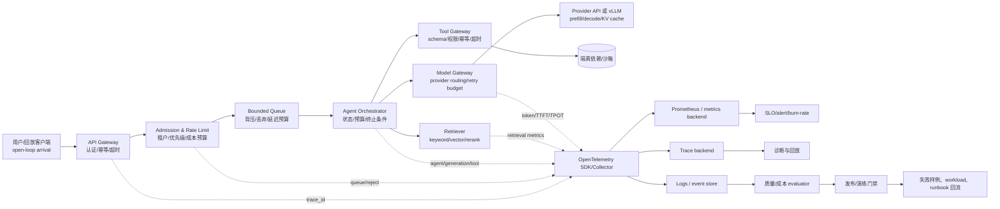

# 30 · 故障注入、稳定性服务建设、AI 服务性能与可观测性

> 研究类型：综合研究（传统 SRE/混沌工程 + K8s 故障注入 + LLM/RAG/Agent 性能、质量、成本与可观测性）  
> 检索日期：2026-08-10（Asia/Shanghai）  
> 来源约束：仅使用官方文档、标准、论文原文、官方 GitHub；没有使用博客转载、论坛或厂商二手解读。  
> 证据边界：文中“官方证据”可直接归因于链接来源；“工程推导”是将多份证据组合成实施方案；本地夹具只证明夹具与门禁行为，不证明生产容量。

## 研究结论

稳定性服务不应被建成“多跑几次 QPS 压测”。可复用的最小闭环是：

```text
定义用户任务的正常状态
        ↓
固定 workload / 版本 / SLO / 安全边界
        ↓
在最小 blast radius 内注入一个真实故障变量
        ↓
用任务、流式、模型、工具、队列、基础设施五层证据观测
        ↓
判定：质量、延迟、成本、容量、恢复是否仍在门内
        ↓
限流/降级/回滚/修复，再复测并把线上失败回流为回归样例
```

AI 服务必须同时维护四个分母：`admitted user tasks`、HTTP/SSE 请求、模型 generation、tool call。只看 HTTP 成功率会漏掉“最终回答错但 HTTP 200”“工具越权后文本看似正确”“模型调用成功但任务超时”和“重试把一次任务放大为几十次调用”。核心发布指标应是带质量、时延、成本和副作用约束的 `good-task rate/goodput`，而不是单一并发数。

## Request Type

Current best-practice research + implementation reference lookup + context/history lookup。下文以当前官方文档为基线；不把快速变化的 provider API、OpenTelemetry GenAI 语义约定或工具版本写成永久稳定接口。

## 1. 统一概念与证据等级

### 1.1 官方证据

- [Google SRE：Service Level Objectives](https://sre.google/sre-book/service-level-objectives/) 定义 SLI、SLO、SLA，并强调用真正重要、可测量的服务行为管理服务。
- [Google SRE：Monitoring Distributed Systems](https://sre.google/sre-book/monitoring-distributed-systems/) 定义四个 Golden Signals：latency、traffic、errors、saturation；建议区分成功请求与失败请求的延迟，也要关注尾部延迟。
- [Google SRE：Addressing Cascading Failures](https://sre.google/sre-book/addressing-cascading-failures/) 将过载、队列、deadline、重试、自动扩容和跨集群转移视为可能形成正反馈的系统性问题。
- [Principles of Chaos Engineering](https://principlesofchaos.org/) 规定 steady state → hypothesis → real-world variable → 尝试证伪的实验骨架，并要求最小化 blast radius、持续自动化。
- [Kubernetes：Disruptions](https://kubernetes.io/docs/concepts/workloads/pods/disruptions/) 区分 voluntary/involuntary disruption，并说明 PDB 只约束符合 Eviction API 的自愿驱逐，不等于防护所有删除、节点故障或资源耗尽。

### 1.2 研究与工程推导

- SRE 的 Golden Signals 是用户可感知的服务健康基线，不足以表达 RAG 答案是否有依据、Agent 是否调用了正确工具；AI 需要在其上加质量、轨迹和成本层。
- “任务成功”必须是业务 oracle，而不是 `HTTP 2xx` 或模型返回 `finish_reason=stop`。任务级成功应由可重放的期望终态、允许的工具集合、权限与副作用规则共同决定。
- 阈值不是通用常数。先用 workload slice 和现有 SLO 校准，再将阈值固化为版本化 gate；示例中的数字只用于实验教学。

### 1.3 未知 / 不应过度声称

- 没有一个跨 provider、跨模型、跨 Agent 框架的统一 TTFT/TPOT、质量或成本阈值。
- OpenTelemetry GenAI 语义约定仍处于演进状态；不能把当前字段当作所有 instrumentation 的稳定兼容契约。
- 单一压测环境、单一 prompt、平均 token 长度、单一并发数都不能证明生产容量。

## 2. 建议架构：稳定性服务与 AI 观测分层



### 架构决策建议

1. **入口先保护**：在 gateway/admission 层做身份、租户、优先级、请求大小、deadline、幂等键、最大 token 预算和总成本预算。不要让每一层都独立 retry。
2. **队列必须有界**：队列长度和等待时间属于用户延迟预算，不是“越大越稳定”。队列满时快速拒绝、降级或转异步；无限队列会把过载变成长时间尾延迟与内存风险。
3. **Agent 以任务为 root span**：generation、retrieval、tool、handoff、retry、state mutation 是子 span；并行子调用计算 wall-clock critical path，不能简单相加所有子 span。
4. **指标低基数，Trace 承载细节**：不要把 user id、完整 prompt、原始 tool arguments 放进高频 metric label。OpenTelemetry 明确指出高基数属性会增加聚合内存成本；敏感内容默认脱敏、采样或只存哈希/引用。
5. **数据面与控制面分离**：演练控制器、故障恢复与观测管道不能依赖被注入的同一条数据面路径；例如 Chaos Mesh 官方文档要求 NetworkChaos 注入期间 Controller Manager 与 Chaos Daemon 保持连通，否则可能无法恢复。

## 3. 指标字典

每个指标必须写清：`name / definition / numerator-denominator / unit / dimensions / source / action / caveat`。下表是课程与服务的最小字典；`local` 表示业务自定义，不是标准字段。

### 3.1 服务与容量层

| 指标 | 定义与分母 | 建议维度 | 来源/性质 | 触发动作与误用警告 |
|---|---|---|---|---|
| `admitted_task_rate` | 单位时间进入系统且未被入口拒绝的任务数 | task type、tenant、priority | local | 与 arrival-rate 压测配对；不能用完成率代替到达率 |
| `task_success_rate` | 通过业务 oracle 的任务 / admitted tasks | task type、model/prompt/KB/tool version | local | 质量 SLI；不能由 HTTP 2xx 推断 |
| `good_task_rate` | 同时满足正确性、允许终态、SLO latency、cost、policy 的任务 / admitted tasks | slice、release、fault | local synthesis | 核心发布门禁；阈值必须由业务定义 |
| `goodput` | 单位时间内完成且满足 good-task 条件的任务数 | workload slice、fault state | local synthesis | 与 arrival rate、SLO 一起报告；不是简单 token throughput |
| `request_rate` | HTTP 请求数 / 时间 | route、status、stream/non-stream | Golden Signal | 不能作为 Agent 容量分母 |
| `error_rate` | 失败请求 / 总请求；同时保留隐式错误（200 但答案错） | error class、dependency、route | Google SRE + local | 分离 client/permanent/retryable/overload |
| `latency` | admitted 到用户可用结果的时间分布 | success/error、route、slice | Golden Signal | 至少 p50/p95/p99 与超时率；均值会隐藏尾部 |
| `queue_wait` | admitted 到 worker/模型调度开始 | queue、priority、model | local; vLLM has queue interval | 先查排队再查模型；大队列不应被 timeout 掩盖 |
| `active_concurrency` | 当前执行中的任务/请求 | route、worker、tenant | local | 与 arrival-rate 联用；闭环 VU 会因慢而自动降到较低到达率 |
| `saturation` | 最受约束资源的占用/容量，如 CPU、GPU、显存、连接、队列、限额 | node、pod、model、pool | Google SRE | 监控“接近饱和”而非等到 100%；资源不同不能平均化 |
| `load_shed_rate` | 被有意拒绝/降级的任务 / admitted attempts | reason、priority | local | 低优先级先降级；不能把 shed 当“服务健康” |
| `retry_amplification` | 所有尝试次数 / 首次尝试次数 | layer、dependency、error class | local + Google SRE | 超过预算先停 retry loop；不要多层相乘 |
| `call_amplification` | model + tool + retrieval calls / admitted tasks | task type、agent version | local | 识别 Agent 分支/循环放大；不等于成功率 |
| `duplicate_side_effect_rate` | 同一幂等业务动作重复提交数 / 业务动作 | tool、idempotency key | local | 写操作必须有幂等与去重证据 |

### 3.2 LLM 与流式接口层

| 指标 | 定义 | 说明 |
|---|---|---|
| `TTFB/TTFO` | 从客户端发起/服务收到请求到首个可观察字节/首个输出事件 | 传输层与模型层不要混称；provider 文档可能只提供流事件，不定义 TTFB |
| `TTFT` | 从统一 arrival timestamp 到第一个输出 token 的时间 | vLLM 将其作为 histogram；需记录 timestamp 起点，不能跨客户端/服务端起点直接比较 |
| `queue_time` | arrival 到调度/执行开始 | 反映 admission、队列、scheduler，不是模型 decode 速度 |
| `prefill_time` | 调度到完成输入处理/首 token 前的计算区间 | 与输入 token 数、KV cache、批处理有关 |
| `TPOT/ITL` | 相邻输出 token 间隔；常用平均/分位数 | vLLM 文档将 inter-token latency 作为 TPOT；要报告 token 长度和是否包含最后 token |
| `E2E latency` | arrival 到最后一个 token/最终可用结果 | streaming 的“最后 token”与 UI 完成可能不同，需定义终止事件 |
| `stream_completion_rate` | 正常收到终止事件的流 / 已建立流 | 单独统计 mid-stream disconnect、client cancel、provider error |
| `stream_gap_p95` | 相邻 chunk/event 的间隔分位数 | 识别 decode 抖动、代理缓冲或网络问题；不是 TPOT 的替代品 |
| `output_tokens_per_second` | 输出 token / decode wall-clock | 与 TPOT 互为近似倒数但不应在不同 token 计数规则下硬换算 |
| `input_tokens/output_tokens` | provider 返回或本地 tokenizer 计算的 token 数 | 明确 tokenizer/model/version；本地估算不能当 billing truth |
| `prompt_cache_hit_rate` | 命中缓存请求 / 可缓存请求 | provider 语义、计费和缓存 TTL 版本化记录 |
| `cost_per_request` | 输入 token、输出 token、缓存 token、工具/检索/基础设施成本之和 | 价格表与 currency/version 必须进入 run manifest |
| `cost_per_success` | 总成本 / 成功任务数 | 比“每次调用成本”更接近业务决策；重试与工具成本必须归属原任务 |

OpenAI 当前流式文档规定 Responses API `stream=true` 通过 SSE 增量传递；Anthropic 流式文档规定事件有命名类型、可能出现 `ping` 和流中 `error`，并要求未知事件优雅处理。因此客户端验收必须检查：事件 parser、顺序、未知事件、错误事件、取消、断线、重复重连和最终 usage，而不仅是“收到了文本”。

### 3.3 RAG 质量层

| 指标 | 定义/用途 | 证据边界 |
|---|---|---|
| `Recall@k` / context recall | gold relevant passages 中被 top-k 找到的比例 | 需要标注 relevant passages；不能只看向量相似度 |
| `Precision@k` / context precision | top-k 中 relevant passages 的比例 | 召回足够但噪声过多会损害生成；按 query slice 统计 |
| `MRR@k` | 第一个 relevant passage 排名倒数的平均 | 适合“首个正确证据出现得多早” |
| `nDCG@k` | 按相关性等级折损的排序质量 | 对多相关度等级、长 tail 检索更有信息 |
| `context_relevance` | 上下文与问题是否相关 | ARES/RAGAS 论文使用该维度；judge 需人工校准 |
| `faithfulness/groundedness` | 回答陈述能否由检索上下文支持 | 不能等同于事实正确；上下文本身错误时仍可能“忠实地错” |
| `answer_relevance` | 回答是否真正回应问题 | 与 correctness 分开，避免流畅但答非所问 |
| `citation_coverage` | 可验证回答陈述中有支持引用的比例 | 自定义 metric；定义 citation 粒度和“支持”规则 |
| `abstention_quality` | 无证据时正确拒答，且有证据时不误拒 | 分成 false answer、false abstain、supported answer |
| `RAG task correctness` | 端到端业务答案通过 reference/oracle 的任务比例 | 不能由任一检索指标推断 |

RAGAS 论文提出将检索上下文、忠实性和生成质量分层；ARES 论文以 context relevance、answer faithfulness、answer relevance 为主要维度；BEIR 论文说明跨数据集 zero-shot 检索必须进行异质数据集评估。工程上应保留检索层、上下文层、生成层和最终任务层四份结果，不把一个 judge 总分当根因。

### 3.4 Agent 与工具层

| 指标 | 定义 | 必须保留的字段 |
|---|---|---|
| `tool_selection_accuracy` | 轨迹中选择的工具是否属于任务允许集合且完成预期动作 | expected tool set、actual tool、step |
| `tool_argument_validity` | 参数是否通过 schema、业务约束、权限和幂等检查 | schema version、validation result |
| `tool_success_rate` | 成功工具调用 / 工具调用尝试 | status class、timeout、retry attempt |
| `tool_latency` | tool span 的 queue、network、server、result parse 分解 | dependency、operation |
| `step_success` | 单步动作是否满足 step oracle | expected state、observed state |
| `trajectory_success` | 完整轨迹是否没有越权、循环、非法副作用并到达允许终态 | trace id、policy result |
| `final_answer_correctness` | 最终结果是否正确 | reference/oracle、grader version |
| `loop_rate` | 超过最大步数、重复状态或重复 tool-call 的任务比例 | loop detector version |
| `handoff_rate` | 发生 Agent handoff 的任务比例 | agent version、handoff target |
| `tool_fanout` | 每个任务工具调用数及 p95 | task_id、parallel/sequential |
| `side_effect_safety` | 高风险写操作通过审批/权限/幂等约束的比例 | policy version、approval id |
| `termination_reason` | completed、timeout、budget_exceeded、policy_blocked、dependency_failed 等 | terminal state enum |

OpenAI Agents SDK 官方 GitHub 文档说明默认 trace 可包含 agent、generation、function tool、guardrail、handoff 等 span；这证明了“轨迹可观察”的接口能力，不证明任何 Agent 的业务正确性。最终结果、单步工具与完整轨迹必须分别评分。

## 4. 故障模型与注入目录

### 4.1 传统 SRE / K8s

| 层 | 故障变量 | 主要假设 | 关键观测 | 最小 blast radius |
|---|---|---|---|---|
| Pod | kill、failure、container kill、readiness/liveness 失配 | 副本、探针、优雅退出能恢复 | PDB、可用副本、重启、任务错误、恢复时间 | 一个非关键 Pod、staging namespace |
| Network | delay、jitter、loss、reorder、partition、bandwidth | timeout、重试、降级、连接池有界 | RTT、连接、timeout、retry、queue、流 gap | 单 workload label、单方向 |
| Resource | CPU/memory stress、GPU/显存压力、disk/inode | 限额、调度、eviction、backpressure 生效 | saturation、eviction、OOM、queue、p99 | 一个 pod 或专用节点 |
| Storage | I/O delay、error、容量/inode 逼近 | timeout、fallback、缓存、数据完整性 | I/O latency/error、cache、read/write correctness | 测试卷/临时挂载 |
| DNS/time | DNS timeout/错误、时钟偏移 | 依赖发现、签名、TTL、deadline 不失控 | lookup、cache、TLS、deadline、错误分类 | 隔离命名空间/进程 |
| Control plane | API 429/5xx/slow、scheduler delay | controller 重试有界、PDB/rollout 可恢复 | API error、workqueue、pending、reconcile latency | 非生产集群 |

Kubernetes 官方文档明确：node-pressure eviction 不同于 API-initiated eviction，kubelet 在资源压力驱逐时不遵守 PDB 或 `terminationGracePeriodSeconds`。这类差异必须成为验收实验，而不是把所有 Pod 消失都归为“PDB 保护”。

Chaos Mesh 当前官方文档显示版本 `2.8.3`，PodChaos 支持 pod failure、pod kill、container kill；NetworkChaos 支持 partition、延迟/丢包/乱序等 netem 和带宽限制。故障实验应以官方当前版本文档为准，不直接复制 `next` 版配置。

### 4.2 AI 服务特有故障

| 故障 | 注入方式 | 预期保护 |
|---|---|---|
| provider 429 / quota | mock gateway 或受控 sandbox 返回 429 + Retry-After | 单层 bounded retry、jitter、retry budget、快速降级 |
| provider 5xx/529 | 返回可重试与不可重试错误的混合流量 | error classification；不重试 billing、schema、权限错误 |
| prefill 慢 | 增大输入 token、关闭/扰动缓存、模型端排队 | TTFT、queue、input-token slice、过载拒绝 |
| decode 慢 | 控制输出长度、故意增加 ITL/TPOT | stream gap、TPOT、E2E、client timeout |
| mid-stream disconnect | 在首 token 后关闭连接 | partial output 不误判完成；重连需幂等/不重复副作用 |
| malformed stream | 打乱未知事件、缺失终止事件、错误事件 | parser graceful handling、terminal state、usage 可用性 |
| retrieval miss/stale/poisoned | 删除 gold chunk、注入冲突 chunk、旧索引 | retrieval metrics、citation/faithfulness、拒答 |
| tool timeout/partial result | 工具超时、5xx、错误 schema、慢响应 | tool timeout、fallback、有限重试、状态补偿 |
| agent loop | 重复 tool、重复状态、handoff 环 | max steps、重复状态检测、budget/policy stop |
| cache miss/stampede | 让同一热点 key 同时失效 | single-flight、TTL jitter、容量保护、成本/延迟 |
| queue overload | 固定 open-loop 到达率超过服务能力 | bounded queue、load shedding、priority、可解释 429/503 |

## 5. 压测与故障注入 SOP

### Gate 0：授权、边界与停止条件

1. 只在隔离环境、canary 或已批准的生产小流量窗口操作；明确 owner、start/end、namespace、selector、最大持续时间和回滚命令。
2. 禁用真实写副作用，或将工具路由到 idempotent sandbox；凭证最小权限；禁止把真实 prompt、token、PII 写入 Trace。
3. 预先写自动停止条件：good-task SLI 越界、错误预算 burn 超阈、队列持续增长、流中断异常、成本预算、观测管道失联、范围 selector 漂移。
4. 先验证观测自身可用：load driver、SUT、metrics、trace、logs、clock、run manifest 均可写且有 `run_id`。

### Gate 1：固定基线

固定以下变量并保存 manifest：

```yaml
run_id: 2026-08-10-baseline-001
sut_version: git-sha-or-image-digest
model: provider/model-and-api-version
prompt_version: prompt-sha
retrieval_index: index-version
tool_schema: schema-version
workload: task-type-mixture-and-token-length-buckets
arrival_model: open-loop-or-closed-loop
rate_or_concurrency: explicit-value
seed: explicit-seed
fault: none
slo: task-success-latency-cost-policy
```

基线至少跑到足够覆盖 p95/p99 的任务数；固定 arrival-rate 时记录 dropped iterations；闭环 VU 只用于用户会话模拟，不能替代 open-loop 容量测试。k6 官方文档区分 VU/closed model 与 arrival-rate/open model，且 arrival-rate 场景会因为可用 VU 不足产生 `dropped_iterations`。

### Gate 2：单变量故障

先做 `one pod kill`、再做单向 network delay/loss、再做 provider/tool 失败。每次只改变一个变量，保留 control group 或相同 baseline run。记录注入开始/结束事件并让它们进入同一 trace/log 时间线。

### Gate 3：比较而非凭印象

报告以下差异：

```text
Δ good_task_rate / Δ task_success_rate
Δ p95/p99(queue, TTFT, TPOT, E2E)
Δ stream_completion_rate / stream_gap_p95
Δ tool_failure / loop / duplicate_side_effect
Δ retry_amplification / call_amplification
Δ cost_per_success / goodput
time_to_detect / time_to_mitigate / time_to_recover
```

### Gate 4：回滚与复测

执行 provider fault 清理、`kubectl delete -f experiment.yaml`、恢复限流/路由/缓存和 sandbox 数据；确认 control 指标回归。修复后重新跑完全相同 manifest，再额外跑一个未见过的 task slice，防止只对单一 fixture 过拟合。

## 6. 可运行脚本清单

### 6.1 已存在、已留有本地执行证据的离线夹具

以下是项目已有的确定性、无外部 API key 的教学夹具；它只能证明门禁能从 baseline `PASS` 变 mutation `FAIL` 再变 repair `PASS`，不能外推生产性能。

```bash
cd /Volumes/MACSSD/owen-home/Documents/Codex/2026-08-07/ai-1-2-skill-3-ai-2/outputs/test-development-ai-v2/courses/td-ai-010-agent-load-stability

python3 lab/agent_load_lab.py \
  --config lab/configs/baseline.json \
  --output evidence/baseline

python3 lab/agent_load_lab.py \
  --config lab/configs/retry-storm.json \
  --output evidence/retry-storm

python3 lab/agent_load_lab.py \
  --config lab/configs/repaired.json \
  --output evidence/repaired
```

预期退出码为 `0 → 1 → 0`；报告检查 `task_success_rate`、`queue_p95_ms`、`e2e_p95_ms`、`retry_amplification`、`cost_per_success`。它是本地 fixture evidence，不是官方性能基准，也不是生产容量证明。

### 6.2 SSE 流式最小探针

对已授权的兼容 SSE endpoint，使用 `-N` 保持未缓冲，并记录首字节/总时长；不要把输出内容写进共享日志。

```bash
curl -N --http1.1 \
  -H 'Accept: text/event-stream' \
  -H 'Content-Type: application/json' \
  -H "Authorization: Bearer ${API_KEY}" \
  --data @request.json \
  -w '\nhttp=%{http_code} connect=%{time_connect}s starttransfer=%{time_starttransfer}s total=%{time_total}s\n' \
  'https://AUTHORIZED-ENDPOINT/v1/responses'
```

验收脚本应另外解析 `event`/`data`、未知事件、错误事件、终止事件、断线和 usage；`curl` 本身不能证明 token 级 TTFT/TPOT。

### 6.3 Kubernetes + Chaos Mesh 最小实验

先确认 selector 只命中演练 deployment，再 apply；实验文件来自 Chaos Mesh 官方 PodChaos/NetworkChaos 语义，生产使用前必须按当前版本校验 CRD。

```bash
kubectl -n demo get pods -l app=ai-gateway
kubectl -n demo get pdb,deploy,svc -l app=ai-gateway
kubectl apply --dry-run=server -f pod-failure.yaml
kubectl apply -f pod-failure.yaml
kubectl -n demo get pods -l app=ai-gateway -w
kubectl get podchaos,networkchaos -A
kubectl delete -f pod-failure.yaml
```

`pod-failure.yaml` 的最小形状：

```yaml
apiVersion: chaos-mesh.org/v1alpha1
kind: PodChaos
metadata:
  name: ai-gateway-pod-failure
  namespace: chaos-mesh
spec:
  action: pod-failure
  mode: one
  duration: 30s
  selector:
    namespaces: [demo]
    labelSelectors:
      app: ai-gateway
```

单向延迟实验的关键字段：

```yaml
apiVersion: chaos-mesh.org/v1alpha1
kind: NetworkChaos
metadata:
  name: model-egress-delay
  namespace: chaos-mesh
spec:
  action: delay
  mode: one
  selector:
    namespaces: [demo]
    labelSelectors: {app: ai-gateway}
  delay: {latency: 100ms, correlation: '100', jitter: 20ms}
  direction: to
  externalTargets: ['MODEL_ENDPOINT_HOST']
```

### 6.4 k6 open-loop arrival-rate

```javascript
import http from 'k6/http';
import { check } from 'k6';

export const options = {
  scenarios: {
    task_arrivals: {
      executor: 'ramping-arrival-rate',
      startRate: 1,
      timeUnit: '1s',
      preAllocatedVUs: 20,
      maxVUs: 200,
      stages: [
        { target: 5, duration: '2m' },
        { target: 10, duration: '5m' },
        { target: 5, duration: '2m' },
      ],
    },
  },
};

export default function () {
  const res = http.post(__ENV.SUT_URL, JSON.stringify({
    task_type: __ENV.TASK_TYPE || 'qa',
    fixture_id: __ENV.FIXTURE_ID || 'safe-001',
    run_id: __ENV.RUN_ID,
  }), { headers: { 'Content-Type': 'application/json' } });
  check(res, {'admitted response': (r) => [200, 202, 429, 503].includes(r.status)});
}
```

这个脚本只产生入口负载；业务成功、工具轨迹、token、成本与 trace completeness 必须由 SUT evaluator 另行判定。

### 6.5 工具清单（职责 + 一手入口）

| 工具/项目 | 适合做什么 | 不应据此推断什么 | 一手入口 |
|---|---|---|---|
| Kubernetes `kubectl`/API | rollout、eviction、资源和控制面状态 | 不等于故障注入器；删除 Pod 不等于真实节点故障 |
| Chaos Mesh 2.8.3 | Pod、网络及其官方实验类型 | 文档能力不证明目标服务恢复；selector/权限需自验 | [官方文档](https://chaos-mesh.org/docs/) · [官方 GitHub](https://github.com/chaos-mesh/chaos-mesh) |
| k6 | open/closed workload、arrival rate、threshold | 不提供 Agent 业务 oracle 或质量评测 | [官方 scenarios](https://grafana.com/docs/k6/latest/using-k6/scenarios/) · [官方 GitHub](https://github.com/grafana/k6) |
| Prometheus | counter、gauge、histogram、PromQL、SLO burn rate | summary quantile 不能跨实例正确聚合；直方图 bucket 需按 SLO 设计 | [Histograms](https://prometheus.io/docs/practices/histograms/) |
| OpenTelemetry SDK/Collector | trace、metric、log、context、OTLP 和语义约定 | GenAI semconv 当前仍演进；采集到不等于数据合规 | [Concepts](https://opentelemetry.io/docs/concepts/) · [Collector GitHub](https://github.com/open-telemetry/opentelemetry-collector) |
| Envoy | timeout、circuit breaking、retry budget、upstream 保护 | 默认值不是你的 SLO；多层代理可能重复 retry | [Circuit breaking](https://www.envoyproxy.io/docs/envoy/latest/intro/arch_overview/upstream/circuit_breaking.html) |
| vLLM | 本地推理服务的 queue、TTFT、ITL/TPOT、E2E、token 和 cache metrics | 版本/部署/硬件变化会改变结果；不是 provider API 的通用定义 | [Metrics](https://docs.vllm.ai/en/latest/design/metrics/) · [GitHub](https://github.com/vllm-project/vllm) |
| OpenAI Agents SDK | Agent/generation/tool/handoff/guardrail trace | SDK tracing 不证明业务质量；敏感数据采集需关闭或治理 | [Official GitHub tracing](https://github.com/openai/openai-agents-python/blob/main/docs/tracing.md) |
| Vegeta | HTTP attack/throughput 负载 | 不理解 SSE token、Agent 轨迹或质量 | [官方 GitHub](https://github.com/tsenart/vegeta) |
| Toxiproxy | 在测试环境注入 TCP latency、timeout、断连等 proxy fault | 不能替代 K8s/node/GPU/控制面故障 | [官方 GitHub](https://github.com/Shopify/toxiproxy) |

## 7. 线上监控与告警设计

### 7.1 Dashboard 分层

1. **用户层**：good-task rate、正确性/拒答、p50/p95/p99 E2E、流完成率、超时、降级、租户/优先级。
2. **服务层**：traffic、errors、latency、saturation、queue depth/wait、admission reject、connection pool。
3. **模型层**：input/output token、TTFT、prefill、TPOT/ITL、E2E、running/waiting/swapped、KV cache、provider 429/5xx。
4. **RAG 层**：retrieval recall/precision、top-k、index freshness、empty result、context size、faithfulness、citation coverage。
5. **Agent 层**：step count、tool fanout、tool error/timeout、retry/call amplification、loop、handoff、terminal state、duplicate side effect、cost per success。
6. **演练层**：experiment id、target selector、fault start/end、blast radius、detected/mitigated/recovered timestamps。

### 7.2 Alert 优先级

- Page：用户 good-task SLI 快速消耗 error budget，且短窗口和长窗口同时满足；Google SRE Workbook 给出 multi-window/multi-burn-rate 作为起点，并明确参数需要按服务校准。
- Ticket：低速但持续的预算消耗、索引新鲜度下降、成本漂移、观测丢失、容量预测风险。
- Dashboard only：单一模型 TTFT、单个工具慢、单个 Pod CPU 高等诊断信号，除非已有明确用户动作和 owner。

推荐的起始模板不是 universal threshold，而是引用 [Google SRE multi-window/multi-burn-rate guidance](https://sre.google/workbook/alerting-on-slos/) 后按业务 SLO 重新计算：短窗口检测“正在烧预算”，长窗口防止只看瞬时尖峰或只看低流量噪声。

## 8. 重试、队列、限流、缓存的稳定性规则

### 重试

1. 只对明确的 transient、幂等操作重试；永久错误、鉴权、schema、quota/billing 不重试。
2. 遵守服务端 `Retry-After`；没有有效值时使用 exponential backoff + jitter；限制 attempts 和 total retry time。OpenAI 当前限流文档还特别提醒：失败请求会计入 per-minute limit，持续重发不会解决问题。
3. 只在一层拥有主要 retry 责任；上层收到“不要重试”的明确错误后应停止。Google SRE 给出的深层系统例子说明：多层各重试 3 次会形成乘法放大，而不是加法。
4. 设置 per-request、per-tenant、per-process、per-dependency retry budget，预算耗尽则快速失败/降级。
5. 写工具必须带 idempotency key、去重记录或补偿事务；mid-stream 重连不能自动重复副作用。

### 队列与限流

- 用 open-loop arrival-rate 找到真实过载点；用 closed-loop 观察交互会话体验，两者结果分开报告。
- 队列上限以“可接受 queue wait + 内存/连接上限”反推；满队列快速拒绝或降级，而不是无限堆积。
- 令牌桶/漏桶/并发 semaphore 的选择依赖“速率上限”还是“并行资源上限”；模型服务通常两者都需要：token budget + in-flight limit。
- 优先级队列要证明低优先级被 shed 后高优先级仍满足 SLO，并监控 starvation。

### 缓存

- 分离 exact response cache、prompt/prefix/KV cache、embedding/retrieval cache、tool result cache；每类记录命中、失效、TTL、数据新鲜度和安全边界。
- 避免同一热点 key 同时失效造成 cache stampede：single-flight、TTL jitter、过期值短暂服务、预热和请求合并都要做故障实验。
- 缓存命中提升速度不等于质量提升；RAG 缓存必须在 trace 中记录 index/version、retrieval timestamp 和 cache key hash。

## 9. 诊断决策树

```text
用户“变慢/答错/变贵”
  ├─ admitted task rate 是否变化？
  │    ├─ 是：先按 workload slice 分开；检查流量、token、tool fan-out、cache state
  │    └─ 否：继续
  ├─ HTTP/SSE 是否建立？
  │    ├─ 否：查 gateway/admission/connection/rate limit/queue
  │    └─ 是：
  ├─ 首字节/首 token 慢？
  │    ├─ 是：查 queue_wait → prefill/input tokens → provider 429/retry → cache/KV → network
  │    └─ 否：
  ├─ chunk 间隔或 TPOT 慢？
  │    ├─ 是：查 decode/ITL、batching、GPU saturation、preemption、网络缓冲/背压
  │    └─ 否：
  ├─ 最终结果晚/断流？
  │    ├─ 是：查 tool/retrieval latency、stream error/unknown event、client cancel、deadline
  │    └─ 否：
  ├─ HTTP 成功但任务失败？
  │    ├─ RAG：检索 recall/precision → context relevance → faithfulness/citation → answer oracle
  │    ├─ Agent：tool selection → args/schema/policy → tool result → loop/handoff → terminal state
  │    └─ 数据/业务：model/prompt/index/tool schema 版本、fixture、judge drift
  ├─ 成本变高？
  │    ├─ input/output tokens 上升？
  │    ├─ retry/call/tool fan-out 上升？
  │    ├─ cache miss 或模型路由变化？
  │    └─ 成功率下降导致 cost_per_success 上升？
  └─ 重试率上升？
       ├─ 只一层依赖错误：bounded retry + jitter + retry budget
       ├─ 多层同时重试：停止上层 retry，保留单一责任层
       └─ 队列/连接/CPU 继续涨：先 load shed / 降级 / 断开反馈环，再做根因复现
```

诊断报告固定四列：`symptom → hypothesis → confirming evidence → disconfirming evidence / controlled rerun`。相关性只用于缩小候选，不能直接写成根因。

## 10. 验收实验集

每个实验都必须保存 `manifest.json`、原始 metric、Trace、注入事件、评测结果、阈值版本和结论。

| ID | 实验 | 红色条件 | 修复后绿色条件 | 证明范围 |
|---|---|---|---|---|
| E1 | 固定 workload baseline | 基线本身失败则停止后续实验 | task/stream/quality/cost/observability 全有基线 | 夹具与服务基线可回放 |
| E2 | provider 429 + 多层 retry storm | retry/call amplification、queue 或 goodput 越界，即使最终成功率尚可也必须红 | 单责任层、Retry-After、jitter、budget 后恢复 | 验证反馈环控制，不证明 provider 容量 |
| E3 | 一个非关键 Pod kill | PDB/副本/路由未达到预期，任务质量或恢复时间越界 | 替换副本、流量转移、good-task SLO 恢复 | Pod disruption resilience |
| E4 | 单向模型出口 delay/loss/partition | timeout 未分类、无限排队、重复副作用、流中错误未终止 | 有界 timeout、降级/拒绝、可解释 terminal state | 网络依赖保护 |
| E5 | stream 首 token 后断线/未知 event | partial answer 被当完成、重连重复工具动作、parser 崩溃 | graceful unknown/error handling、幂等重连、usage/terminal 可追踪 | SSE 客户端契约 |
| E6 | 删除 gold chunk + 注入冲突 chunk | retrieval/citation/faithfulness/abstention 门禁未红 | 检索或拒答修复后分层指标恢复 | RAG 质量根因分离 |
| E7 | tool timeout、错参、重复状态 | 轨迹 scorer 仍绿、越权/循环/重复写入 | schema/policy/idempotency/step budget 阻断 | Agent 中间态与副作用 |
| E8 | 输入/输出 token、cache、fan-out 漂移 | cost_per_success 或 TTFT/TPOT 超限但总 QPS 看不出 | 路由、截断、缓存或预算修复 | 性能-成本联合门禁 |
| E9 | OTel collector/metrics 部分失联 | 用户服务看似绿但 trace/metric completeness 低 | 观测有降级策略且丢失显式告警 | “不可观测”本身是稳定性故障 |
| E10 | open-loop 阶梯 + soak | 到达率超过 sustainable goodput 后 queue 无界或错误预算烧尽 | admission/load shed/priority 后高优先级仍满足 SLO | 容量边界与过载行为 |

### 建议验收断言

```text
1. 每个 admitted task 都有 task_id、run_id、trace_id 和终态。
2. 每个 model/tool/retrieval attempt 都能归属 task，且 attempt/retry 数可重算。
3. 每个流都有 start、first-event/first-token、chunk gaps、terminal/error/cancel 之一。
4. 每个失败都能区分 permanent、transient、overload、policy、unknown；unknown 不得自动重试。
5. 质量失败、延迟失败、成本失败和安全/副作用失败可独立使 gate 变红。
6. 故障停止后，SLO、队列、连接、retry 和观测管道在规定恢复窗口内回落。
7. 修复复测必须使用相同 manifest，并增加至少一个未见过的 slice。
```

## 11. 来源与版本证据

### Official Docs / Standards

- [Google SRE SLO](https://sre.google/sre-book/service-level-objectives/) — SLI/SLO/SLA 与服务行为。
- [Google SRE Monitoring](https://sre.google/sre-book/monitoring-distributed-systems/) — Golden Signals、尾延迟、黑盒/白盒监控。
- [Google SRE Handling Overload](https://sre.google/sre-book/handling-overload/) — load shedding、资源容量而非只看 QPS、过载错误。
- [Google SRE Addressing Cascading Failures](https://sre.google/sre-book/addressing-cascading-failures/) — 队列、deadline、重试风暴、retry budget、指数退避+jitter。
- [Google SRE Service Best Practices](https://sre.google/sre-book/service-best-practices/) — 压测容量、降级、排队、动态超时。
- [Google SRE Alerting on SLOs](https://sre.google/workbook/alerting-on-slos/) — burn rate、multi-window/multi-burn-rate。
- [Principles of Chaos Engineering](https://principlesofchaos.org/) — steady state hypothesis、真实变量、持续自动化、blast radius。
- [Kubernetes Disruptions](https://kubernetes.io/docs/concepts/workloads/pods/disruptions/) — PDB、voluntary/involuntary disruption、Eviction API。
- [Kubernetes Node-pressure Eviction](https://kubernetes.io/docs/concepts/scheduling-eviction/node-pressure-eviction/) — 资源压力驱逐与 PDB/termination grace 的边界。
- [Chaos Mesh Pod Faults](https://chaos-mesh.org/docs/simulate-pod-chaos-on-kubernetes/) — 当前页面标注版本 2.8.3；PodChaos 类型与 YAML。
- [Chaos Mesh Network Faults](https://chaos-mesh.org/docs/simulate-network-chaos-on-kubernetes/) — NetworkChaos 的 partition、delay、loss、bandwidth 等。
- [OpenAI Streaming Responses](https://developers.openai.com/api/docs/guides/streaming-responses) — Responses API `stream=true`、SSE 增量事件。
- [OpenAI Rate Limits](https://developers.openai.com/api/docs/guides/rate-limits) — 429、Retry-After、指数退避、jitter、bounded retries。
- [OpenAI Function Calling](https://developers.openai.com/api/docs/guides/function-calling) — tool call 结构、参数累计与执行回传。
- [Anthropic Streaming](https://platform.claude.com/docs/en/build-with-claude/streaming) — named event、ping、stream error、未知事件处理。
- [WHATWG HTML Server-sent events](https://html.spec.whatwg.org/dev/server-sent-events.html) — `text/event-stream` 与 EventSource/SSE 规范；页面 2026-07-16 更新。
- [vLLM Metrics](https://docs.vllm.ai/en/latest/design/metrics/) — TTFT、inter-token latency/TPOT、E2E、queue/running/waiting、token/cache 指标。
- [OpenTelemetry Signals](https://opentelemetry.io/docs/concepts/signals/) — traces、metrics、logs、baggage 与 profiles 的信号边界。
- [OpenTelemetry Metrics](https://opentelemetry.io/docs/concepts/signals/metrics/) — histogram、聚合、cardinality limit。
- [OpenTelemetry Context/Propagators](https://opentelemetry.io/docs/specs/otel/context/api-propagators/) — 跨边界传播 trace/baggage 的 API 契约。
- [OpenTelemetry GenAI Semantic Conventions](https://opentelemetry.io/docs/specs/semconv/gen-ai/) — 当前 GenAI 约定迁移/演进中的页面，不应当作稳定跨厂商 schema。
- [W3C Trace Context](https://www.w3.org/TR/trace-context/) — HTTP trace context propagation Recommendation，2021-11-23。
- [Prometheus Histograms and Summaries](https://prometheus.io/docs/practices/histograms/) — histogram 可聚合，summary quantile 一般不可跨实例聚合。
- [Grafana k6 Scenarios](https://grafana.com/docs/k6/latest/using-k6/scenarios/) — VU/closed 与 arrival-rate/open workload 模型。
- [Envoy Circuit Breaking](https://www.envoyproxy.io/docs/envoy/latest/intro/arch_overview/upstream/circuit_breaking.html) — max requests/pending/retries 与 retry budget。
- [AWS Well-Architected: Control and limit retry calls](https://docs.aws.amazon.com/wellarchitected/latest/framework/rel_mitigate_interaction_failure_limit_retries.html) — 有界重试、backoff、jitter 与队列风险。

### Source-reference Evidence: papers and official GitHub

- [Lewis et al., Retrieval-Augmented Generation for Knowledge-Intensive NLP Tasks](https://arxiv.org/abs/2005.11401) — RAG 体系与知识密集型任务实验。
- [Es et al., RAGAS](https://arxiv.org/abs/2309.15217) — context、faithfulness、generation quality 的分层评测思路。
- [Saad-Falcon et al., ARES](https://arxiv.org/abs/2311.09476) — context relevance、answer faithfulness、answer relevance 与人工校准。
- [Thakur et al., BEIR](https://arxiv.org/abs/2104.08663) — 异质数据集的 zero-shot retrieval 评估、nDCG 等排序评估。
- [Yao et al., ReAct](https://arxiv.org/abs/2210.03629) — reasoning/action 交错、工具交互与轨迹。
- [Liu et al., AgentBench](https://arxiv.org/abs/2308.03688) — 多环境、多轮 Agent 评测与失败类型。
- [OpenAI Agents SDK tracing](https://github.com/openai/openai-agents-python/blob/main/docs/tracing.md) — workflow、generation、function、guardrail、handoff span 能力。
- [Chaos Mesh official GitHub](https://github.com/chaos-mesh/chaos-mesh) — 实验控制器和 CRD 的上游实现。
- [OpenTelemetry Collector official GitHub](https://github.com/open-telemetry/opentelemetry-collector) — telemetry pipeline 组件实现。
- [vLLM official GitHub](https://github.com/vllm-project/vllm) — 推理服务与 metrics 实现来源。
- [k6 official GitHub](https://github.com/grafana/k6) — 负载生成器实现与版本历史。
- [Vegeta official GitHub](https://github.com/tsenart/vegeta) — HTTP attack/load 工具实现。
- [Toxiproxy official GitHub](https://github.com/Shopify/toxiproxy) — TCP proxy fault injection 实现。

## Version Note

- 本文按 2026-08-10 可访问页面检索；provider 文档已从旧 `platform.openai.com/docs` 跳转到 `developers.openai.com`，使用时应锁定 API、model、SDK 和响应 schema 版本。
- Kubernetes 页面是滚动文档；PDB、node-pressure eviction、scheduler 行为需按目标 Kubernetes minor version 与发行版校验。
- Chaos Mesh 页面当前标注 `2.8.3`；不要把 `next` 页面配置无验证地用于生产。
- OpenTelemetry core specification 页面当前显示 `1.59.0`，一般 semantic conventions 页面显示 `1.43.0`；GenAI 语义约定已迁移并仍在发展中，实施时记录 semconv 版本与 stability level。
- vLLM latest metrics 页面是滚动文档；指标名称、前缀、统计起点和 runtime flags 应从实际镜像对应 tag 复核。
- Anthropic 文档明确未来可能加入事件类型；SSE parser 必须对未知事件保持向前兼容。

## Caveats / Ambiguity Flags

- “TPOT”和“ITL”在不同工具里可能指相邻 token 间隔、平均 decode 间隔或某个请求区间；以实际工具定义和 timestamp 起点为准，不能只看字段名。
- “TTFT”若一方从客户端 send 开始、另一方从 server tokenization 开始，数值不可直接比较；run manifest 必须声明起点。
- “质量”不是一个标量。RAG 的 retrieval、context、faithfulness、answer relevance、citation 和业务 correctness 可能朝不同方向变化。
- 任何 LLM judge 都可能漂移；关键 slice 必须保留人工标注、确定性规则或 reference-based oracle，并记录 judge/prompt/version。
- 生产混沌实验需要真实流量才有代表性，但生产实验不是默认许可；先在隔离环境证明停止、恢复和回滚，再逐步扩大范围。
- 本文没有给出“所有服务都应达到 X ms / Y%”的硬阈值；这应由业务 SLO、用户任务重要性、成本预算和风险接受共同确定。

## Reusable Takeaway

把 AI 稳定性建设成一个可回放的控制系统：以用户任务为根，以 Golden Signals、TTFT/TPOT/E2E、RAG 分层质量、Agent 轨迹、token/成本、重试/队列/缓存和 Trace 作为证据；用最小 blast radius 的 K8s/依赖故障注入证伪 steady-state 假设；用 bounded retry、有限队列、load shedding、幂等工具和版本化 evaluator 修复；最终只在 baseline → fault red → repair green 且线上 SLO/成本/质量/副作用证据齐全时宣称稳定性门禁成立。
