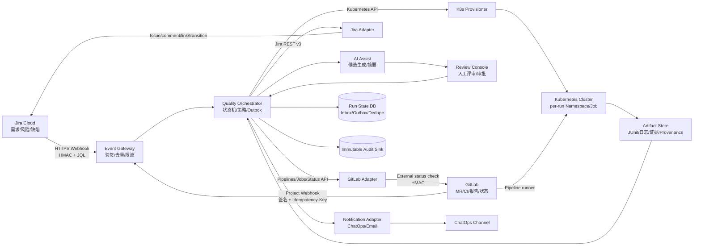
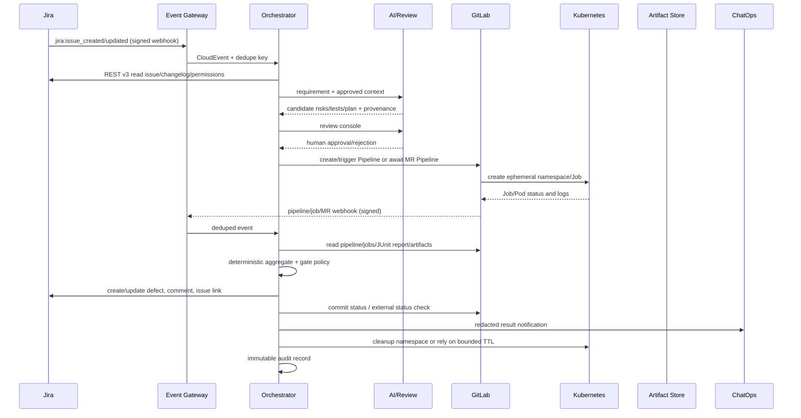

# AI 时代研发测试流程平台：打通 Jira、GitLab、Kubernetes 与通知/Pipeline

> 研究类型：综合研究（官方文档、官方 GitHub、标准）  
> 研究日期：2026-08-10（Asia/Shanghai）  
> 交付状态：核心设计已收敛；脚本为租户参数化模板，需在目标 Jira/GitLab/Kubernetes 集群执行验收实验。  
> 来源约束：只采用 Atlassian Jira、GitLab、Kubernetes 官方文档/官方 GitHub，以及 CloudEvents、OpenAPI、W3C Trace Context、SLSA、RFC 等标准。

## 1. 直接结论

推荐建设一个“质量控制平面”（Quality Control Plane），把 Jira、GitLab、Kubernetes 和 ChatOps 置于适配器之后：

1. Jira 是需求、风险、缺陷和审计查询的业务系统；GitLab 是代码、MR、Pipeline、测试报告和合并门禁的工程系统；Kubernetes 只负责短生命周期的隔离执行环境；通知系统只消费经过脱敏的事件，不成为事实来源。
2. AI 只生成需求解析、技术方案检查项、风险候选、测试用例候选和缺陷摘要；“评审通过”“门禁通过”“缺陷关闭”必须由有权限的人或确定性策略产生。AI 输出必须携带模型、提示词哈希、数据集/规则版本和人工审批证据。
3. 所有跨系统写入都经过统一的事件网关、幂等键、重试/死信队列和审计记录。Webhook 不是事实来源：GitLab/Jira 事件到达后还要用 API 回读状态，定时 reconciliation 负责修复漏事件。
4. 合并门禁采用 GitLab Pipeline 成功 + 外部质量状态检查成功 + 必需审批/线程规则满足的组合。没有 Pipeline 不等于通过；过期 commit 的状态不得覆盖当前 HEAD。
5. 临时环境采用“每次 MR/测试运行一个 namespace”，配合 ResourceQuota、LimitRange（如适用）、NetworkPolicy、命名标签、Job TTL 和 ownerReferences；执行身份不授予 cluster-admin，也不允许默认读取 Secret。

### 1.1 范围与不做事项

覆盖：需求/技术方案解析、风险建模、用例生成与评审、执行、结果聚合、缺陷回写、MR/CI 门禁、Kubernetes 临时环境、ChatOps 通知、审计与权限。

本稿不做具体厂商插件选型，不假设 Jira/GitLab 的版本、部署形态或许可证等级；涉及 GitLab Premium/Ultimate、GitLab.com/Self-Managed/Dedicated 或 Jira Cloud 权限差异时，必须在验收前以目标租户文档和 API 响应复核。

## 2. 参考架构



### 2.1 组件边界

| 组件 | 负责 | 不负责 |
|---|---|---|
| Event Gateway | HTTPS 接入、签名验证、时间窗、防重放、快速 2xx、事件入队 | 直接修改 Jira、批准 MR、删除 namespace |
| Quality Orchestrator | 关联 `jira_issue_key/project_id/mr_iid/commit_sha/run_id`，驱动状态机、策略和补偿 | 代理用户权限、绕过 GitLab 保护规则 |
| AI Assist | 解析、候选风险、候选用例、失败摘要、缺陷文本草稿 | 最终测试结论、审批、门禁放行 |
| Review Console | 人工确认技术方案、风险等级、用例、豁免 | 直接使用高权限 Token 调外部系统 |
| Jira Adapter | REST v3 的读、写、评论、链接、状态转换 | 把 Jira 邮件通知当作 ChatOps |
| GitLab Adapter | Pipeline、Job、测试报告、commit status、MR 状态检查 | 修改保护分支规则或直接推送生产分支 |
| K8s Provisioner | 受限地创建/回收临时 namespace 和 Job | 给测试 Runner cluster-admin |
| Artifact Store | 保存 JUnit、日志、截图、SBOM/Provenance 的不可变引用 | 在事件 payload 中塞入敏感内容或大文件 |
| Audit Sink | 记录主体、动作、资源、结果、关联 ID、版本和哈希 | 记录 Secret 明文 |

### 2.2 状态机与事实来源

```text
Jira Requirement
  -> Parsed -> Risked -> Plan/Tests Proposed -> Human Approved
  -> Execution Requested -> Environment Ready -> Running
  -> Results Collected -> Defect Synced -> Gate Evaluated
  -> Passed | Failed | Waived(expiry required) | Superseded
```

每个状态迁移必须有 `actor_type`（human/service/AI）、`actor_id`、`policy_version`、`source_event_id`、`occurred_at`、`trace_id`。状态机以数据库的当前版本和外部回读结果为准；消息重复、乱序或重试不能产生第二个缺陷、第二个环境或过期 SHA 的成功状态。

## 3. 端到端事件流



### 3.1 事件语义

事件格式采用 CloudEvents JSON 1.0.2 的最小上下文：`specversion`、`id`、`source`、`type`、`time`、`subject`、`datacontenttype`、`dataschema`。`source + id` 必须可唯一定位一次上游事件；重复事件复用同一 `id`，接收端使用 Inbox 去重。大日志、JUnit 和截图只传 `artifact_ref`，并由授权 API 读取；不要把 Secret、完整堆栈中的凭据或 PII 放入 CloudEvents context attributes。

推荐事件类型：

| `type` | 触发方 | 核心 `data` | 下游动作 |
|---|---|---|---|
| `quality.requirement.changed` | Jira | issue key、version、changelog、actor | 重新解析；旧候选标记 superseded |
| `quality.review.approved` | Review Console | revision、reviewer、scope、policy version | 允许生成执行计划 |
| `quality.test-run.requested` | Orchestrator/GitLab | MR、SHA、run_id、suite | 触发 Pipeline/环境 |
| `quality.environment.ready` | K8s adapter | namespace、labels、endpoint、expiry | 启动测试 Job |
| `quality.test-results.collected` | GitLab/Artifact | report refs、counts、SHA、provenance | 确定性聚合 |
| `quality.defect.synced` | Jira adapter | issue key、fingerprint、action | 更新关联和通知 |
| `quality.gate.evaluated` | Policy engine | gate、decision、reasons、SHA | GitLab status/ChatOps |
| `quality.environment.expired` | Cleanup worker | namespace、reason、deletion result | 审计与告警 |

每个消息都带 `tenant_id`、`correlation_id`、`causation_id`、`trace_id`、`schema_version`、`source_event_id`；敏感字段通过引用或服务端查询取得。跨服务传播 W3C `traceparent`，不把业务身份、Token 或 PII 写入 `traceparent/tracestate`。

## 4. 统一数据模型

### 4.1 实体模型

| 实体 | 必需字段 | 关键约束 |
|---|---|---|
| Requirement | `id`, `jira_issue_key`, `version`, `summary`, `acceptance_criteria_ref`, `source_snapshot_hash` | Jira issue 版本变化后，旧解析不可继续作为最新依据 |
| TechnicalPlan | `id`, `requirement_id`, `revision`, `assumptions`, `interfaces`, `failure_modes`, `approved_by` | AI 生成只能是 `proposed`；进入执行必须有人工审批 |
| Risk | `id`, `requirement_id`, `category`, `likelihood`, `impact`, `score`, `mitigation`, `owner`, `status` | 风险评分可复算；高风险必须映射到至少一个用例和门禁 |
| TestCase | `id`, `requirement_id`, `revision`, `precondition`, `steps`, `expected`, `oracle`, `severity`, `review_status` | 用例必须有可观察的 oracle；模型输出不能直接视为通过 |
| TestRun | `run_id`, `project_id`, `mr_iid`, `commit_sha`, `pipeline_id`, `suite_version`, `environment_id`, `started_at`, `ended_at` | `commit_sha` 是门禁绑定主键；同一 SHA/run 只能有一个最终决策 |
| TestResult | `run_id`, `test_id`, `status`, `duration_ms`, `failure_class`, `artifact_ref`, `attempt`, `producer` | 重试记录独立保存；聚合规则明确是否按最终 attempt 计数 |
| Defect | `fingerprint`, `jira_issue_key`, `first_seen_run`, `last_seen_run`, `severity`, `status`, `linked_artifacts` | 通过 fingerprint 幂等创建/更新，不靠摘要文本去重 |
| Environment | `environment_id`, `cluster`, `namespace`, `owner_run_id`, `expires_at`, `policy_hash`, `cleanup_status` | 只允许创建者/清理器管理；过期可回收 |
| GateDecision | `gate_id`, `run_id`, `sha`, `decision`, `reasons`, `policy_version`, `waiver`, `evaluated_at` | `passed` 不能由人工备注替代；豁免必须有范围、原因、到期时间 |
| Artifact | `artifact_id`, `uri`, `sha256`, `media_type`, `producer`, `retention_until`, `access_policy` | 不在 webhook/event 中复制大文件；校验哈希 |
| AuditEvent | `id`, `time`, `principal`, `action`, `resource`, `decision`, `source_event_id`, `trace_id`, `before_hash`, `after_hash` | append-only；禁止写入凭据和不必要的个人数据 |

### 4.2 推荐事件信封

```json
{
  "specversion": "1.0",
  "id": "gl-pipeline-987654",
  "source": "https://gitlab.example.com/group/service",
  "type": "quality.test-results.collected",
  "time": "2026-08-10T08:00:00Z",
  "subject": "project/123/pipeline/987654",
  "datacontenttype": "application/json",
  "dataschema": "https://quality.example.com/schemas/test-results/v1.json",
  "data": {
    "tenant_id": "t-001",
    "correlation_id": "req-42",
    "causation_id": "gl-pipeline-event-1",
    "trace_id": "4bf92f3577b34da6a3ce929d0e0e4736",
    "jira_issue_key": "PROJ-42",
    "gitlab_project_id": 123,
    "mr_iid": 17,
    "commit_sha": "0123456789abcdef0123456789abcdef01234567",
    "run_id": "run-20260810-0001",
    "artifact_refs": ["artifact://junit/run-20260810-0001.xml"],
    "summary": {"total": 120, "passed": 118, "failed": 2, "skipped": 0}
  }
}
```

## 5. 需求、方案、风险、用例与执行 SOP

### SOP-0：一次性基线配置

1. 固定并记录 Jira Cloud REST v3、GitLab 实例版本/许可证、Kubernetes cluster minor/API 版本和 Runner 版本；官方文档是滚动更新的，GitLab 的部分能力按版本和 tier 区分，Kubernetes API 行为必须以实际 minor 版本为准。
2. 建立专用 service identity：Jira、GitLab、K8s provisioner、K8s test runner、ChatOps bot、审计读取者分离；所有 token 设过期、轮换和责任人。
3. 配置 Jira issue webhooks（HTTPS、CA 校验证书、JQL 过滤、secret HMAC、到期续期）；Jira REST 创建的 webhook 需要按官方规则续期，不能只配置一次后遗忘。
4. 配置 GitLab project webhooks（HTTPS、签名 secret、事件最小集合、快速 2xx、队列异步处理、重复事件幂等）；配置 MR approval、protected branch、status check 和 Pipeline rules。
5. 创建 K8s 的 namespace 模板、Role/RoleBinding、ResourceQuota、NetworkPolicy、Job TTL、标签和审计策略；不要用 `default` namespace 承载临时环境。
6. 将以上配置和策略版本登记为 `integration_baseline_version`，并执行第 9 节验收实验。

### SOP-1：需求与技术方案解析

1. Jira webhook 到达后，Gateway 验签、检查时间窗、写 Inbox、返回 2xx；Orchestrator 再用 Jira API 回读 issue 和 changelog。
2. AI 输出：目标、非目标、接口/数据流、验收条件、依赖、失败模式、可观测性、回滚条件。所有假设标记为 `assumption`，未验证内容不能写入“已确认需求”。
3. 生成 `TechnicalPlan` revision；要求研发/测试/产品至少一名有权限的 reviewer 做 approve/reject。评论或 ChatOps 表情不等价于审批记录。
4. 方案批准后，创建或更新 Jira 关联的测试计划；需求再次变更时，旧 revision 自动 supersede，阻止用旧计划发起新的门禁。

### SOP-2：风险建模与用例生成/评审

风险至少按功能正确性、数据一致性、权限/越权、可靠性/幂等、性能/容量、可观测性、依赖/供应链、回滚/数据恢复分类。建议评分：

```text
risk_score = likelihood(1..5) × impact(1..5)
1..4 low；5..9 medium；10..16 high；17..25 critical
```

AI 只能提出候选分数和证据；owner 审核 likelihood、impact、mitigation。`high/critical` 风险必须至少有一个负向测试、一个可观测性断言和一个明确的门禁或人工放行条件。

用例生成必须包含：前置条件、输入、动作、期望结果、oracle、数据清理、超时、重试语义、风险映射和证据引用。评审人重点检查：

- 是否覆盖正常、边界、异常、权限、幂等、重放、并发、回滚和依赖不可用；
- 期望结果是否可由系统状态、API、日志、指标或工件观察，而不是“模型判断正确”；
- 是否把不稳定的自然语言条件改成确定性断言；
- 测试数据、模型版本、提示词哈希、评分器版本是否可复现；
- 是否区分产品缺陷、测试缺陷、环境故障和外部依赖故障。

### SOP-3：执行与结果聚合

1. 用 `project_id + mr_iid + commit_sha + run_id` 绑定执行。Pipeline 触发时传入 `inputs`/变量，并在 job 中打印非敏感的 correlation IDs。
2. 由 K8s provisioner 创建唯一 namespace 和受限 Job；环境 Ready 后才启动测试。每个资源带 `quality.example.com/run-id`、`quality.example.com/mr`、`quality.example.com/expires-at` 标签。
3. 测试输出 JUnit、日志、截图和必要的 provenance；GitLab Pipeline/Test Report API 回读报告，Artifact Store 保存不可变引用和 SHA-256。
4. 聚合器确定性地计算 `total/passed/failed/skipped/error/flaky`；重复 webhook、重复拉取和重试不能重复计数。建议将 flaky 单独计数，不把“最近一次通过”直接变成 overall passed。
5. 结果发布前校验：报告属于当前 SHA、producer/pipeline/run 一致、工件可读、时间范围有效、必跑套件齐全。任一校验失败，门禁为 `failed` 或 `inconclusive`，不可静默通过。

### SOP-4：缺陷回写与 MR/CI 门禁

1. 用稳定 fingerprint 幂等创建 Jira 缺陷；首次失败创建 issue，后续失败更新同一 issue，恢复则记录 recovered run。缺陷内容使用 Jira REST v3 的 ADF；同时写入需求、MR、Pipeline、运行和工件链接。
2. Jira transition 前先查询当前 issue 可用 transitions 和权限；不能假设某个状态名或 transition ID 在所有项目相同。
3. GitLab 侧写入当前 SHA 的 commit status 或 external status check。状态必须包含 target URL、run_id、policy_version 和 reasons；当前 HEAD 改变后，旧成功状态不得成为新代码的通过证据。
4. GitLab MR 合并要求：Pipeline 成功、外部质量 status check 成功、必需审批满足、线程按策略解决、分支无冲突。开启 auto-merge 时要防止重复 Pipeline；没有 Pipeline 不得解释为成功。
5. ChatOps 发送脱敏摘要：项目/MR/SHA、结论、失败数量、缺陷链接、运行/工件链接、是否需要人工动作；不发送 Token、Secret、完整请求体或 PII。

### SOP-5：失败、豁免与恢复

- Webhook 验签失败：拒绝并审计；不重试外部写入。
- 重复事件：返回成功但不重复副作用；审计记录 `duplicate_suppressed`。
- API 429/5xx：遵守 `Retry-After`；指数退避 + jitter；仅重试幂等读或带幂等键的写，超过上限进入死信。
- Pipeline/Job 报告缺失、SHA 不匹配、必跑套件缺失：`inconclusive/failed`，阻止合并并通知 owner。
- 人工豁免：仅允许预先定义角色；必须有原因、范围、关联风险、到期时间、审批人；豁免不会删除原始失败证据，过期自动恢复门禁。
- 部分系统不可用：冻结新的外部成功状态，保留本地 outbox；恢复后 reconciliation；不得通过手工评论伪造通过。

## 6. API、Webhook 与权限边界

### 6.1 边界总表

| 边界 | 推荐接口 | 最小权限/验证 | 关键风险控制 |
|---|---|---|---|
| Jira → Gateway | Jira issue webhook | HTTPS；CA；JQL；HMAC `X-Hub-Signature`；原始 body constant-time 比较 | webhook 30 天续期、过期监控、重放去重 |
| Gateway → Jira | REST v3 issue/changelog/transition/comment/link | 只授予目标项目的读写能力；写前做 permission check；transition 先读可用项 | 429/5xx 退避；异步操作不可假设顺序 |
| GitLab → Gateway | Project Webhook | HTTPS；优先 GitLab signing token 的 HMAC-SHA256；校验 `webhook-id/timestamp/signature`；timestamp 窗口 | 快速 2xx、异步队列、重复 `Idempotency-Key` 去重；监控自动禁用 |
| Gateway → GitLab | Pipeline/Jobs/Test Report/Commit Status API | project access token 或 OAuth；只覆盖目标项目；不授予保护规则管理 | API 回读校验 SHA；指定 `pipeline_id` 避免重复 Pipeline 歧义 |
| GitLab MR → 质量平台 | External status check | HTTPS + HMAC；状态只能由质量平台服务产生 | pending/success/failed 显式建模；密钥轮换通过删除/重建 |
| Quality → K8s | Kubernetes API | `NamespaceProvisioner` 与 `TestRunner` 分离；namespace RoleBinding；拒绝 wildcard 和 Secret 读取 | quota、network policy、Pod/Job 资源限制、TTL、审计 |
| Quality → ChatOps | Bot/Webhook | 发送端 allowlist；命令先入队并二次鉴权；输出脱敏 | 通知失败不改变门禁；ChatOps 不写事实来源 |
| 全链路 | HTTP headers | W3C `traceparent`；CloudEvents `id/source/subject` | 不将 PII/Token 放 tracing header；保留 correlation/causation |

### 6.2 Jira 关键 API

| 用途 | 官方端点/约束 |
|---|---|
| 创建缺陷 | `POST /rest/api/3/issue`；需要 Browse projects + Create issues；描述使用 ADF；正文可带 `fields`/`update` |
| 读变更 | `GET /rest/api/3/issue/{issueIdOrKey}/changelog`；分页；用于判断当前 revision |
| 查可用状态 | `GET /rest/api/3/issue/{issueIdOrKey}/transitions`；结果取决于当前状态和用户权限 |
| 状态转换 | `POST /rest/api/3/issue/{issueIdOrKey}/transitions`；需要 Transition Issues；不要硬编码跨项目 transition ID |
| 发 Jira 邮件 | `POST /rest/api/3/issue/{issueIdOrKey}/notify`；这是 Jira 邮件通知，不是 ChatOps 替代品 |
| 审计查询 | `GET /rest/api/3/auditing/record`；需要 Administer Jira；应由独立只读审计身份使用 |

Jira Cloud REST v3 是当前官方最新版本，v2/v3 操作大体相同，但 v3 对 ADF 支持更完整。具体 OAuth/Forge/Connect scopes 和项目权限要以目标租户响应为准。

### 6.3 GitLab 关键 API

| 用途 | 官方端点/约束 |
|---|---|
| 读 Pipeline | `GET /projects/:id/pipelines`、`GET /projects/:id/pipelines/:pipeline_id`；按 status/ref/SHA 过滤并分页 |
| 触发 Pipeline | `POST /projects/:id/pipeline`；至少指定 `ref`；实例支持时使用 typed `inputs`，不要把任意用户输入直接拼接成脚本 |
| 读报告 | `GET /projects/:id/pipelines/:pipeline_id/test_report`、`.../test_report_summary`；报告分页，保存原始引用 |
| 读 Job/Trace | `GET /projects/:id/jobs`、`GET /projects/:id/jobs/:job_id/trace`；连续分页优先 keyset pagination |
| 写 commit status | `POST /projects/:id/statuses/:sha`；`state` 为 pending/running/success/failed/canceled/skipped；传 `pipeline_id` 和 target URL |
| 读/写 MR 审批 | `GET .../approval_state`、`POST .../approve`；审批时传当前 `sha`，不匹配返回 409 |
| Merge request 事件 | Project Webhook payload；关注 `head_pipeline_id`、`last_commit` 和 `changes`，不要只看 action |

Project access token 应设最小 scope 和过期时间；其 bot 的能力受项目角色约束。Protected branch 要把“Allowed to push and merge”明确设为 `No one`（若要禁止直推），并区分 Allowed to merge；通配符保护规则按 GitLab 官方匹配规则复核。

### 6.4 Kubernetes 权限分层

建议至少使用以下身份：

| 身份 | Scope | 可做 | 明确禁止 |
|---|---|---|---|
| `quality-namespace-provisioner` | 受控 cluster-scope | 创建/读取/标记临时 namespace；按 allowlist 绑定模板 | 读取 Secret；修改任意 RBAC；创建任意 ClusterRoleBinding |
| `quality-test-runner` | 每个临时 namespace | 创建/读取/删除本 namespace 的 Job、Pod、Service、ConfigMap（按实际需求缩减） | `list/get` Secret；访问其他 namespace；修改 RBAC、Quota、NetworkPolicy |
| `quality-cleaner` | 受控 namespace/资源集合 | 删除带指定 owner/run label 的资源；回收 namespace | 按名称模糊删除；清理无 owner/标签的生产资源 |
| `quality-auditor` | 只读审计后端 | 查询审计事件和运行证据 | 调用写 API；读取业务 Secret |

Kubernetes `RoleBinding` 可在 namespace 内绑定 Role，或绑定一个 ClusterRole 但权限仍限制到该 RoleBinding 的 namespace；优先显式列出 verbs/resources，避免 wildcard。ResourceQuota 会在违反额度时拒绝创建请求，且启用 quota 时通常必须提供 requests/limits。NetworkPolicy 是累加规则，源端 egress 与目标端 ingress 都允许时连接才成立，实际 enforcement 依赖网络插件。Secret 的 base64 不是加密，外部凭据应使用外部 Secret 管理或短期注入。

## 7. 可运行脚本与配置清单

以下均为不含真实凭据的最小模板。将 `$...` 替换为 CI protected variables/secret manager 注入的值；不要把 token 写入仓库或 Kubernetes manifest。

### 7.1 GitLab CI：临时环境、JUnit、门禁、清理

```yaml
# .gitlab-ci.yml
stages: [validate, environment, test, aggregate, gate, cleanup]

variables:
  QUALITY_RUN_ID: "${CI_PROJECT_ID}-${CI_PIPELINE_ID}"
  QUALITY_NAMESPACE: "qa-${CI_PROJECT_ID}-${CI_PIPELINE_ID}"
  KUBECTL_CONTEXT: "quality-cluster"

validate:
  stage: validate
  image: alpine:3.20
  script:
    - test -n "$CI_COMMIT_SHA"
    - test -n "$QUALITY_RUN_ID"
    - echo "run=$QUALITY_RUN_ID sha=$CI_COMMIT_SHA"
  rules:
    - if: '$CI_PIPELINE_SOURCE == "merge_request_event"'

provision_environment:
  stage: environment
  image: registry.k8s.io/kubectl:v1.36.0
  script:
    - export RUN_LABEL="quality.example.com/run-id=${QUALITY_RUN_ID}"
    - envsubst < k8s/ephemeral-baseline.yaml | kubectl --context "$KUBECTL_CONTEXT" apply -f -
    - kubectl --context "$KUBECTL_CONTEXT" -n "$QUALITY_NAMESPACE" get resourcequota,networkpolicy,serviceaccount
  environment:
    name: review/$CI_COMMIT_REF_SLUG
    on_stop: stop_environment
    auto_stop_in: 1 day
  rules:
    - if: '$CI_PIPELINE_SOURCE == "merge_request_event"'

test:
  stage: test
  image: registry.example.com/qa/runner:2026.08
  script:
    - ./run-tests --junit results/junit.xml --run-id "$QUALITY_RUN_ID"
  artifacts:
    when: always
    expire_in: 14 days
    reports:
      junit: results/junit.xml
    paths:
      - results/
  needs: [provision_environment]
  rules:
    - if: '$CI_PIPELINE_SOURCE == "merge_request_event"'

aggregate:
  stage: aggregate
  image: registry.example.com/qa/aggregator:2026.08
  script:
    - ./aggregate --junit results/junit.xml --sha "$CI_COMMIT_SHA" --out results/summary.json
  artifacts:
    when: always
    paths: [results/summary.json]
  needs: [test]

quality_gate:
  stage: gate
  image: registry.example.com/qa/gate-client:2026.08
  script:
    - ./publish-gate --run-id "$QUALITY_RUN_ID" --sha "$CI_COMMIT_SHA" --summary results/summary.json
  needs: [aggregate]
  rules:
    - if: '$CI_PIPELINE_SOURCE == "merge_request_event"'

stop_environment:
  stage: cleanup
  image: registry.k8s.io/kubectl:v1.36.0
  script:
    - kubectl --context "$KUBECTL_CONTEXT" delete namespace "$QUALITY_NAMESPACE" --ignore-not-found=true --wait=true
  when: manual
  environment:
    name: review/$CI_COMMIT_REF_SLUG
    action: stop
  allow_failure: false
```

GitLab dynamic environment 的 `auto_stop_in` 是后台清理，不保证精确到秒；因此仍需 Job TTL、清理 worker 和 MR close/merge 的 stop job。`rules` 必须在 provision、test、gate、stop 间保持一致，否则 GitLab 可能无法执行 stop job。

### 7.2 Kubernetes 临时环境基线

```yaml
# k8s/ephemeral-baseline.yaml
apiVersion: v1
kind: Namespace
metadata:
  name: ${QUALITY_NAMESPACE}
  labels:
    quality.example.com/run-id: ${QUALITY_RUN_ID}
    quality.example.com/mr: "${CI_MERGE_REQUEST_IID}"
---
apiVersion: v1
kind: ResourceQuota
metadata:
  name: quality-run-quota
  namespace: ${QUALITY_NAMESPACE}
spec:
  hard:
    pods: "20"
    jobs.batch: "10"
    services: "10"
    requests.cpu: "4"
    requests.memory: 8Gi
    limits.cpu: "8"
    limits.memory: 16Gi
---
apiVersion: v1
kind: NetworkPolicy
metadata:
  name: default-deny-ingress-egress
  namespace: ${QUALITY_NAMESPACE}
spec:
  podSelector: {}
  policyTypes: [Ingress, Egress]
---
apiVersion: v1
kind: ServiceAccount
metadata:
  name: quality-test-runner
  namespace: ${QUALITY_NAMESPACE}
---
apiVersion: batch/v1
kind: Job
metadata:
  name: quality-test
  namespace: ${QUALITY_NAMESPACE}
  labels:
    quality.example.com/run-id: ${QUALITY_RUN_ID}
spec:
  ttlSecondsAfterFinished: 3600
  backoffLimit: 0
  template:
    metadata:
      labels:
        app: quality-test
        quality.example.com/run-id: ${QUALITY_RUN_ID}
    spec:
      serviceAccountName: quality-test-runner
      restartPolicy: Never
      containers:
        - name: runner
          image: registry.example.com/qa/runner:2026.08
          args: ["./run-tests", "--junit", "/results/junit.xml"]
          resources:
            requests: {cpu: "250m", memory: "256Mi"}
            limits: {cpu: "1", memory: "1Gi"}
          volumeMounts:
            - name: results
              mountPath: /results
      volumes:
        - name: results
          emptyDir: {}
```

该清单刻意采用默认拒绝网络；需要 DNS、被测服务或报告上传时，必须增加明确的 allow policy，并在验收实验中验证“允许的连接成功、未列入 allowlist 的连接失败”。生产环境应由准入策略补充 Pod Security、镜像来源和签名校验；这些不应由 AI 或测试 Job 自行决定。

### 7.3 Jira 缺陷回写（REST v3 + ADF）

```bash
# 仅使用 CI protected variable / secret manager 注入 JIRA_TOKEN
curl --fail-with-body --retry 3 --retry-all-errors \
  -X POST "$JIRA_BASE/rest/api/3/issue" \
  -H "Authorization: Bearer $JIRA_TOKEN" \
  -H 'Accept: application/json' -H 'Content-Type: application/json' \
  --data @- <<JSON
{
  "fields": {
    "project": {"key": "${JIRA_PROJECT_KEY}"},
    "issuetype": {"name": "Bug"},
    "summary": "[quality:${QUALITY_FINGERPRINT}] ${QUALITY_TITLE}",
    "labels": ["quality-platform", "run-${QUALITY_RUN_ID}"],
    "description": {
      "type": "doc",
      "version": 1,
      "content": [{"type": "paragraph", "content": [{"type": "text", "text": "${QUALITY_SUMMARY}"}]}]
    }
  }
}
JSON
```

真实实现还应先 `GET /rest/api/3/issue/{key}/transitions` 和权限检查，再决定 transition；摘要、评论和标签都不能包含凭据。Jira API 的 429 应读取 `Retry-After`，退避时只重试可安全重放的操作。

### 7.4 GitLab Pipeline 与当前 SHA 状态

```bash
# 触发 Pipeline：ref 和 variables 必须经过 allowlist/校验
curl --fail-with-body --request POST \
  --header "PRIVATE-TOKEN: $GITLAB_TOKEN" \
  --data-urlencode "ref=$CI_COMMIT_REF_NAME" \
  --data-urlencode "variables[QUALITY_RUN_ID]=$QUALITY_RUN_ID" \
  --data-urlencode "variables[QUALITY_SHA]=$CI_COMMIT_SHA" \
  "$GITLAB_BASE/api/v4/projects/$GITLAB_PROJECT_ID/pipeline"

# 绑定当前 SHA 的外部质量状态；生产实现应使用 URL 编码工具构造 query
curl --fail-with-body --request POST \
  --header "PRIVATE-TOKEN: $GITLAB_TOKEN" \
  --data-urlencode "state=$QUALITY_STATE" \
  --data-urlencode "name=quality-platform" \
  --data-urlencode "context=quality-platform/$QUALITY_RUN_ID" \
  --data-urlencode "target_url=$QUALITY_RUN_URL" \
  --data-urlencode "description=$QUALITY_DESCRIPTION" \
  --data-urlencode "pipeline_id=$CI_PIPELINE_ID" \
  "$GITLAB_BASE/api/v4/projects/$GITLAB_PROJECT_ID/statuses/$CI_COMMIT_SHA"
```

如果采用 GitLab External Status Checks，则在 GitLab 中注册 HTTPS API URL 和 HMAC secret；状态检查服务必须显式返回 pending/success/failed。Secret 不能读取或原地修改，轮换采用删除/重建并进行验收。

### 7.5 GitLab Webhook HMAC 验签（Python 标准库）

```python
#!/usr/bin/env python3
import base64, hashlib, hmac, time

def verify_gitlab_webhook(raw_body: bytes, headers: dict[str, str], secret: str,
                          tolerance_seconds: int = 300) -> bool:
    webhook_id = headers.get("webhook-id", "")
    timestamp = headers.get("webhook-timestamp", "")
    signature_header = headers.get("webhook-signature", "")
    if not webhook_id or not timestamp or not signature_header:
        return False
    try:
        if abs(int(time.time()) - int(timestamp)) > tolerance_seconds:
            return False
    except ValueError:
        return False
    # GitLab signing secret is commonly represented as whsec_<base64>
    encoded_key = secret.removeprefix("whsec_")
    try:
        key = base64.b64decode(encoded_key)
    except Exception:
        return False
    signed = f"{webhook_id}.{timestamp}.".encode() + raw_body
    digest = base64.b64encode(hmac.new(key, signed, hashlib.sha256).digest()).decode()
    expected = f"v1,{digest}"
    return any(hmac.compare_digest(expected, item.strip())
               for item in signature_header.split(" "))
```

接收端必须对原始 body 验签，使用 constant-time compare，限制 timestamp 防重放，先写 Inbox 再快速返回 2xx；签名通过后仍要校验 project、事件类型和 payload 中的 SHA。Jira 的 HMAC 格式不同，不能复用此函数。

### 7.6 配置清单（提交前逐项打勾）

```text
[ ] Jira: project/issue type/fields/transitions 已在目标租户验证
[ ] Jira: OAuth/Forge/Connect scopes 与项目权限最小化；Administer Jira 审计身份分离
[ ] Jira: HTTPS webhook、JQL、secret、raw-body HMAC、30-day renewal job、重放缓存
[ ] GitLab: project/instance version、tier、MR pipeline source 与 rules 已记录
[ ] GitLab: protected branches、Allowed to push/merge、approval rules、Code Owners 已验证
[ ] GitLab: project access token scopes/expiry/rotation owner 已登记
[ ] GitLab: webhook signing secret、timestamp window、Idempotency-Key、resend/disable 告警
[ ] GitLab: status check HMAC；commit status 绑定当前 SHA 和 pipeline_id
[ ] Pipeline: JUnit reports、artifacts retention、必跑套件、无 Pipeline 判定为失败/不确定
[ ] Correlation: jira_key/project_id/mr_iid/commit_sha/pipeline_id/run_id 全链路一致
[ ] K8s: cluster minor/API/runner 版本 pin；namespace/Role/RoleBinding/ServiceAccount 分离
[ ] K8s: ResourceQuota、requests/limits、NetworkPolicy、Job TTL、owner/label cleanup
[ ] K8s: 禁止 cluster-admin、wildcard RBAC、默认读取 Secret；外部 Secret 管理已接入
[ ] Audit: Jira audit、GitLab event history、K8s audit、平台 append-only audit 可查询
[ ] Notification: 只发脱敏摘要；通知失败不改变 gate；命令需二次鉴权和审计
[ ] Recovery: outbox/inbox、dead letter、API backoff、reconciliation、失效 webhook 告警
[ ] Evidence: JUnit/trace/log/screenshots/provenance 的 URI、SHA256、retention、访问策略
```

## 8. 审计、权限与安全控制

### 8.1 权限原则

- 身份隔离：Jira 写入者、GitLab Pipeline 触发者、GitLab 状态写入者、K8s provisioner、K8s runner、清理器、ChatOps bot、审计读取者不共用 token。
- 资源隔离：Jira 按 project；GitLab 按 project/group；K8s 按 namespace；ChatOps 按 channel/command allowlist。
- 变更隔离：平台可以写测试结果和缺陷，但不能自行改变 branch protection、approval rule、Jira permission scheme 或集群 RBAC。
- 失败关闭：权限检查失败、签名失败、SHA 不一致、报告不完整、环境不受控、策略版本缺失，均不得发布成功 gate。
- 凭据边界：GitLab protected variables 只在受保护 ref/符合配置的 MR pipeline 中可用；不要让不可信 MR 代码接触生产凭据。Kubernetes Secret base64 不等于加密。

### 8.2 审计事件最小集合

```text
principal_id / principal_type
action / resource_type / resource_id
decision / reason / policy_version
source_event_id / causation_id / trace_id
old_state_hash / new_state_hash
git_sha / pipeline_id / run_id / environment_id
request_id / remote_address (按保留策略)
occurred_at / recorded_at
```

Jira 官方审计 API 可以按摘要、类别、事件来源、对象、变更值、远端地址和时间查询；Kubernetes 官方审计记录用户/应用/控制面做了什么、何时、对哪个对象、从哪里做。平台审计必须把这些外部记录的引用和自己的决策记录关联起来，不要复制整份 Secret 或大日志。

## 9. 验收实验

> 验收应在隔离的 Jira project、GitLab project 和非生产 K8s cluster 运行。以下是可执行实验定义；未在当前环境执行，不把模板结果写成已通过。

| ID | 实验步骤 | 预期证据 | 通过条件 |
|---|---|---|---|
| A1 正常链路 | Jira 新建需求 → approve plan/tests → GitLab MR → Pipeline → K8s Job → JUnit → 回写 Jira → status success | 事件 ID、run_id、SHA、Pipeline/Job/JUnit/缺陷/MR URL | 各系统只出现一个 run，MR 仅在全部必需条件满足后可合并 |
| A2 AI 人工门 | 让 AI 生成一个错误 oracle 或高风险遗漏；reviewer reject；尝试触发执行 | review audit、未创建环境/未写 success status | 未审批 revision 不能执行；拒绝原因可追溯 |
| A3 失败关闭 | 运行确定性失败用例；报告有 `failed=1` | JUnit、summary、Jira defect、GitLab failed status、ChatOps | 无法 auto-merge；缺陷以 fingerprint 幂等创建 |
| A4 SHA 竞态 | Pipeline 运行中推送新 commit；用旧 SHA 写 status/approve | GitLab HTTP 409 或旧状态与新 HEAD 分离 | 新 HEAD 绝不继承旧成功；必须重新执行 |
| A5 重复/重放 | 重发相同 Jira/GitLab webhook；发送旧 timestamp 签名 | Inbox/Dedupe、signature rejection、audit | 副作用只执行一次；旧 timestamp 被拒绝 |
| A6 API 限流 | 在测试租户制造 429/5xx；观察 backoff 和死信 | request log、Retry-After、outbox/DLQ | 不重复创建 issue；达到上限可告警并可补偿 |
| A7 K8s RBAC | `kubectl auth can-i` 检查 runner；尝试读 Secret、访问其他 ns、改 Role | allow/deny 输出、K8s audit | 仅允许模板声明的 namespaced 操作；越权均 deny |
| A8 K8s 隔离清理 | 在环境内访问未 allowlist endpoint；完成 Job 后等待 TTL；关闭 MR 执行 stop | NetworkPolicy 连接结果、Job/namespace 删除记录 | 未授权网络失败；TTL/stop 最终回收资源；无孤儿资源 |
| A9 报告完整性 | 删除/篡改 JUnit、使用错误 SHA 或缺少必跑套件 | hash mismatch/incomplete evidence | gate 为 failed/inconclusive，不得 success |
| A10 审计闭环 | 执行创建环境、写状态、回写缺陷、人工豁免、清理 | 平台审计 + Jira audit + GitLab history + K8s audit | 每次副作用可由 actor/action/resource/time/trace/run 重建 |
| A11 Webhook 可用性 | 让 receiver 延迟/返回错误，检查 GitLab event history；恢复后 resend | receiver latency、event history、resend、alert | receiver 快速 2xx；失败有告警；恢复后不重复副作用 |
| A12 权限变更 | 撤销 Jira Create issues 或 GitLab status scope 后重跑 | 403、fail-closed audit、ChatOps告警 | 不出现半成功；outbox 可恢复；权限恢复后 reconciliation 可继续 |

### 9.1 验收命令片段

```bash
# K8s RBAC：应按实际 Role 精确得到 yes/no
kubectl auth can-i --as="system:serviceaccount:${QUALITY_NAMESPACE}:quality-test-runner" \
  create jobs -n "$QUALITY_NAMESPACE"
kubectl auth can-i --as="system:serviceaccount:${QUALITY_NAMESPACE}:quality-test-runner" \
  get secrets -n "$QUALITY_NAMESPACE"             # 期望 no
kubectl auth can-i --as="system:serviceaccount:${QUALITY_NAMESPACE}:quality-test-runner" \
  create deployments -n production                  # 期望 no

# 运行/证据绑定：必须只接受当前 SHA 的 Pipeline 和报告
curl --fail-with-body --header "PRIVATE-TOKEN: $GITLAB_TOKEN" \
  "$GITLAB_BASE/api/v4/projects/$GITLAB_PROJECT_ID/pipelines?sha=$CI_COMMIT_SHA"
curl --fail-with-body --header "PRIVATE-TOKEN: $GITLAB_TOKEN" \
  "$GITLAB_BASE/api/v4/projects/$GITLAB_PROJECT_ID/pipelines/$CI_PIPELINE_ID/test_report_summary"

# 清理：只按精确 namespace/run label 操作；生产清理器应额外做 allowlist 校验
kubectl get namespace "$QUALITY_NAMESPACE" -o jsonpath='{.metadata.labels.quality\.example\.com/run-id}{"\n"}'
kubectl delete namespace "$QUALITY_NAMESPACE" --ignore-not-found=true --wait=true
```

## 10. 风险登记与控制映射

| 风险 | 触发 | 后果 | 控制/验收 |
|---|---|---|---|
| AI 错误方案/用例 | 幻觉、遗漏、错误 oracle | 漏测或误测 | revision + 人工审批 + 可观察 oracle；A2 |
| 旧 SHA 成功污染新 MR | 并行 Pipeline/重跑 | 错误合并 | status/approval 绑定 SHA；A4 |
| Webhook 重放/重复 | 网络重试、恶意请求 | 重复缺陷、重复环境 | HMAC/timestamp/Inbox/idempotency；A5 |
| Webhook 漏投/失效 | 接收端错误、Jira 到期、GitLab 自动禁用 | 质量平台状态落后 | API reconciliation、续期任务、event history 告警；A11 |
| 测试环境越权 | Runner token 过大、Secret 暴露 | 集群/供应链风险 | namespaced RBAC、quota、network deny、外部 Secret；A7/A8 |
| 报告不完整 | job 中断、artifact 过期、格式错误 | 虚假通过 | 完整性和 SHA 校验；A9 |
| API 限流/乱序 | 429、异步操作、并发写 | 状态丢失或覆盖 | Retry-After、幂等 outbox、回读；A6 |
| 通知泄露 | 日志/Token/PII 进入消息 | 数据泄露 | 脱敏、最小 channel、引用而非正文；A10 |
| 审计不可重建 | 只保留最终状态 | 无法追责/复盘 | append-only audit + 外部 audit refs + trace/run；A10 |

## 11. 官方文档证据、版本与不确定性

### Jira / Atlassian 官方

- [Jira Cloud REST API v3 introduction](https://developer.atlassian.com/cloud/jira/platform/rest/v3/intro/) — v3、ADF、认证、权限、分页和异步操作边界。
- [Jira issue REST API](https://developer.atlassian.com/cloud/jira/platform/rest/v3/api-group-issues/) — 创建/编辑 issue、changelog、transition、notify 的端点、权限和 scopes。
- [Jira Cloud webhooks](https://developer.atlassian.com/cloud/jira/software/webhooks/) — HTTPS、JQL、HMAC、IP/证书、webhook 生命周期和续期。
- [Jira Cloud rate limiting](https://developer.atlassian.com/cloud/jira/platform/rate-limiting/) — 429、`Retry-After`、指数退避和幂等重试建议。
- [Jira permissions REST API](https://developer.atlassian.com/cloud/jira/platform/rest/v3/api-group-permissions/) — 全局、项目、issue/comment 的上下文权限检查。
- [Jira audit records REST API](https://developer.atlassian.com/cloud/jira/platform/rest/v3/api-group-audit-records/) — 审计记录查询字段和 Administer Jira 要求。
- [Jira issue links REST API](https://developer.atlassian.com/cloud/jira/platform/rest/v3/api-group-issue-links/) — 需求、缺陷和相关 issue 的显式关联。

### GitLab 官方

- [Pipelines API](https://docs.gitlab.com/api/pipelines/) — Pipeline 查询/触发、变量/inputs、JUnit test report 与 summary。
- [Jobs API](https://docs.gitlab.com/api/jobs/) — Job 查询、keyset pagination、trace 和 artifacts。
- [Merge request approvals](https://docs.gitlab.com/user/project/merge_requests/approvals/) 与 [Approvals API](https://docs.gitlab.com/api/merge_request_approvals/) — 审批规则、SHA 校验、合并前提和 tier 约束。
- [External status checks](https://docs.gitlab.com/user/project/merge_requests/status_checks/) — HTTPS、HMAC、pending/success/failed 和 secret 轮换边界。
- [Auto-merge](https://docs.gitlab.com/user/project/merge_requests/auto_merge/) — Pipeline、审批、线程、冲突、无 Pipeline 和重复 Pipeline 语义。
- [Commits API / commit statuses](https://docs.gitlab.com/api/commits/) — 当前 SHA 的 commit status、`pipeline_id`、state 和 target URL。
- [Project webhooks](https://docs.gitlab.com/user/project/integrations/webhooks/) 与 [Webhook events](https://docs.gitlab.com/user/project/integrations/webhook_events/) — signing token、时间戳、幂等、事件历史、自动禁用和 MR/Pipeline payload。
- [CI/CD environments](https://docs.gitlab.com/ci/environments/) — dynamic environment、`on_stop`、`auto_stop_in`、MR close/merge 清理条件。
- [Protected branches](https://docs.gitlab.com/user/project/repository/branches/protected/) — merge/push 分离、禁止直推和生产分支保护。
- [CI/CD variables](https://docs.gitlab.com/ci/variables/) — protected variable 与不可信 MR pipeline 的安全边界。
- [Project access tokens](https://docs.gitlab.com/user/project/settings/project_access_tokens/) — 项目 token 的角色、scope、过期和轮换。
- [GitLab integrations](https://docs.gitlab.com/user/project/integrations/) — Jira、Slack、Teams、ChatOps 等官方集成入口。

### Kubernetes 官方

- [Namespaces](https://kubernetes.io/docs/concepts/overview/working-with-objects/namespaces/) — 资源隔离边界、namespaced/cluster-scoped 差异和 quota 使用背景。
- [Labels and selectors](https://kubernetes.io/docs/concepts/overview/working-with-objects/labels/) — 资源选择、run/owner 标签和保留前缀限制。
- [Jobs](https://kubernetes.io/docs/concepts/workloads/controllers/job/) 与 [TTL after finished](https://kubernetes.io/docs/concepts/workloads/controllers/ttlafterfinished/) — Job 生命周期和 `ttlSecondsAfterFinished`。
- [RBAC authorization](https://kubernetes.io/docs/reference/access-authn-authz/rbac/) — Role/RoleBinding 作用域、最小权限、wildcard 风险。
- [Network Policies](https://kubernetes.io/docs/concepts/services-networking/network-policies/) — additive 规则、双向允许和 CNI enforcement 前提。
- [Resource Quotas](https://kubernetes.io/docs/concepts/policy/resource-quotas/) — quota 拒绝条件、requests/limits 和对象数量限制。
- [Garbage collection](https://kubernetes.io/docs/concepts/architecture/garbage-collection/) — ownerReferences、级联删除、跨 namespace 限制。
- [Kubernetes auditing](https://kubernetes.io/docs/tasks/debug/debug-cluster/audit/) — audit policy levels、log/webhook backend 和审计事件内容。
- [Secrets](https://kubernetes.io/docs/concepts/configuration/secret/) — Secret 的 base64 不提供保密性，读取权限即可能读取凭据。

官网当前 Kubernetes 文档导航显示 v1.36/v1.35 等版本入口；GitLab 文档包含 GitLab 19.0/19.1 等版本历史提示；Jira Cloud REST 页面为滚动更新。部署必须 pin 目标版本，并将本文的 API/权限验收作为升级回归，而不是把当前网页内容当作永久兼容承诺。

### 标准与官方 GitHub

- [CloudEvents v1.0.2 specification](https://github.com/cloudevents/spec/blob/v1.0.2/cloudevents/spec.md) — 事件 envelope、唯一性、扩展属性、JSON 和大数据引用边界。
- [OpenAPI Specification 3.1.0](https://spec.openapis.org/oas/v3.1.0.html) — 适配器 REST API 的可机器验证合同。
- [W3C Trace Context](https://www.w3.org/TR/trace-context/) — `traceparent/tracestate` 跨服务传播和敏感信息边界。
- [SLSA Provenance v1.0](https://slsa.dev/spec/v1.0/provenance) — 构建产物 subject、buildDefinition、runDetails 和 builder/invocation 证据模型。
- [RFC 2104 HMAC](https://www.rfc-editor.org/rfc/rfc2104) — webhook 消息认证的 HMAC 基础；具体 header/编码必须按 Jira 或 GitLab 官方定义实现。

## 12. 版本/兼容性与未决项

- Jira Cloud 的 scopes、项目权限、transition 和自定义字段是租户/项目相关；执行前必须以目标项目的 permission check、metadata 和 transitions 响应校验。
- GitLab External Status Checks、MR approval rules、typed `inputs`、webhook signing token 等能力有版本、部署形态或 tier 条件；如果目标实例不是 GitLab.com 当前版本，必须以实例版本文档和 API schema 校验。
- Kubernetes NetworkPolicy 是否真正执行依赖安装的网络插件；Job TTL 是控制器回收机制，不是精确调度器；`auto_stop_in` 也不是秒级 SLA。
- 外部 ChatOps 平台不在本次来源范围内，因此只定义“经过脱敏的通知适配器”和验收边界，不声称某一具体聊天产品的 API 行为。
- 本稿没有在用户租户创建 Jira issue、GitLab Pipeline 或 K8s namespace；第 9 节是验收实验清单，必须由目标环境产生实际证据后才能标记通过。

## 13. 可复用收敛结论

最小可交付闭环是：

```text
Jira requirement webhook
  -> signed event gateway + inbox/dedupe
  -> AI candidate + human approval
  -> GitLab MR/Pipeline bound to current SHA
  -> namespace-scoped K8s ephemeral Job
  -> JUnit/artifact/provenance collection
  -> deterministic aggregation
  -> Jira defect/link + GitLab status check
  -> protected-branch merge gate
  -> redacted ChatOps + immutable audit
  -> TTL/stop cleanup + reconciliation
```

验收只需证明六件事：事件能验签且不重放、需求和用例必须人工批准、结果绑定当前 SHA、失败不能合并、K8s runner 不能越权且环境能回收、每个副作用都能通过官方系统审计和平台 trace/run 重建。其余能力应在这条闭环稳定后再扩展。
