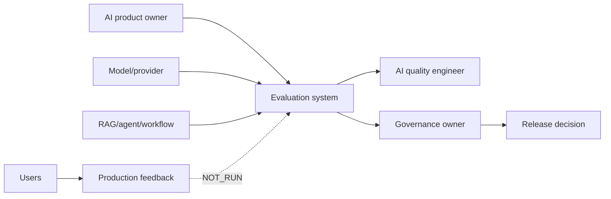
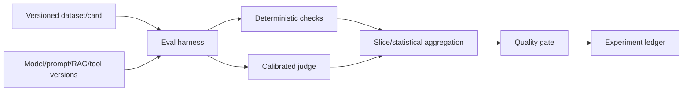
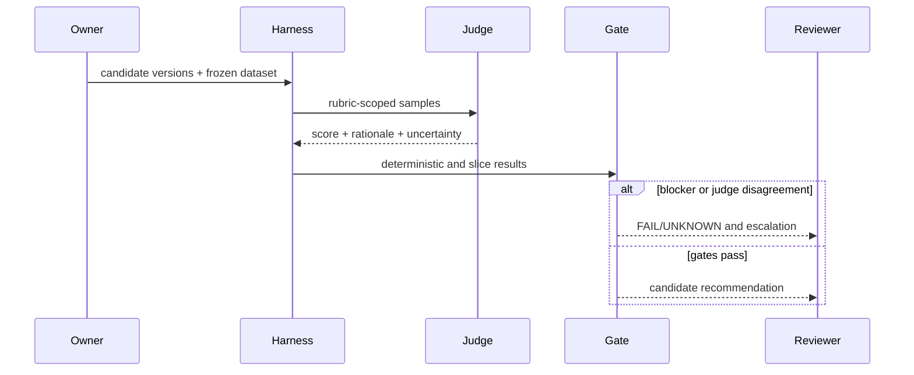
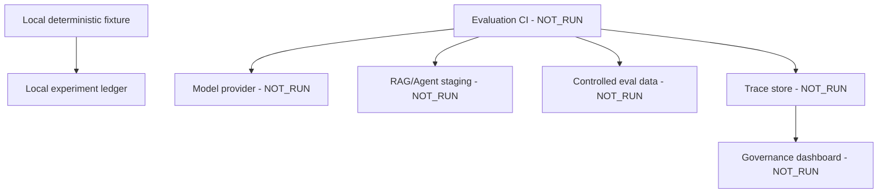
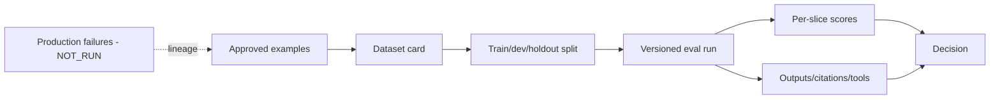
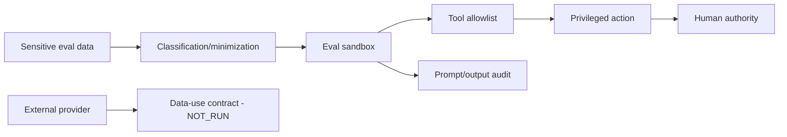

# AI system evaluation and governance architecture

Boundary: curriculum and design evidence. Real model/provider calls, production data, calibrated judges, red-team approval, continuous evaluation and deprecation operations are `NOT_RUN`.

## Context

## Building block

## Runtime

## Deployment

## Data flow

## Security and trust boundary

Failure path: dataset leakage, contamination, missing lineage, unsafe tool call, uncalibrated judge, statistically ambiguous change or missing human approval blocks promotion. Decisions supported: combined deterministic/human-calibrated oracles and versioned evaluation before release.
