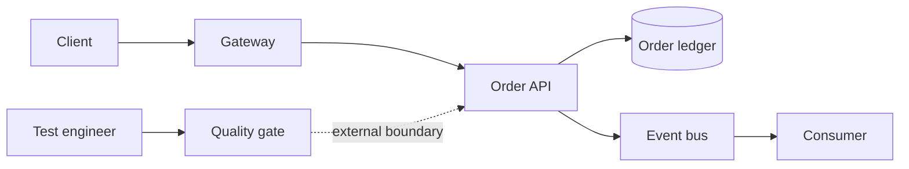
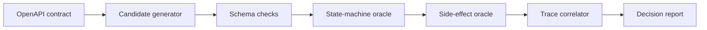
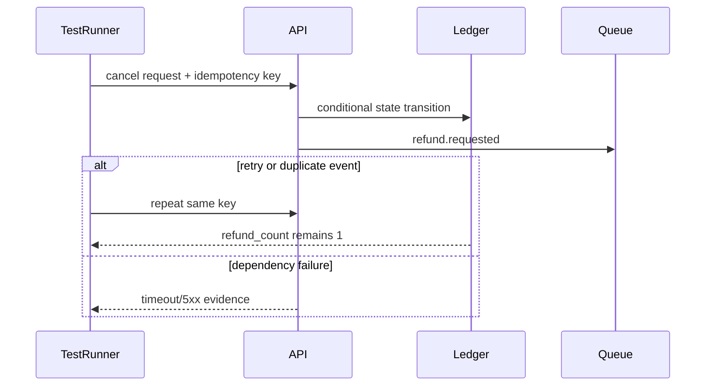
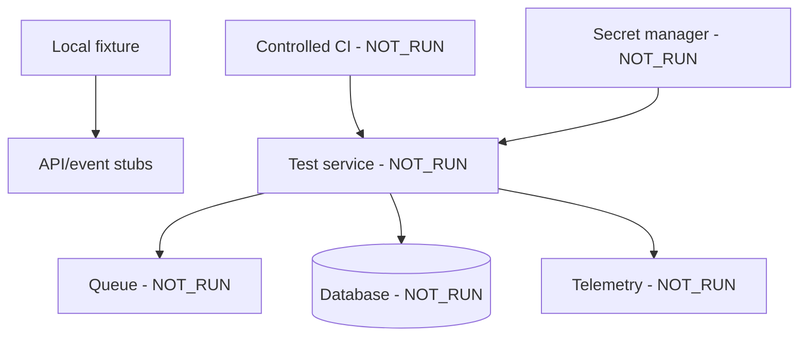
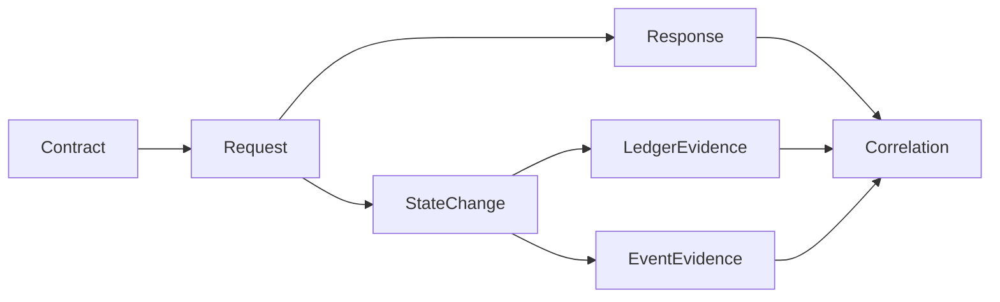
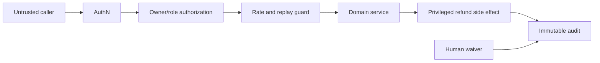

# API and service quality architecture

Boundary: design and local contract fixtures only. Real OAuth/mTLS, tenant isolation, payment side effects, queues, rate limits and production cleanup are `NOT_RUN`.

## Context

## Building block

## Runtime

## Deployment

## Data flow

## Security and trust boundary

Failure path: authentication failure, state conflict, duplicate refund, delayed event or missing ledger evidence blocks a positive conclusion. Decisions supported: deterministic business oracles over HTTP-only checks, and controlled adapters before real side effects.
