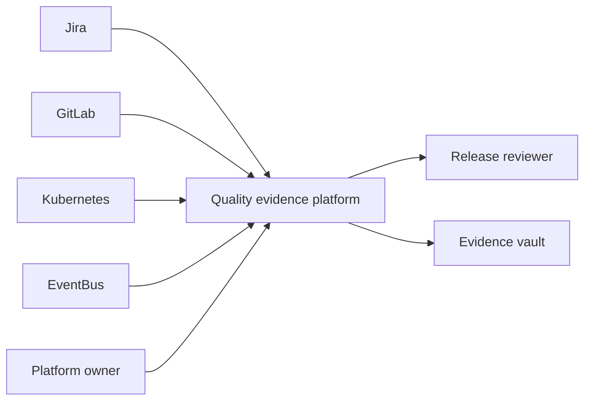
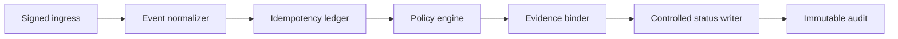
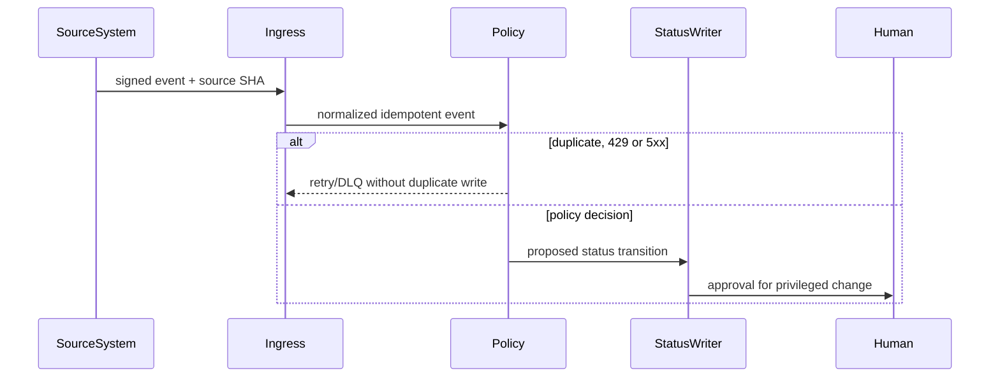
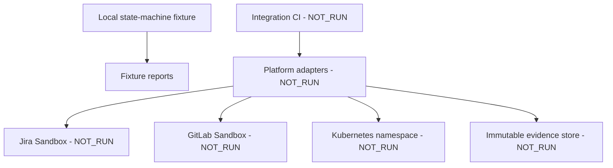
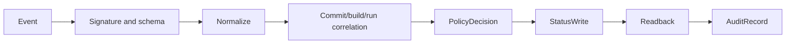
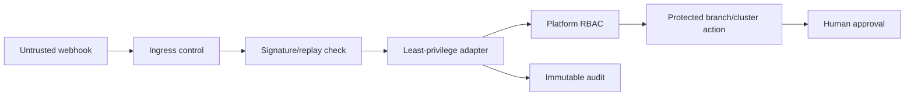

# Quality platform integration architecture

Boundary: local Jira, GitLab, Kubernetes and event-state fixtures. Real webhooks, protected branches, RBAC, NetworkPolicy, Admission, immutable storage and notifications are `NOT_RUN`.

## Context

## Building block

## Runtime

## Deployment

## Data flow

## Security and trust boundary

Failure path: invalid signature, replay, missing source SHA, non-idempotent write, failed readback or unavailable DLQ remains `FAIL/UNKNOWN`. Decisions supported: append-only evidence before status mutation and least-privilege adapters with readback.
