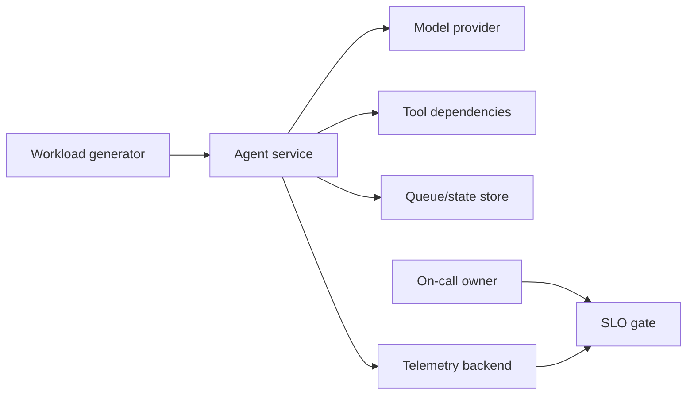
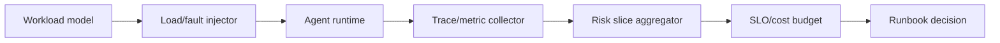
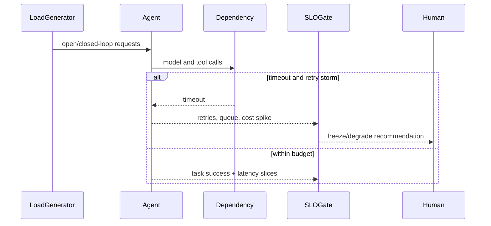
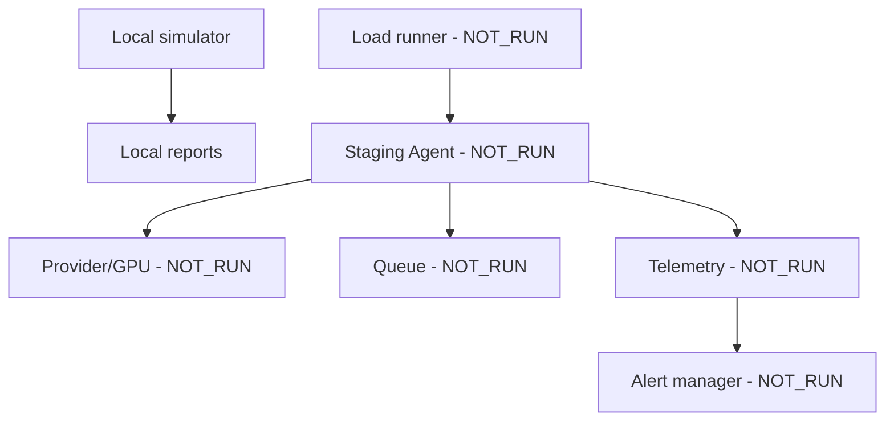
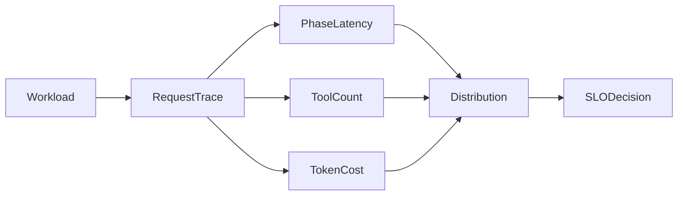
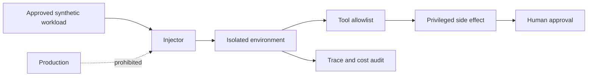

# Reliability, performance and Agent load architecture

Boundary: deterministic retry-storm and load fixtures. Real providers, GPUs, queues, model endpoints, alerting, On-call, disaster recovery and cost accounts are `NOT_RUN`.

## Context

## Building block

## Runtime

## Deployment

## Data flow

## Security and trust boundary

Failure path: overload, retry amplification, queue saturation, quality regression or missing telemetry blocks capacity claims. Decisions supported: phase- and risk-sliced metrics rather than averages, and a freeze/degrade/rollback human gate.
