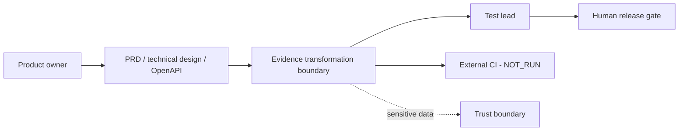
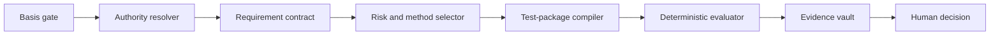
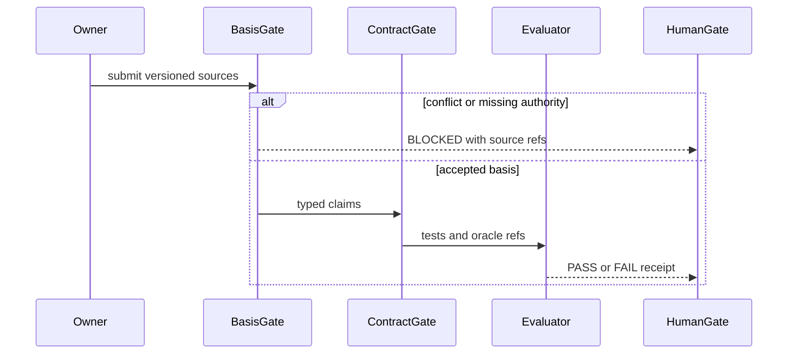
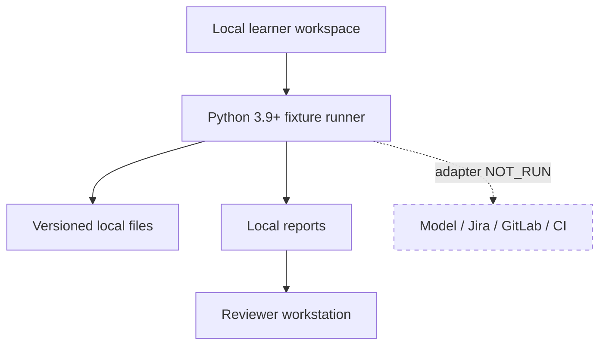
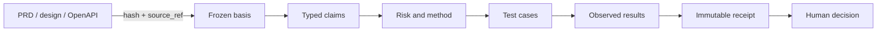
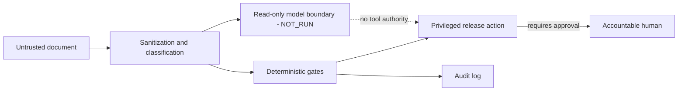

# Requirements-to-release evidence architecture

Boundary: synthetic requirements, designs, contracts and local deterministic checks. Jira, Confluence, Git, CI and production release systems are external and `NOT_RUN`. The evidence points are the frozen basis, authority policy, requirement contract, test package, red/green reports and human release gate.

## Context

## Building block

## Runtime

## Deployment

## Data flow

## Security and trust boundary

Failure path: missing sources, ambiguous precedence or unsupported rules stop as `BLOCKED`; an implementation mutation produces `FAIL`; only a named human may accept residual release risk. Decisions supported: offline/live separation and independent human authority.
