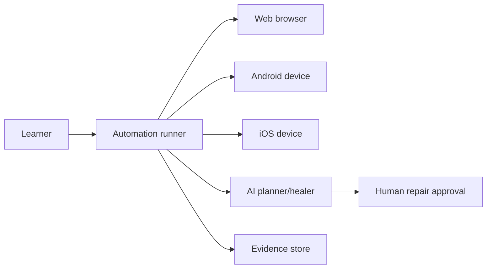
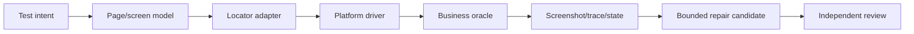
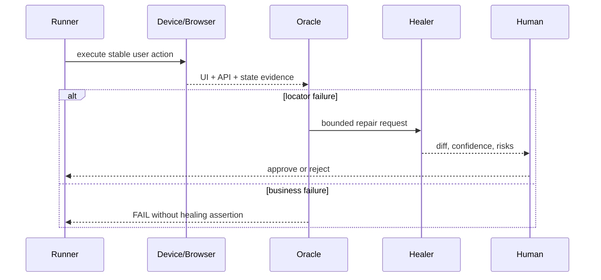
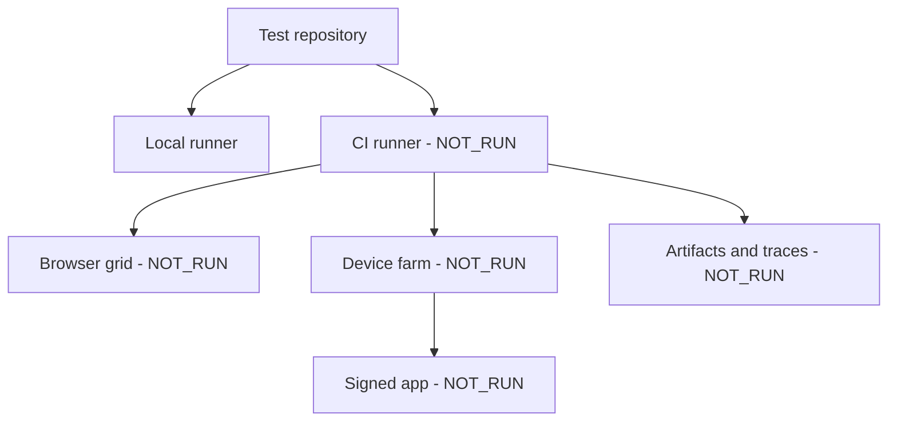
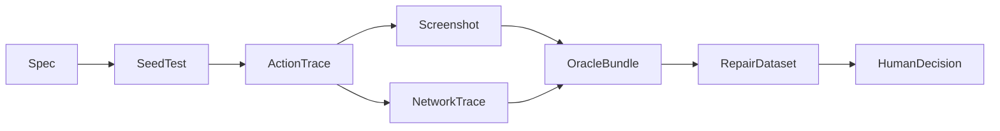
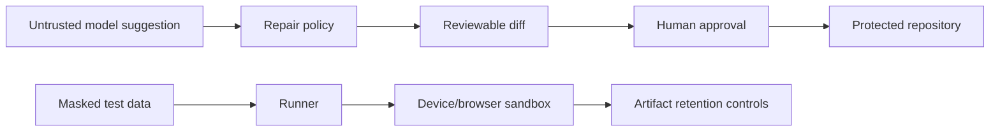

# Web, Android and iOS automation architecture

Boundary: page designs and shared offline contracts. Real browsers, simulators, signed apps, device farms, OS dialogs and repair telemetry are `NOT_RUN`.

## Context

## Building block

## Runtime

## Deployment

## Data flow

## Security and trust boundary

Failure path: platform unavailable, permission dialog, flaky timing, wrong locator or unsafe AI repair remains `UNKNOWN/FAIL`; the agent may not delete assertions or rewrite expected business outcomes. Decisions supported: platform-specific adapters and human-approved repair.
