# AI测试开发工程师能力模型与成长路径

> **文档版本**: v1.0  
> **更新日期**: 2025-11-05  
> **适用范围**: AI/ML相关产品测试开发岗位

---

## 📋 目录

- [一、能力模型总览](#一能力模型总览)
- [二、能力维度详解](#二能力维度详解)
- [三、职级能力矩阵](#三职级能力矩阵)
- [四、成长路径规划](#四成长路径规划)
- [五、能力评估标准](#五能力评估标准)
- [六、学习资源推荐](#六学习资源推荐)

---

## 一、能力模型总览

### 1.0 AI测试工程师的角色定位

**核心职责**: 保障AI系统的质量，而非开发AI系统

**与AI开发工程师的区别**:

| 维度 | AI测试工程师 | AI开发工程师 |
|------|------------|-------------|
| **核心目标** | 发现问题、评估质量 | 解决问题、优化性能 |
| **AI知识深度** | 理解原理、识别问题 | 深入原理、算法创新 |
| **工作重点** | 测试设计、质量评估、问题诊断 | 模型训练、算法优化、系统开发 |
| **技能侧重** | 测试方法论 + AI理解 | AI算法 + 工程实现 |
| **思维方式** | 质疑精神、风险意识 | 创新精神、解决方案 |

**AI测试工程师的价值**:
- 🔍 **质量守门员**: 在AI系统上线前发现潜在问题
- 📊 **效果评估者**: 客观评估模型效果和业务价值
- 🛡️ **风险识别者**: 识别偏见、安全、鲁棒性风险
- 🔧 **工具建设者**: 构建测试工具和平台提升效率
- 📈 **持续优化者**: 通过监控和反馈推动系统改进

#### AI测试 vs 传统软件测试对比图

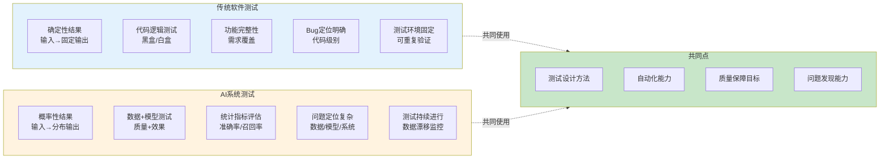

### 1.1 能力维度框架

AI测试开发工程师的能力模型包含**5大维度**，每个维度下有多个子能力项：

#### 能力模型结构图

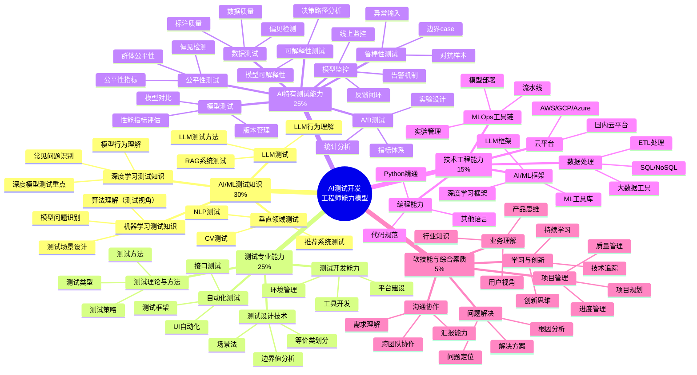

#### 能力占比图

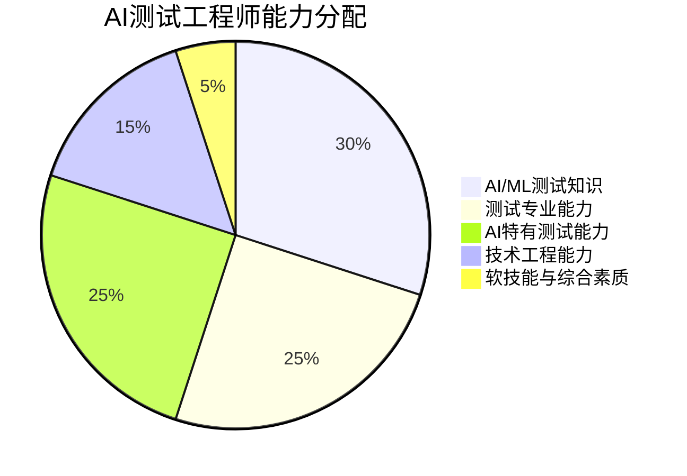

### 1.2 能力分级标准

| 等级 | 说明 | 标准 |
|------|------|------|
| **L0 - 不了解** | 没有接触过该领域 | 无相关知识和经验 |
| **L1 - 了解** | 知道基本概念 | 能说出是什么，但不能独立实践 |
| **L2 - 掌握** | 能在指导下完成 | 能在他人帮助下完成相关工作 |
| **L3 - 熟练** | 能独立完成 | 能独立完成工作，质量达标 |
| **L4 - 精通** | 能指导他人 | 能解决复杂问题，指导他人 |
| **L5 - 专家** | 领域专家 | 行业顶尖水平，能创新和引领 |

---

## 二、能力维度详解

### 2.1 维度一：AI/ML测试专业知识 (30%)

> **核心理念**: 理解AI系统的工作原理，从测试视角识别问题、评估质量、保障效果

#### 2.1.1 机器学习测试知识
- **算法理解**（测试视角）:
  - 理解不同算法的应用场景和局限性
  - 识别算法选择是否合理
  - 理解模型输出的不确定性
  - 判断模型行为是否符合预期
- **模型问题识别**:
  - 过拟合/欠拟合的表现和检测
  - 数据泄露的识别
  - 特征重要性异常
  - 模型退化检测
- **测试场景设计**:
  - 针对监督学习的测试策略
  - 针对非监督学习的验证方法
  - 强化学习系统的测试方法

#### 2.1.2 深度学习测试知识
- **模型行为理解**:
  - 理解神经网络的基本原理（不需要深入数学）
  - 了解CNN、RNN、Transformer的应用场景
  - 理解不同架构的优缺点和适用性
- **深度模型测试重点**:
  - 梯度消失/爆炸问题的表现
  - 激活函数选择对结果的影响
  - 层数和参数量对性能的影响
  - 预训练模型的迁移效果评估
- **常见问题识别**:
  - 模型收敛问题
  - 训练不稳定
  - 推理速度异常
  - 内存占用问题

#### 2.1.3 大语言模型（LLM）测试
- **LLM行为理解**:
  - 理解LLM的能力边界和局限性
  - 理解Token机制对输出的影响
  - 理解上下文窗口的作用
  - 理解温度参数等配置的影响
- **LLM测试方法**:
  - Prompt测试设计（正常、边界、对抗）
  - 输出质量评估（准确性、相关性、安全性）
  - 幻觉检测和评估
  - 上下文理解能力测试
  - 多轮对话一致性测试
- **RAG系统测试**:
  - 检索质量评估
  - 生成质量评估
  - 端到端效果测试
  - 响应时间测试

#### 2.1.4 计算机视觉（CV）测试
- **CV模型理解**:
  - 理解图像分类、检测、分割的区别
  - 理解不同模型的性能特点
  - 理解数据增强的作用
- **CV测试重点**:
  - 不同光照条件下的测试
  - 不同角度、尺度的测试
  - 遮挡、模糊、噪声场景测试
  - 边界case图像设计
  - 真实场景vs训练数据的差异
- **常见问题**:
  - 误检测和漏检测分析
  - 特定场景失效
  - 性能不稳定
  - 实时性问题

#### 2.1.5 自然语言处理（NLP）测试
- **NLP模型理解**:
  - 理解分类、抽取、生成任务的特点
  - 理解预训练模型的优势
  - 理解不同语言模型的适用场景
- **NLP测试重点**:
  - 多种表达方式的测试
  - 语义相似但表述不同的case
  - 歧义、否定、反讽等复杂语义
  - 多语言、方言、俚语测试
  - 长文本处理能力
- **质量评估**:
  - 分类准确性评估
  - 实体识别完整性和准确性
  - 生成文本的质量评估
  - 情感分析的准确性

#### 2.1.6 推荐系统测试
- **推荐模型理解**:
  - 理解协同过滤、内容推荐、混合推荐
  - 理解推荐系统的评估指标
  - 理解冷启动、多样性、新颖性问题
- **推荐测试方法**:
  - 推荐准确性测试
  - 推荐多样性评估
  - 冷启动场景测试
  - A/B测试设计
  - 用户行为模拟
- **业务指标关联**:
  - 点击率、转化率测试
  - 用户满意度评估
  - 长期效果监控

---

### 2.2 维度二：测试专业能力 (25%)

#### 2.2.1 测试理论与方法
- **测试类型**: 单元测试、集成测试、系统测试、验收测试
- **测试方法**: 黑盒测试、白盒测试、灰盒测试
- **测试策略**: 测试金字塔、测试左移、测试右移
- **测试管理**: 测试计划、测试报告、缺陷管理

#### 2.2.2 测试设计技术
- **等价类划分**: 有效等价类、无效等价类
- **边界值分析**: 边界值测试用例设计
- **因果图法**: 输入条件组合测试
- **判定表法**: 多条件组合覆盖
- **状态转换法**: 状态机测试
- **场景法**: 业务流程测试
- **正交实验法**: 参数组合优化

#### 2.2.3 自动化测试
- **测试框架**: Pytest、unittest、TestNG、JUnit
- **UI自动化**: Selenium、Appium、Playwright、Cypress
- **接口测试**: Requests、RestAssured、Postman
- **性能测试**: JMeter、Locust、K6
- **CI/CD集成**: Jenkins、GitLab CI、GitHub Actions

#### 2.2.4 测试开发能力
- **测试工具开发**: 测试框架、测试平台
- **测试数据管理**: 数据生成、数据脱敏
- **测试环境管理**: Docker、K8s、云环境
- **测试报告与可视化**: 报表系统、Dashboard

---

### 2.3 维度三：AI特有测试能力 (25%)

#### AI测试完整流程图

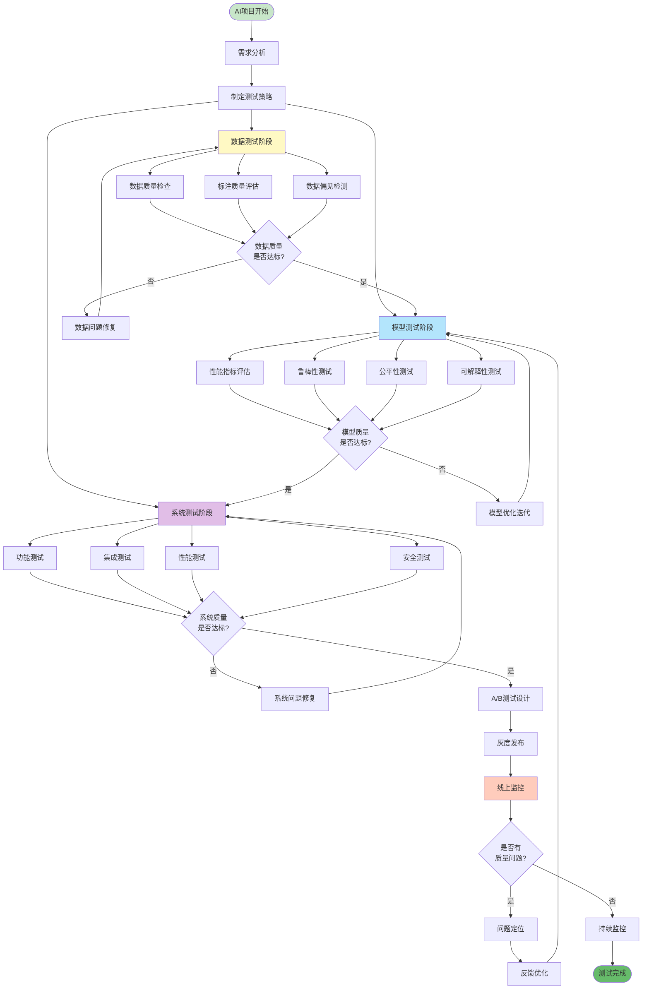

#### 2.3.1 数据测试
- **数据质量**: 完整性、准确性、一致性、时效性
- **数据标注质量**: 标注准确率、标注一致性、标注覆盖度
- **数据偏见检测**: 样本分布、类别均衡、偏见识别
- **数据隐私**: 数据脱敏、隐私保护
- **数据版本管理**: DVC、数据血缘

#### 2.3.2 模型测试
- **性能指标评估**:
  - 分类: 准确率、精确率、召回率、F1-score、AUC-ROC
  - 回归: MAE、MSE、RMSE、R²
  - 聚类: 轮廓系数、Calinski-Harabasz指数
  - NLP: BLEU、ROUGE、Perplexity
  - LLM: 人工评估、GPT-4评分
- **混淆矩阵分析**: TP/FP/TN/FN、错误模式分析
- **模型对比**: A/B测试、多模型对比
- **模型版本管理**: MLflow、模型注册表

#### 2.3.3 鲁棒性测试
- **对抗样本测试**: FGSM、PGD、对抗攻击
- **边界case测试**: 极端输入、边界条件
- **异常输入测试**: 噪声、畸变、缺失值
- **压力测试**: 大规模数据、高并发
- **长尾分布测试**: 稀有case覆盖

#### 2.3.4 公平性与偏见测试
- **群体公平性**: 不同群体预测准确率
- **个体公平性**: 相似个体相似输出
- **偏见检测**: 性别、种族、年龄等偏见
- **公平性指标**: Demographic Parity、Equal Opportunity、Equalized Odds

#### 2.3.5 可解释性测试
- **模型可解释性**: SHAP、LIME、特征重要性
- **决策路径分析**: 决策树可视化、规则提取
- **注意力机制分析**: Attention权重可视化
- **Case Study**: 典型case分析

#### 2.3.6 A/B测试
- **实验设计**: 假设检验、样本量计算、分组策略
- **统计分析**: t检验、卡方检验、置信区间
- **指标体系**: 北极星指标、核心指标、辅助指标
- **实验平台**: 流量分配、实验监控

#### 2.3.7 模型监控
- **线上监控**: 模型性能、数据漂移、概念漂移
- **告警机制**: 阈值告警、异常检测
- **日志分析**: 请求日志、错误日志
- **反馈闭环**: 坏case收集、持续优化

---

### 2.4 维度四：技术工程能力 (15%)

#### 2.4.1 编程能力
- **Python**: 
  - 基础: 数据结构、算法、OOP
  - 进阶: 装饰器、生成器、多线程/多进程、异步编程
  - 库: NumPy、Pandas、Matplotlib、Scikit-learn
- **其他语言**: Java、Go、JavaScript（根据团队技术栈）
- **代码规范**: PEP8、Clean Code、代码审查

#### 2.4.2 AI/ML框架（测试应用）
- **深度学习框架**: 
  - 了解TensorFlow、PyTorch的基本使用
  - 能加载和运行预训练模型进行测试
  - 能进行简单的模型推理和结果验证
- **ML工具库**: 
  - 使用Scikit-learn进行模型评估
  - 使用XGBoost、LightGBM进行模型对比测试
- **LLM框架**: 
  - 使用Transformers加载和测试模型
  - 使用LangChain/LlamaIndex测试LLM应用
- **模型分析工具**:
  - SHAP、LIME等可解释性工具
  - 模型评估和对比工具

#### 2.4.3 数据处理
- **数据库**: 
  - SQL: MySQL、PostgreSQL、查询优化
  - NoSQL: MongoDB、Redis、Elasticsearch
- **大数据**: Spark、Hive、数据仓库
- **数据处理**: ETL、数据清洗、特征工程

#### 2.4.4 MLOps工具链
- **实验管理**: MLflow、Weights & Biases、Neptune
- **模型部署**: TensorFlow Serving、TorchServe、ONNX
- **容器化**: Docker、Kubernetes
- **流水线**: Airflow、Kubeflow Pipelines
- **监控**: Prometheus、Grafana、ELK

#### 2.4.5 云平台
- **AWS**: SageMaker、EC2、S3、Lambda
- **GCP**: Vertex AI、BigQuery、Cloud Functions
- **Azure**: Azure ML、Cognitive Services
- **国内云**: 阿里云PAI、腾讯云TI-ONE

---

### 2.5 维度五：软技能与综合素质 (5%)

#### 2.5.1 沟通协作
- **跨团队协作**: 与算法、产品、研发、运营协同
- **需求理解**: 需求分析、需求评审
- **汇报能力**: 工作汇报、技术分享
- **文档能力**: 测试报告、技术文档、Wiki

#### 2.5.2 问题解决
- **问题定位**: 日志分析、调试技巧、性能分析
- **根因分析**: 5 Why分析、鱼骨图
- **解决方案**: 技术选型、方案设计
- **风险意识**: 风险识别、风险预防

#### 2.5.3 项目管理
- **项目规划**: 工作分解、时间估算
- **进度管理**: 任务跟踪、风险管理
- **质量管理**: 质量标准、质量保证
- **敏捷实践**: Scrum、看板、迭代

#### 2.5.4 学习与创新
- **持续学习**: 学习能力、知识更新
- **技术追踪**: 前沿技术、行业动态
- **创新思维**: 新技术应用、流程优化
- **技术影响力**: 技术博客、开源贡献、技术分享

#### 2.5.5 业务理解
- **产品思维**: 用户体验、产品价值
- **行业知识**: 垂直领域理解
- **商业思维**: ROI、成本效益
- **用户视角**: 用户场景、用户痛点

---

## 三、职级能力矩阵

### 3.1 职级体系说明

| 职级 | 岗位名称 | 工作年限 | 能力总览 |
|------|----------|----------|----------|
| **P5** | 初级AI测试开发工程师 | 0-2年 | 具备基础能力，能在指导下完成工作 |
| **P6** | AI测试开发工程师 | 2-4年 | 独立负责模块，能独立完成项目 |
| **P7** | 高级AI测试开发工程师 | 4-7年 | 负责复杂项目，技术深度和广度兼具 |
| **P8** | 资深AI测试专家 | 7-10年 | 技术专家，领域深耕，体系建设 |
| **P9** | AI测试领域专家/架构师 | 10年+ | 行业顶尖，战略规划，技术引领 |

#### 职级晋升路径图

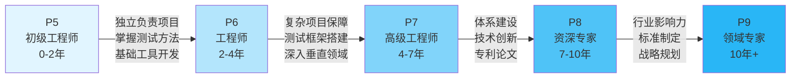

#### 职级能力雷达图对比

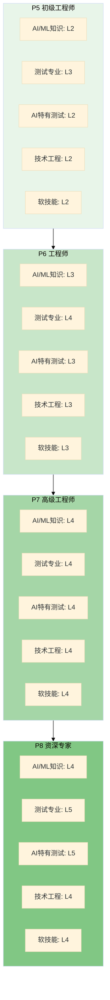

### 3.2 P5 - 初级AI测试开发工程师

#### 能力要求详表

| 能力维度 | 能力项 | 等级要求 | 具体标准 |
|----------|--------|----------|----------|
| **AI/ML测试知识** | 机器学习理解 | L2 | 了解常见算法的应用场景和局限性，能识别明显的模型问题 |
| | 深度学习理解 | L1 | 知道CNN、RNN、Transformer的基本用途和测试要点 |
| | LLM/NLP/CV | L1 | 了解基本测试场景和质量评估方法 |
| **测试专业能力** | 测试理论 | L3 | 熟练掌握测试用例设计方法 |
| | 测试设计 | L3 | 能独立完成功能测试用例设计 |
| | 自动化测试 | L2 | 能编写简单的自动化脚本 |
| **AI特有测试** | 数据测试 | L2 | 能进行基础数据质量检查 |
| | 模型测试 | L2 | 理解基本评估指标（准确率、召回率） |
| | 鲁棒性测试 | L1 | 了解边界case概念 |
| | 公平性测试 | L1 | 了解偏见的概念 |
| **技术工程能力** | Python编程 | L3 | 熟练掌握Python基础 |
| | ML框架 | L1 | 了解主流框架 |
| | 数据处理 | L2 | 掌握Pandas、SQL基础 |
| **软技能** | 沟通协作 | L2 | 能与团队成员有效沟通 |
| | 问题解决 | L2 | 能在指导下定位问题 |

#### 典型工作内容
- ✅ 执行AI模型的功能测试用例
- ✅ 进行数据集基础质量检查
- ✅ 编写简单的自动化测试脚本
- ✅ 进行Bug跟踪和回归测试
- ✅ 参与测试用例评审
- ✅ 学习AI测试相关知识

#### 工作产出标准
- 每周完成50+测试用例执行
- 测试用例设计准确率≥85%
- Bug描述清晰准确率≥90%
- 自动化脚本可维护性良好

#### 晋升到P6的关键指标
- ✅ 独立负责过1-2个小型AI功能模块测试
- ✅ 掌握至少1个AI领域的测试方法
- ✅ 编写过自动化测试框架的部分模块
- ✅ 理解常见AI算法的测试要点
- ✅ 获得团队成员的认可

---

### 3.3 P6 - AI测试开发工程师

#### 能力要求详表

| 能力维度 | 能力项 | 等级要求 | 具体标准 |
|----------|--------|----------|----------|
| **AI/ML测试知识** | 机器学习理解 | L3 | 理解主流算法的行为特点，能设计针对性测试策略 |
| | 深度学习理解 | L2 | 理解不同架构的特点，能识别模型异常行为 |
| | LLM测试 | L2 | 掌握LLM基本测试方法和Prompt测试技巧 |
| | NLP/CV（选一个） | L2 | 熟悉所在领域的测试方法和常见问题 |
| **测试专业能力** | 测试理论 | L4 | 精通测试方法，能指导初级工程师 |
| | 测试设计 | L4 | 能设计复杂场景的测试方案 |
| | 自动化测试 | L3 | 独立开发自动化测试框架 |
| **AI特有测试** | 数据测试 | L3 | 独立完成数据质量评估体系 |
| | 模型测试 | L3 | 熟练使用各种评估指标，能进行对比分析 |
| | 鲁棒性测试 | L2 | 能设计边界case和异常场景 |
| | A/B测试 | L2 | 了解A/B测试设计和分析 |
| **技术工程能力** | Python编程 | L4 | 精通Python，代码质量高 |
| | ML框架 | L2 | 能使用TensorFlow/PyTorch进行测试 |
| | 数据处理 | L3 | 熟练数据分析和可视化 |
| | MLOps | L2 | 了解MLOps工具链 |
| **软技能** | 沟通协作 | L3 | 能有效推动跨团队协作 |
| | 问题解决 | L3 | 能独立定位和解决问题 |
| | 项目管理 | L2 | 能管理小型项目 |

#### 典型工作内容
- ✅ 制定AI项目的测试计划和策略
- ✅ 设计复杂场景的测试用例和测试方案
- ✅ 开发和维护自动化测试框架
- ✅ 进行模型性能评估和对比测试
- ✅ 数据质量分析和偏见识别
- ✅ 参与技术方案评审
- ✅ 编写测试工具和脚本

#### 工作产出标准
- 负责1-2个中型AI项目的完整测试
- 测试覆盖率≥80%
- 关键Bug发现率≥90%
- 自动化测试覆盖率≥60%
- 产出测试工具或平台模块

#### 晋升到P7的关键指标
- ✅ 独立负责过2-3个复杂AI项目
- ✅ 搭建过测试框架或工具平台
- ✅ 深入理解AI系统端到端流程
- ✅ 发现过重大质量问题并推动解决
- ✅ 有技术分享或技术文档输出

---

### 3.4 P7 - 高级AI测试开发工程师

#### 能力要求详表

| 能力维度 | 能力项 | 等级要求 | 具体标准 |
|----------|--------|----------|----------|
| **AI/ML测试知识** | 算法行为理解 | L4 | 深入理解算法特性，能准确判断模型质量问题根因 |
| | 深度学习测试 | L3 | 精通深度模型的测试方法，能设计复杂测试场景 |
| | LLM测试 | L3 | 掌握LLM完整测试方法论，能评估复杂LLM应用 |
| | NLP/CV/推荐 | L3 | 成为至少1个垂直领域的测试专家 |
| **测试专业能力** | 测试理论 | L4 | 能制定测试标准和规范 |
| | 测试设计 | L4 | 能设计复杂系统的测试架构 |
| | 自动化测试 | L4 | 能搭建企业级测试平台 |
| **AI特有测试** | 数据测试 | L4 | 建立数据测试体系和标准 |
| | 模型测试 | L4 | 能进行深度模型分析和优化建议 |
| | 鲁棒性测试 | L3 | 掌握对抗测试等高级方法 |
| | 公平性测试 | L3 | 能进行系统的偏见检测和评估 |
| | A/B测试 | L3 | 独立设计和分析A/B实验 |
| | 模型监控 | L3 | 搭建监控体系 |
| **技术工程能力** | 编程能力 | L4 | 多语言精通，架构设计能力 |
| | ML框架 | L3 | 深入理解框架原理 |
| | MLOps | L3 | 熟练使用MLOps工具链 |
| | 系统设计 | L3 | 能设计测试平台架构 |
| **软技能** | 沟通协作 | L4 | 能推动跨部门合作 |
| | 问题解决 | L4 | 能解决复杂技术难题 |
| | 项目管理 | L3 | 能管理大型项目 |
| | 技术影响力 | L3 | 有技术分享和博客输出 |

#### 典型工作内容
- ✅ 负责大型AI项目的质量保障体系设计
- ✅ 搭建AI测试平台和基础设施
- ✅ 制定测试规范和最佳实践
- ✅ 攻克复杂技术难题
- ✅ 跨团队技术方案评审
- ✅ 指导和培养初中级工程师
- ✅ 技术创新和工具研发
- ✅ 参与算法优化讨论

#### 工作产出标准
- 负责3+个大型AI项目或重要产品线
- 搭建测试平台，支撑团队效率提升30%+
- 制定至少2项团队测试规范
- 发现并推动解决系统性质量问题
- 指导2-3名初中级工程师成长
- 对外技术分享2+次/年

#### 晋升到P8的关键指标
- ✅ 建设过公司级测试平台或体系
- ✅ 在AI测试领域有深入研究和实践
- ✅ 解决过重大技术难题，有显著业务影响
- ✅ 有技术专利或论文产出
- ✅ 在团队和公司有较高技术影响力
- ✅ 培养出P6+工程师

---

### 3.5 P8 - 资深AI测试专家

#### 能力要求详表

| 能力维度 | 能力项 | 等级要求 | 具体标准 |
|----------|--------|----------|----------|
| **AI/ML测试知识** | 全栈AI测试理解 | L4 | 深入理解多个AI领域的测试方法和质量保障体系 |
| | 前沿测试技术 | L4 | 追踪和应用AI测试前沿方法，能进行测试创新 |
| | 质量诊断能力 | L4 | 能快速定位复杂AI系统的质量问题根因 |
| **测试专业能力** | 测试体系 | L5 | 建立公司级测试标准和体系 |
| | 测试创新 | L4 | 在测试方法上有创新 |
| **AI特有测试** | 全领域测试 | L4 | 精通AI测试各个细分领域 |
| | 测试研究 | L4 | 能进行测试方法研究和创新 |
| **技术工程能力** | 架构能力 | L4 | 系统架构设计专家 |
| | 技术选型 | L4 | 能做出正确的技术决策 |
| **软技能** | 技术领导力 | L4 | 能带领团队攻克难题 |
| | 战略思维 | L3 | 具备业务和技术战略思考 |
| | 影响力 | L4 | 公司内外有技术影响力 |

#### 典型工作内容
- ✅ 建设公司AI测试能力体系
- ✅ 攻克关键技术难题和创新
- ✅ 技术专利和论文产出
- ✅ 跨部门技术合作推动
- ✅ 培养高级人才
- ✅ 对外技术影响力建设
- ✅ 参与技术战略规划
- ✅ 技术委员会/专家评审

#### 工作产出标准
- 建立公司级AI测试标准和体系
- 技术创新带来显著业务价值
- 专利/论文产出2+篇/年
- 培养P7+工程师2+人
- 对外技术分享5+次/年
- 在行业内有一定知名度

#### 晋升到P9的关键指标
- ✅ 在AI测试领域有行业影响力
- ✅ 技术创新带来重大业务突破
- ✅ 顶会论文或重要专利
- ✅ 制定行业标准或最佳实践
- ✅ 培养出P8级别人才

---

### 3.6 P9 - AI测试领域专家/架构师

#### 能力要求详表

| 能力维度 | 能力项 | 等级要求 | 具体标准 |
|----------|--------|----------|----------|
| **AI测试能力** | 全领域测试专家 | L5 | 行业顶尖的AI测试深度和广度，引领测试方向 |
| | 测试技术前瞻 | L5 | 能预判AI测试技术趋势和挑战 |
| **软技能** | 战略规划 | L4 | 制定公司技术战略 |
| | 行业影响力 | L5 | 行业标准制定者 |

#### 典型工作内容
- ✅ 公司技术战略制定
- ✅ 重大技术决策
- ✅ 行业标准推动
- ✅ 前沿技术探索
- ✅ 顶级人才招募和培养
- ✅ 顶会演讲和论文发表

#### 工作产出标准
- 引领公司技术方向
- 行业顶会演讲或Keynote
- 顶级期刊论文发表
- 制定行业标准
- 培养P8+专家

---

## 四、成长路径规划

### 4.0 成长路径总览

#### 成长时间线图

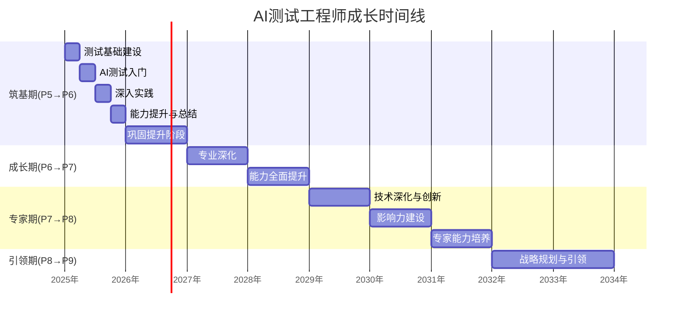

#### 四阶段成长路径图

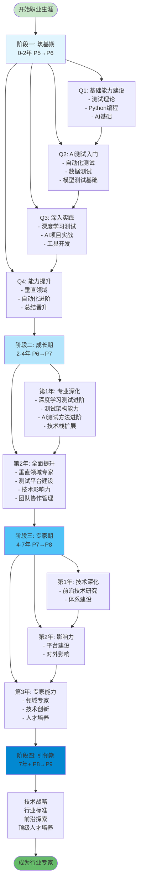

### 4.1 阶段一：筑基期（0-2年，P5→P6）

#### 成长目标
从测试小白成长为能独立负责AI项目测试的工程师

#### 学习路径

**第一季度：基础能力建设**
- **Week 1-4: 测试基础**
  - 阅读《软件测试的艺术》
  - 学习测试用例设计方法
  - 实践：为小型项目设计50+测试用例
  
- **Week 5-8: Python编程**
  - 完成Python基础教程
  - 刷LeetCode简单题50道
  - 学习Pandas、NumPy基础
  
- **Week 9-12: AI测试基础入门**
  - 学习吴恩达机器学习课程（重点理解算法应用场景）
  - 理解线性回归、逻辑回归的使用和问题
  - 实践：从测试角度分析1个Kaggle竞赛模型

**第二季度：AI测试入门**
- **Week 13-16: 自动化测试**
  - 学习Pytest框架
  - 编写API自动化测试脚本
  - 搭建简单的测试框架
  
- **Week 17-20: 数据测试**
  - 学习数据质量评估方法
  - 实践：分析1个真实数据集质量
  - 掌握数据可视化（Matplotlib）
  
- **Week 21-24: 模型测试基础**
  - 理解准确率、召回率、F1
  - 学习混淆矩阵分析
  - 实践：评估1个分类模型

**第三季度：深入实践**
- **Week 25-28: 深度学习测试入门**
  - 理解神经网络的基本行为模式
  - 学习CNN、RNN的测试要点
  - 实践：测试1个图像分类或文本分类模型
  
- **Week 29-32: AI项目实战**
  - 独立负责1个AI功能模块测试
  - 设计并执行完整测试方案
  - 发现并跟踪10+模型相关缺陷
  
- **Week 33-36: 工具开发**
  - 开发1个AI测试辅助工具
  - 提高团队测试效率
  - 代码规范和文档完善

**第四季度：能力提升**
- **Week 37-40: 垂直领域测试**
  - 选择1个方向深入（NLP/CV/推荐）
  - 学习该领域的测试方法和常见问题
  - 完成1个该领域的完整项目测试
  
- **Week 41-44: 自动化进阶**
  - 学习接口测试框架
  - 掌握CI/CD集成
  - 提升自动化覆盖率到50%+
  
- **Week 45-48: 总结与晋升**
  - 整理工作成果和测试案例
  - 准备晋升材料
  - 技术分享1次（AI测试经验）

**第二年：巩固提升**
- 负责2-3个完整项目
- 深入1个垂直领域
- 搭建测试框架
- 指导新人
- 准备P6晋升

#### 学习资源清单
**书籍**:
- 《软件测试的艺术》（必读）
- 《Python编程：从入门到实践》
- 《机器学习实战》

**课程**:
- 吴恩达机器学习课程（Coursera）
- Python数据分析课程
- Pytest自动化测试教程

**实践平台**:
- Kaggle（数据科学竞赛）
- LeetCode（算法练习）
- GitHub（开源项目）

#### 关键里程碑
- ✅ 3个月：完成第一个自动化测试脚本
- ✅ 6个月：独立完成第一个AI模块测试
- ✅ 9个月：负责第一个完整项目
- ✅ 12个月：开发第一个测试工具
- ✅ 18个月：深入1个AI垂直领域
- ✅ 24个月：晋升P6

---

### 4.2 阶段二：成长期（2-4年，P6→P7）

#### 成长目标
从独立贡献者成长为能带领小团队的技术骨干

#### 学习路径

**第一年：专业深化**

**Q1: 深度学习测试进阶**
- 学习深度学习模型的测试方法
- 理解Transformer架构的测试要点
- 掌握大模型测试策略和评估方法
- 实践：完整测试1个LLM应用

**Q2: 测试架构能力**
- 学习测试平台架构设计
- 掌握微服务测试
- 学习性能测试方法
- 实践：搭建团队测试框架

**Q3: AI测试方法进阶**
- 深入学习对抗测试方法
- 掌握A/B测试设计和分析
- 学习公平性和偏见测试
- 实践：建立完整的模型质量评估体系

**Q4: 技术栈扩展**
- 学习MLOps工具链
- 掌握容器化技术（Docker）
- 学习云平台使用
- 实践：搭建CI/CD流水线

**第二年：能力全面提升**

**Q1: 垂直领域测试专家**
- 成为NLP/CV/推荐某一领域的测试专家
- 深入理解该领域的业务场景和质量要求
- 建立该领域的完整测试方法论
- 实践：负责核心产品的质量保障

**Q2: 测试平台建设**
- 设计测试平台架构
- 开发核心功能模块
- 推动团队使用
- 实践：提升团队效率30%+

**Q3: 技术影响力**
- 编写技术博客5+篇
- 内部技术分享3+次
- 参与开源项目
- 实践：建立个人技术品牌

**Q4: 团队协作与管理**
- 学习项目管理方法
- 指导2-3名初级工程师
- 参与招聘面试
- 准备P7晋升

#### 技能强化重点

**技术深度**:
- 精通至少1个AI垂直领域
- 掌握高级测试方法
- 能进行系统架构设计

**技术广度**:
- 了解多个AI领域
- 掌握完整的技术栈
- 理解端到端业务流程

**软技能**:
- 项目管理能力
- 跨团队协作能力
- 技术表达能力
- 人才培养能力

#### 关键里程碑
- ✅ 6个月：成为1个领域的专家
- ✅ 12个月：搭建团队测试框架
- ✅ 18个月：负责重要产品测试
- ✅ 24个月：技术分享5+次
- ✅ 30个月：指导初级工程师成长
- ✅ 36个月：晋升P7

---

### 4.3 阶段三：专家期（4-7年，P7→P8）

#### 成长目标
从技术骨干成长为领域专家，建立技术影响力

#### 发展方向选择

此阶段需要选择重点发展方向：

**方向1: 技术专家路线**
- 深耕AI测试技术
- 追踪前沿研究
- 技术创新和专利
- 成为领域KOL

**方向2: 技术管理路线**
- 带领技术团队
- 体系和平台建设
- 跨部门协作
- 战略规划能力

**建议**: 根据个人兴趣和公司需要选择，也可以两条线并行发展

#### 学习路径

**第一年：技术深化与创新**

**Q1-Q2: AI测试前沿方法研究**
- 跟进AI测试领域前沿论文（每周2-3篇）
- 研究新型AI模型（如大模型）的测试方法
- 探索创新的测试技术和工具
- 尝试测试方法创新并在项目中落地

**Q3-Q4: 体系建设**
- 设计公司级测试标准
- 建立测试方法论
- 推动最佳实践落地
- 培养高级人才

**第二年：影响力建设**

**Q1-Q2: 平台和工具**
- 设计企业级测试平台
- 解决关键技术难题
- 技术专利申请
- 重大项目保障

**Q3-Q4: 对外影响力**
- 技术博客/公众号运营
- 行业会议演讲
- 开源项目贡献
- 技术社区活跃

**第三年：专家能力**

**全年重点**:
- 成为AI测试领域专家
- 推动技术创新落地
- 培养P7级别人才
- 准备P8晋升

#### 能力建设重点

**技术能力**:
- 深入理解AI系统全栈
- 掌握前沿测试技术
- 具备创新能力
- 能解决复杂难题

**体系能力**:
- 建立测试标准和规范
- 设计平台架构
- 制定技术策略
- 推动组织变革

**影响力**:
- 公司内技术权威
- 行业内有知名度
- 技术社区贡献
- 人才梯队建设

#### 关键里程碑
- ✅ 6个月：完成1项技术创新
- ✅ 12个月：建立测试标准体系
- ✅ 18个月：申请1-2项技术专利
- ✅ 24个月：外部技术分享3+次
- ✅ 30个月：培养P7工程师
- ✅ 36个月：晋升P8

---

### 4.4 阶段四：引领期（7年+，P8→P9）

#### 成长目标
从领域专家成长为行业引领者

#### 发展路径

**核心方向**:
- 技术战略规划
- 行业标准制定
- 前沿技术探索
- 顶级人才培养

#### 关键能力

**战略能力**:
- 技术趋势判断
- 业务战略理解
- 技术路线规划
- 投入产出评估

**影响力**:
- 行业标准制定者
- 顶会演讲嘉宾
- 顶级论文发表
- 技术社区领袖

**创新能力**:
- 原创性研究
- 技术突破
- 专利产出
- 开创性工作

#### 关键里程碑
- ✅ 发表顶会论文
- ✅ 制定行业标准
- ✅ 培养P8专家
- ✅ 引领技术方向
- ✅ 行业影响力

---

### 4.5 技能学习优先级建议

#### 不同背景的学习路径图

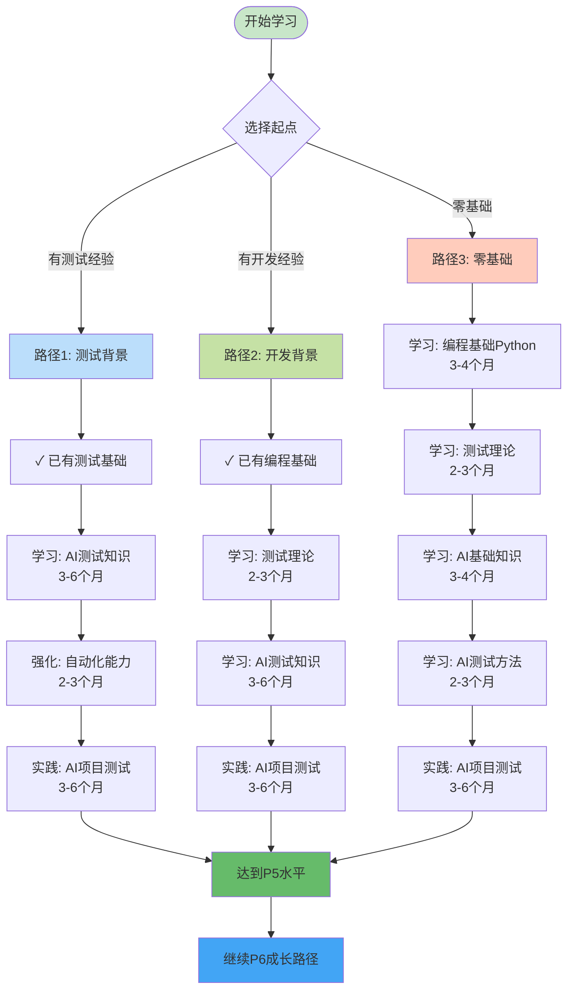

#### 技能提升优先级矩阵

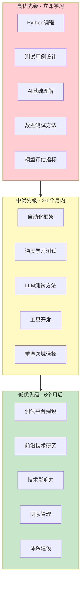

---

## 五、能力评估标准

### 5.0 能力等级提升路径

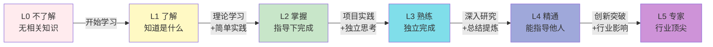

### 5.1 能力评估表（可直接复用）

#### 能力发展四象限图

```mermaid
graph TB
    subgraph Quadrant ["能力发展优先级矩阵"]
        subgraph Q1["第一象限<br/>高重要 + 低掌握<br/>⚠️ 优先提升"]
            Q1_1[测试设计能力]
            Q1_2[AI测试知识]
            Q1_3[数据测试]
            Q1_4[模型评估]
        end
        
        subgraph Q2["第二象限<br/>高重要 + 高掌握<br/>✅ 保持优势"]
            Q2_1[编程能力]
            Q2_2[自动化测试]
            Q2_3[问题分析]
            Q2_4[项目交付]
        end
        
        subgraph Q3["第三象限<br/>低重要 + 低掌握<br/>⏸️ 暂缓学习"]
            Q3_1[前沿研究]
            Q3_2[管理技能]
            Q3_3[非核心技术]
            Q3_4[跨领域知识]
        end
        
        subgraph Q4["第四象限<br/>低重要 + 高掌握<br/>💡 可分享传承"]
            Q4_1[已掌握的<br/>非核心技能]
            Q4_2[可以教给<br/>他人的能力]
        end
    end
    
    Q1 -.优先学习.-> Q2
    Q2 -.带教分享.-> Q4
    Q3 -.适时学习.-> Q1
    
    style Q1 fill:#ffcdd2
    style Q2 fill:#c8e6c9
    style Q3 fill:#f5f5f5
    style Q4 fill:#fff9c4
```

#### P5级别能力评估表

| 能力大项 | 能力子项 | 评估标准 | 自评 | 主管评 | 差距分析 |
|---------|---------|---------|------|--------|---------|
| **AI/ML基础** | 机器学习算法 | 了解常见监督学习算法原理 | ☐ L1 ☐ L2 ☐ L3 | | |
| | 深度学习基础 | 知道CNN、RNN基本概念 | ☐ L1 ☐ L2 | | |
| | 模型评估 | 理解准确率、召回率、F1 | ☐ L1 ☐ L2 ☐ L3 | | |
| **测试专业** | 测试用例设计 | 独立完成功能测试用例 | ☐ L2 ☐ L3 | | |
| | 缺陷管理 | 准确描述和跟踪Bug | ☐ L2 ☐ L3 | | |
| | 自动化测试 | 编写简单自动化脚本 | ☐ L1 ☐ L2 | | |
| **AI测试** | 数据质量检查 | 进行基础数据质量检查 | ☐ L1 ☐ L2 | | |
| | 模型测试 | 使用基本评估指标 | ☐ L1 ☐ L2 | | |
| **技术能力** | Python编程 | 掌握Python基础语法 | ☐ L2 ☐ L3 | | |
| | 数据处理 | 使用Pandas进行数据处理 | ☐ L1 ☐ L2 | | |
| **软技能** | 沟通能力 | 清晰表达问题和想法 | ☐ L2 ☐ L3 | | |
| | 学习能力 | 主动学习新知识 | ☐ L2 ☐ L3 | | |

**晋升P6关键检查项**:
- ☐ 独立负责过1-2个AI功能模块测试
- ☐ 编写过自动化测试框架的部分模块
- ☐ 理解至少1个AI领域的测试方法
- ☐ 工作得到团队认可

---

#### P6级别能力评估表

| 能力大项 | 能力子项 | 评估标准 | 自评 | 主管评 | 差距分析 |
|---------|---------|---------|------|--------|---------|
| **AI/ML专业** | 机器学习算法 | 理解主流算法，能分析问题 | ☐ L2 ☐ L3 ☐ L4 | | |
| | 深度学习 | 掌握CNN、RNN，能简单调试 | ☐ L2 ☐ L3 | | |
| | LLM基础 | 了解LLM原理和Prompt设计 | ☐ L1 ☐ L2 ☐ L3 | | |
| | 垂直领域 | 熟悉NLP/CV/推荐其中之一 | ☐ L2 ☐ L3 | | |
| **测试专业** | 测试方案设计 | 设计复杂场景测试方案 | ☐ L3 ☐ L4 | | |
| | 自动化框架 | 独立开发测试框架 | ☐ L2 ☐ L3 ☐ L4 | | |
| | 测试策略 | 制定项目测试策略 | ☐ L2 ☐ L3 | | |
| **AI测试** | 数据测试 | 建立数据质量评估体系 | ☐ L2 ☐ L3 | | |
| | 模型测试 | 多维度模型评估和对比 | ☐ L2 ☐ L3 | | |
| | 鲁棒性测试 | 设计边界和异常场景 | ☐ L2 ☐ L3 | | |
| | A/B测试 | 了解A/B测试设计 | ☐ L1 ☐ L2 | | |
| **技术能力** | Python编程 | 精通Python，代码高质量 | ☐ L3 ☐ L4 | | |
| | ML框架 | 使用TF/PyTorch进行测试 | ☐ L2 ☐ L3 | | |
| | 数据分析 | 熟练数据分析和可视化 | ☐ L2 ☐ L3 | | |
| **软技能** | 项目管理 | 管理小型项目 | ☐ L2 ☐ L3 | | |
| | 问题解决 | 独立定位和解决问题 | ☐ L2 ☐ L3 | | |

**晋升P7关键检查项**:
- ☐ 独立负责过2-3个复杂AI项目
- ☐ 搭建过测试框架或工具平台
- ☐ 深入理解AI端到端流程
- ☐ 有技术分享或文档输出
- ☐ 发现并推动解决重要问题

---

#### P7级别能力评估表

| 能力大项 | 能力子项 | 评估标准 | 自评 | 主管评 | 差距分析 |
|---------|---------|---------|------|--------|---------|
| **AI/ML专业** | 算法原理 | 精通算法，能进行调优 | ☐ L3 ☐ L4 | | |
| | 深度学习 | 深入理解架构和性能分析 | ☐ L3 ☐ L4 | | |
| | LLM测试 | 掌握LLM测试方法体系 | ☐ L3 ☐ L4 | | |
| | 垂直领域 | 精通1个领域，了解多个 | ☐ L3 ☐ L4 | | |
| **测试专业** | 测试体系 | 制定测试标准和规范 | ☐ L3 ☐ L4 | | |
| | 平台建设 | 搭建企业级测试平台 | ☐ L3 ☐ L4 | | |
| | 性能测试 | 系统性能测试和优化 | ☐ L2 ☐ L3 | | |
| **AI测试** | 数据测试 | 建立数据测试标准 | ☐ L3 ☐ L4 | | |
| | 模型测试 | 深度模型分析和优化建议 | ☐ L3 ☐ L4 | | |
| | 对抗测试 | 掌握高级对抗测试方法 | ☐ L2 ☐ L3 | | |
| | 公平性测试 | 系统化偏见检测和评估 | ☐ L2 ☐ L3 | | |
| | A/B测试 | 独立设计和分析实验 | ☐ L2 ☐ L3 | | |
| | 模型监控 | 搭建监控体系 | ☐ L2 ☐ L3 | | |
| **技术能力** | 架构设计 | 测试平台架构设计 | ☐ L3 ☐ L4 | | |
| | MLOps | 熟练MLOps工具链 | ☐ L2 ☐ L3 | | |
| | 云平台 | 熟练使用云平台 | ☐ L2 ☐ L3 | | |
| **软技能** | 项目管理 | 管理大型复杂项目 | ☐ L2 ☐ L3 | | |
| | 团队协作 | 推动跨部门合作 | ☐ L3 ☐ L4 | | |
| | 人才培养 | 指导2-3名工程师 | ☐ L2 ☐ L3 | | |
| | 技术影响力 | 技术分享和博客输出 | ☐ L2 ☐ L3 | | |

**晋升P8关键检查项**:
- ☐ 建设过团队/公司级测试平台
- ☐ 在AI测试领域有深入研究
- ☐ 解决过重大技术难题
- ☐ 有专利或论文产出
- ☐ 培养出P6+工程师
- ☐ 在团队有较高技术影响力

---

### 5.2 项目评估标准

#### 项目复杂度评级

**简单项目（S级）**:
- 功能单一，逻辑简单
- 数据量小（<10万条）
- 单一模型，算法成熟
- 1人1-2周完成

**中等项目（M级）**:
- 功能模块2-3个
- 数据量中等（10万-100万）
- 多个模型或中等复杂算法
- 1-2人1-2月完成

**复杂项目（L级）**:
- 多功能模块，系统复杂
- 大数据量（>100万）
- 多模型联合或复杂算法
- 2-3人2-3月完成

**大型项目（XL级）**:
- 核心产品或平台
- 海量数据（>千万）
- 复杂AI系统
- 团队3-6月完成

#### 质量指标体系

**过程质量**:
- 测试计划完整性：是否有完整的测试方案
- 用例覆盖率：功能覆盖≥90%，代码覆盖≥70%
- 自动化覆盖率：回归场景自动化≥80%
- 执行及时性：测试不阻塞项目进度

**结果质量**:
- Bug发现率：线上Bug≤2个/版本
- Bug修复率：P0/P1 Bug修复率100%
- 回归通过率：≥95%
- 用户满意度：NPS≥8

**效率指标**:
- 测试效率：自动化节省人力30%+
- 交付及时：按时交付率≥90%
- 工具复用：开发工具被复用≥3次

---

### 5.3 技术影响力评估

#### 内部影响力

**分享与培训**:
- 技术分享：次数、质量、反馈
- 培训课程：课程数、参与人数
- 文档贡献：Wiki、最佳实践

**工具与平台**:
- 工具开发：使用人数、效率提升
- 平台建设：支撑项目数、用户数
- 标准规范：落地程度、影响范围

**人才培养**:
- 导师指导：指导人数、成长情况
- 招聘贡献：面试场次、招聘质量
- 团队影响：团队氛围、技术水平

#### 外部影响力

**技术输出**:
- 技术博客：阅读量、点赞数
- 开源贡献：项目Star数、PR数量
- 专利论文：专利申请、论文发表

**社区活动**:
- 会议演讲：演讲次数、会议级别
- 社区活跃：提问回答、讨论参与
- 个人品牌：粉丝数、影响力指数

---

## 六、学习资源推荐

### 6.1 书籍推荐

#### 测试基础
1. **《软件测试的艺术》** - Glenford J. Myers
   - 难度：⭐⭐
   - 必读指数：⭐⭐⭐⭐⭐
   - 适合：P5-P6
   - 简介：软件测试经典入门书籍

2. **《Google软件测试之道》** - James A. Whittaker
   - 难度：⭐⭐⭐
   - 必读指数：⭐⭐⭐⭐
   - 适合：P6-P7
   - 简介：Google的测试实践

3. **《测试驱动开发》** - Kent Beck
   - 难度：⭐⭐⭐
   - 必读指数：⭐⭐⭐⭐
   - 适合：P6-P7
   - 简介：TDD方法论

#### AI/ML基础

**学习建议**: 
- ⚠️ 作为测试工程师，学习AI/ML的目标是"理解和评估"，而非"开发和训练"
- 📖 阅读时重点关注：算法的应用场景、局限性、常见问题，而非复杂的数学推导
- 🎯 学习目标：能判断模型选择是否合理、能设计有效的测试策略、能识别模型质量问题

1. **《机器学习》（西瓜书）** - 周志华
   - 难度：⭐⭐⭐⭐
   - 必读指数：⭐⭐⭐⭐⭐
   - 适合：P5-P7
   - 简介：机器学习理论基础

2. **《深度学习》（花书）** - Ian Goodfellow
   - 难度：⭐⭐⭐⭐⭐
   - 必读指数：⭐⭐⭐⭐
   - 适合：P6-P8
   - 简介：深度学习权威教材

3. **《统计学习方法》** - 李航
   - 难度：⭐⭐⭐⭐
   - 必读指数：⭐⭐⭐⭐
   - 适合：P5-P7
   - 简介：算法原理详解

4. **《动手学深度学习》** - 李沐等
   - 难度：⭐⭐⭐
   - 必读指数：⭐⭐⭐⭐⭐
   - 适合：P5-P6
   - 简介：实践导向，代码丰富

#### AI测试专业
1. **《Machine Learning Testing》** - 
   - 难度：⭐⭐⭐⭐
   - 必读指数：⭐⭐⭐⭐
   - 适合：P6-P8
   - 简介：ML测试专业书籍

2. **《Fairness in Machine Learning》** - 
   - 难度：⭐⭐⭐⭐
   - 必读指数：⭐⭐⭐
   - 适合：P7-P8
   - 简介：公平性和偏见

#### 编程与工程
1. **《Python编程：从入门到实践》** - Eric Matthes
   - 难度：⭐⭐
   - 必读指数：⭐⭐⭐⭐⭐
   - 适合：P5
   - 简介：Python入门最佳

2. **《流畅的Python》** - Luciano Ramalho
   - 难度：⭐⭐⭐⭐
   - 必读指数：⭐⭐⭐⭐
   - 适合：P6-P7
   - 简介：Python进阶

3. **《代码大全》** - Steve McConnell
   - 难度：⭐⭐⭐
   - 必读指数：⭐⭐⭐⭐
   - 适合：P6-P8
   - 简介：软件工程经典

---

### 6.2 在线课程

#### AI/ML课程
1. **吴恩达机器学习专项课程**
   - 平台：Coursera
   - 难度：⭐⭐⭐
   - 时长：3个月
   - 适合：P5-P6
   - 链接：coursera.org/specializations/machine-learning

2. **吴恩达深度学习专项课程**
   - 平台：Coursera
   - 难度：⭐⭐⭐⭐
   - 时长：3个月
   - 适合：P6-P7
   - 链接：coursera.org/specializations/deep-learning

3. **Fast.ai深度学习实战**
   - 平台：fast.ai
   - 难度：⭐⭐⭐
   - 时长：2个月
   - 适合：P5-P6
   - 特点：实践导向，快速上手

4. **斯坦福CS229机器学习**
   - 平台：YouTube/Coursera
   - 难度：⭐⭐⭐⭐⭐
   - 适合：P6-P8
   - 特点：理论深入

#### 测试课程
1. **软件测试精品课程**
   - 平台：中国大学MOOC
   - 难度：⭐⭐
   - 适合：P5
   - 特点：中文教学

2. **自动化测试实战**
   - 平台：极客时间/慕课网
   - 难度：⭐⭐⭐
   - 适合：P5-P6
   - 特点：实战项目

---

### 6.3 实践平台

#### 数据科学竞赛
1. **Kaggle**
   - 网址：kaggle.com
   - 推荐理由：数据集丰富，社区活跃
   - 适合：P5-P8
   - 建议：从入门竞赛开始

2. **天池**
   - 网址：tianchi.aliyun.com
   - 推荐理由：中文平台，国内数据
   - 适合：P5-P7

3. **DataFountain**
   - 网址：datafountain.cn
   - 推荐理由：企业真实问题
   - 适合：P6-P8

#### 编程练习
1. **LeetCode**
   - 网址：leetcode.com
   - 推荐理由：算法面试必备
   - 适合：P5-P7
   - 建议：每周3-5题

2. **HackerRank**
   - 网址：hackerrank.com
   - 推荐理由：全栈练习
   - 适合：P5-P6

#### 开源项目
1. **GitHub**
   - 推荐关注：
     - TensorFlow
     - PyTorch
     - Scikit-learn
     - MLflow
   - 建议：参与Issue讨论，提交PR

---

### 6.4 技术社区

#### 国际社区
1. **Stack Overflow**
   - 用途：技术问答
   - 建议：积极提问和回答

2. **Reddit - r/MachineLearning**
   - 用途：前沿讨论
   - 建议：关注热门话题

3. **Arxiv**
   - 用途：论文预印本
   - 建议：每周浏览最新论文

#### 国内社区
1. **掘金**
   - 用途：技术文章
   - 建议：关注AI测试标签

2. **知乎**
   - 用途：问答讨论
   - 建议：关注机器学习、测试话题

3. **CSDN**
   - 用途：技术博客
   - 建议：写博客记录学习

---

### 6.5 工具与框架

#### 测试框架
```
├─ 单元测试
│  ├─ Pytest（Python，推荐⭐⭐⭐⭐⭐）
│  ├─ unittest（Python，标准库）
│  └─ JUnit（Java）
│
├─ UI测试
│  ├─ Selenium（通用，推荐⭐⭐⭐⭐）
│  ├─ Playwright（现代化，推荐⭐⭐⭐⭐⭐）
│  └─ Appium（移动端）
│
├─ API测试
│  ├─ Requests（Python，推荐⭐⭐⭐⭐⭐）
│  ├─ Postman（GUI工具）
│  └─ RestAssured（Java）
│
└─ 性能测试
   ├─ Locust（Python，推荐⭐⭐⭐⭐）
   ├─ JMeter（Java，功能强大）
   └─ K6（JavaScript）
```

#### AI/ML框架
```
├─ 深度学习
│  ├─ TensorFlow（Google，推荐⭐⭐⭐⭐）
│  ├─ PyTorch（Meta，推荐⭐⭐⭐⭐⭐）
│  └─ Keras（高层API）
│
├─ 机器学习
│  ├─ Scikit-learn（推荐⭐⭐⭐⭐⭐）
│  ├─ XGBoost（推荐⭐⭐⭐⭐）
│  └─ LightGBM（推荐⭐⭐⭐⭐）
│
├─ LLM应用
│  ├─ Transformers（Hugging Face，推荐⭐⭐⭐⭐⭐）
│  ├─ LangChain（推荐⭐⭐⭐⭐）
│  └─ LlamaIndex（推荐⭐⭐⭐⭐）
│
└─ 数据处理
   ├─ Pandas（推荐⭐⭐⭐⭐⭐）
   ├─ NumPy（推荐⭐⭐⭐⭐⭐）
   └─ Polars（新一代，推荐⭐⭐⭐⭐）
```

#### MLOps工具
```
├─ 实验管理
│  ├─ MLflow（推荐⭐⭐⭐⭐⭐）
│  ├─ Weights & Biases（推荐⭐⭐⭐⭐）
│  └─ Neptune.ai
│
├─ 模型部署
│  ├─ TensorFlow Serving
│  ├─ TorchServe
│  └─ ONNX Runtime
│
├─ 流水线
│  ├─ Airflow（推荐⭐⭐⭐⭐）
│  ├─ Kubeflow Pipelines
│  └─ Prefect
│
└─ 监控
   ├─ Prometheus + Grafana（推荐⭐⭐⭐⭐⭐）
   ├─ ELK Stack
   └─ Datadog
```

---

### 6.6 论文推荐

#### 必读论文（按难度排序）

**入门级（P5-P6）**:
1. ImageNet Classification with Deep CNNs (AlexNet)
2. Very Deep CNNs for Large-Scale Image Recognition (VGG)
3. Deep Residual Learning for Image Recognition (ResNet)
4. Attention Is All You Need (Transformer)

**进阶级（P6-P7）**:
1. BERT: Pre-training of Deep Bidirectional Transformers
2. GPT-3: Language Models are Few-Shot Learners
3. YOLO: You Only Look Once
4. Fairness in Machine Learning

**高级（P7-P8）**:
1. Testing and Debugging in Machine Learning
2. Adversarial Examples in Deep Learning
3. Fairness and Bias in AI Systems
4. Explainable AI: A Review

---

### 6.7 学习路径示例

#### 快速入门路径（3个月）
```
Week 1-4: Python + 测试基础
├─ Python基础（变量、函数、类）
├─ 测试理论（黑盒、白盒）
└─ Pytest框架

Week 5-8: 机器学习入门
├─ 吴恩达ML课程前4周
├─ Scikit-learn实践
└─ Kaggle入门竞赛

Week 9-12: AI测试实践
├─ 数据质量检查
├─ 模型评估指标
└─ 简单项目测试
```

#### 系统学习路径（1年）
```
Q1: 基础建设
├─ 测试理论与实践（4周）
├─ Python进阶（4周）
└─ 机器学习基础（4周）

Q2: AI知识深化
├─ 深度学习原理（4周）
├─ NLP/CV选择一个（4周）
└─ Kaggle竞赛实战（4周）

Q3: 测试能力提升
├─ 自动化测试框架（4周）
├─ AI测试方法（4周）
└─ 工具开发实践（4周）

Q4: 项目与总结
├─ 完整项目实战（6周）
├─ 技术文档输出（3周）
└─ 能力总结复盘（3周）
```

---

## 附录

### A. 常用术语表

| 术语 | 英文 | 解释 |
|------|------|------|
| 机器学习 | Machine Learning | 让计算机从数据中学习的方法 |
| 深度学习 | Deep Learning | 使用多层神经网络的机器学习方法 |
| 大语言模型 | Large Language Model, LLM | 参数量巨大的预训练语言模型 |
| 准确率 | Accuracy | 预测正确的比例 |
| 精确率 | Precision | 预测为正的样本中实际为正的比例 |
| 召回率 | Recall | 实际为正的样本中被预测为正的比例 |
| F1分数 | F1 Score | 精确率和召回率的调和平均 |
| AUC | Area Under Curve | ROC曲线下面积 |
| 过拟合 | Overfitting | 模型在训练集表现好但泛化能力差 |
| 欠拟合 | Underfitting | 模型在训练集表现就不好 |
| 对抗样本 | Adversarial Examples | 故意设计的让模型出错的输入 |
| 数据漂移 | Data Drift | 数据分布随时间变化 |
| 概念漂移 | Concept Drift | 目标变量与特征的关系变化 |
| MLOps | ML Operations | 机器学习工程化实践 |

---

### B. 常见问题FAQ

**Q1: AI测试和传统软件测试最大的区别是什么？**

A: 主要区别在于：
1. 不确定性：AI系统输出具有随机性
2. 数据依赖：质量高度依赖数据质量
3. 评估标准：需要使用统计指标而非绝对正确
4. 持续性：需要持续监控和优化

**Q2: 零基础转AI测试需要多久？**

A: 一般路径：
- 有测试经验：6-12个月达到P5水平
- 有开发经验：3-6个月达到P5水平
- 零基础：12-18个月达到P5水平

**Q3: 数学基础差能做AI测试吗？**

A: 完全可以！AI测试和AI开发对数学的要求不同：
- 测试视角：更关注模型行为、质量评估、问题识别，不需要推导复杂公式
- 基础数学：概率统计基础（高中水平）即可入门，主要用于理解评估指标
- 学习路径：从测试实践开始，在工作中逐步理解原理
- 重点能力：测试设计、问题分析、质量判断比数学推导更重要

**Q4: AI测试工程师的职业天花板在哪？**

A: 发展路径多样：
- 技术专家：P9级别技术专家
- 技术管理：测试经理、技术总监
- 产品转型：AI产品经理
- 创业：AI质量咨询、工具创业

**Q5: 如何选择垂直领域？**

A: 考虑因素：
- 兴趣：对NLP/CV/推荐哪个更感兴趣
- 公司业务：根据公司主要业务方向
- 市场需求：当前NLP（LLM）最热门
- 个人优势：结合自己的背景

**Q6: P6到P7最难突破的是什么？**

A: 关键点：
1. 技术深度：从会用到精通
2. 技术广度：从单点到系统
3. 体系思维：从执行到规划
4. 影响力：从个人到团队

---

### C. 能力模型使用指南

#### 对个人的使用建议

**重要提醒：保持测试视角**
- 🎯 学习AI知识的目的是更好地测试，而非成为算法专家
- 🔍 关注"如何发现问题"比"如何解决问题"更重要
- ⚖️ 平衡AI知识学习和测试能力提升的时间分配
- 💡 在实际项目中学习，带着测试问题去理解AI

**1. 自我评估**
- 每季度进行一次完整的能力评估
- 使用评估表对每项能力打分
- 识别优势和短板

**2. 制定计划**
- 根据评估结果制定3-6个月学习计划
- 每月设定1-2个具体目标
- 每周安排学习和实践时间

**3. 定期复盘**
- 每月回顾目标达成情况
- 调整学习计划和方法
- 记录成长轨迹

**4. 寻求反馈**
- 与主管进行能力评估讨论
- 向资深同事请教
- 参与同行交流

#### 对团队管理者的使用建议

**1. 人才盘点**
- 使用能力模型评估团队成员
- 识别人才梯队分布
- 发现人才缺口

**2. 培养计划**
- 为每个成员制定成长计划
- 分配合适的项目和任务
- 提供学习资源和机会

**3. 绩效评估**
- 将能力模型纳入绩效考核
- 设定清晰的晋升标准
- 公平公正的评价

**4. 团队建设**
- 优化团队能力结构
- 促进知识分享
- 建立学习型团队

---

### D. 更新日志

**v1.0 (2025-11-05)**
- 初始版本发布
- 完整的5级职级能力模型
- 4个阶段成长路径
- 学习资源推荐

**后续规划**
- 增加更多实际案例
- 补充行业特定要求
- 更新最新技术趋势
- 增加面试题库

---

### E. 参考资料

1. 《软件测试的艺术》- Glenford J. Myers
2. 《深度学习》- Ian Goodfellow
3. Google Testing Blog
4. Martin Fowler - Testing Strategies in ML
5. AI Testing Best Practices - Various Industry Reports
6. 各大公司技术博客（Google、Meta、Uber等）

---

## 结语

AI测试开发是一个快速发展的领域，需要持续学习和实践。这份能力模型为大家提供了一个系统的成长框架，但重要的是：

**关于AI测试的定位**：
- 🎯 **我们是质量专家，不是算法专家**：深入理解AI是为了更好地测试，而非替代算法工程师
- 🔍 **质疑精神最重要**：保持对AI系统的批判性思维，这是测试工程师的核心价值
- ⚖️ **平衡深度与广度**：既要有AI测试的深度，也要有软件测试的全局视野

**成长建议**：
1. **找到自己的节奏**：不必完全按照路径图，根据实际情况调整
2. **注重实践**：理论+实践，在项目中学习和成长，从测试问题出发学习AI
3. **保持好奇**：对新技术保持敏感，但不盲目追逐，始终以测试为核心
4. **建立网络**：与同行交流，建立学习社群，分享测试经验
5. **长期主义**：技术成长是马拉松，不是短跑

祝愿每一位AI测试工程师都能在这个领域找到自己的价值，成为AI质量的守护者！

---


